---

**Thank you for choosing keyestudio!**

**We will endeavor to provide you with better products and services!**

**About keyestudio**

Keyestudio is the best-selling brand owned by KEYES Corporation. Our product contains Arduino development and expansion boards, sensors and modules, Raspberry Pi, micro:bit expansion boards as well as smart cars and learning kits, which can help customers at any level to learn about Arduino.

Notably, all of our products are in line with international quality standards and are greatly appreciated in a broad menu of different markets across the world.

Welcome to check out more contents from our official website:

[http://www.keyestudio.com](http://www.keyestudio.com)

**Obtain Information and After-sales Service**

1\. If something is found missing or broken, or you have some difficulty learning the kit, please feel free to contact us. Welcome to send email to us: [service@keyestudio.com](http://m.138.gz.cn/webadmin/~CAmsnCrrNXhTAySKCerrIfWjjZuuWVfI/~/usr/mod_edituser.jsp?;uid=service@keyestudio.com;;clearCache=)

2\. We will endeavor to update projects and products continuously from your sincere advice! Thanks!

**Warning**

1\. This product contains tiny pin headers, so please keep out of reach of children under 7 to prevent from lacerations.

2\. This product also contains conductive parts(control board and electronic modules). Please operate according to the requirements of tutorials. Otherwise, improper operation may damage parts due to overheating. In this case, do not touch it and immediately disconnect the circuit power.

**Copyright**

The Keyestudio trademark and logo are the copyright of KEYES DIY ROBOT co.,LTD. All products under Keyestudio brand can’t be copied, sold or resold without authorization by anyone or any company.

If you are interested in our products, please contact to our sales representatives: [fennie@keyestudio.com](http://m.138.gz.cn/webadmin/~CAmsnCrrNXhTAySKCerrIfWjjZuuWVfI/~/usr/mod_edituser.jsp?;uid=fennie@keyestudio.com;;clearCache=)

---

**Keyestudio  Arduino UNO R4 Smart Living and Learning Kit**

---


# Introduction

Keyestudio  Arduino UNO R4 Smart Living and Learning Kit includes rich resources, including multiple electronic components and sensors, detailed project tutorials, and high quality after-sales service. Aiming at a progressive learning from basic to advanced, it is a perfect choice for students, educators and electronics enthusiasts. 

In this kit, two types of boards are optional, Arduino Uno R4 WiFi control board and Arduino Uno R4 Minima control board. So you may choose one as needed.

Arduino Uno R4 WiFi control board, comes with 32-bit Arm Cortex-M4 microcontroller, extended memory, LED matrix, USB-C port and built-in WiFi/Bluetooth. It offers enhanced processing power and wireless connectivity for a variety of creative projects.

Except for 32-bit Arm Cortex-M4 microcontroller and USB-C port, Arduino Uno R4 Minima control board boasts larger memory and storage space, higher power supply voltage and additional CAN bus and 12-bit analog DAC. It is another choice for users.

This kit integrates creativity and practical learning. It can be a tool to inspire creativity and develop problem-solving skills by building automated devices, exploring IoT projects and participating in programming.

If you have some difficulty in learning the kit, please feel free to contact us. 

---

# Kit List

Please check the list to ensure that all parts are intact. If you find missing ones, please contact our sales staff immediately.

|  #   | PIC | NAME | QTY |
| :--: | :--: | :--: | :--: |
| 1 || Arduino UNO R4 main board |either-or|
| 2 ||breadboard | 1 |
| 3 |  | ultrasonic sensor | 1 |
| 4 |  | stepper motor drive board | 1 |
| 5 | | PIR motion sensor | 1 |
| 6 |  | RFID module | 1 |
| 7 |  | joystick module | 1 |
| 8 |  | MP3 module | 1 |
| 9 |  |I2C 1602 LCD display| 1 |
| 10 |  | OLED display | 1 |
| 11 | |thin-film 4*4 keypad| 1 |
| 12 |  | servo | 1 |
| 13 |  | stepper motor | 1 |
| 14 |  | DC motor | 1 |
| 15 |  | 1-bit digital tube | 1 |
| 16 |  | 4-bit digital tube | 1 |
| 17 |  | relay | 1 |
| 18 | | DHT11 temperature and humidity sensor | 1 |
| 19 | | button module | 6 |
| 20 |  | passive buzzer | 1 |
| 21 |  | active buzzer | 1 |
| 22 |  | photoresistor | 2 |
| 23 |  | tilt switch | 2 |
| 24 | | flame sensor | 1 |
| 25 |  |thermistor| 1 |
| 26 |  | IR receiver | 1 |
| 27 |  | DIP switch | 1 |
| 28 |  | 74HC595 chip | 1 |
| 29 |  | potentiometer | 1 |
| 30 |  | NPN(S8050) triode | 1 |
| 31 | | PNP(S8550) triode | 1 |
| 32 |  | LM35 temperature sensor | 1 |
| 33 |  | electrolytic capacitor | 5 |
| 34 |  | ceramic capacitor | 5 |
| 35 |  | diode | 2 |
| 36 |  | RGB | 1 |
| 37 |  |red LED| 10 |
| 38 | | yellow LED | 10 |
| 39 |  | green LED | 10 |
| 40 |  | blue LED | 10 |
| 41 |  | 220Ω resistor | 10 |
| 42 |  | 10KΩ resistor | 10 |
| 43 |  | 1KΩ resistor | 10 |
| 44 |  | 4.7KΩ resistor | 10 |
| 45 |  | speaker | 1 |
| 46 | | battery holder | 1 |
| 47 |  | white IC card | 1|
| 48| | blue key chain | 1 |
| 49 |  |joystick cap| 1 |
| 50 | | fan | 1 |
| 51 ||resistance card| 1 |
| 52 | |remote control | 1 |
| 53 |  | yellow button cap | 2 |
| 54 |  | green button cap | 1 |
| 55 |  | white button cap | 1 |
| 56 |  | red button cap | 1 |
| 57 |  | blue button cap | 1 |
| 58 |  |USB cable | 1 |
| 59 |  | jumper wire | 1 |
| 60 |  | DuPont wire | 1 |
| 61 |  | TF card (<span style="color: rgb(255, 76, 65);">provide for yourself</span>) | 1 |
| 62 |  | 1.5V AA battery (<span style="color: rgb(255, 76, 65);">provide for yourself</span>) | 6 |

---

# Data download

Click to download to All resources such as specification, project codes and libraries.

- [Arduino_C_Code](Arduino_C_Code.zip)

- [Library](Library.zip)

- [Specification](Specification.zip)

---

# UNO R4 Main Board

For details, please visit: [https://docs.keyestudio.com/projects/UNO-R4-Main-Board/en/latest/](https://docs.keyestudio.com/projects/UNO-R4-Main-Board/en/latest/)

- [Documentation for compatibility with UNO-R4-WiFi](https://docs.arduino.cc/hardware/uno-r4-wifi/)

- [Documentation for compatibility with UNO-R4-Minima](https://docs.arduino.cc/hardware/uno-r4-minima/)

---

## UNO R4 Arduino IDE Download

For details, please visit: [https://docs.keyestudio.com/projects/UNO-R4-Arduino-IDE-Tutorial/en/latest/](https://docs.keyestudio.com/projects/UNO-R4-Arduino-IDE-Tutorial/en/latest/)

<span style="color: rgb(255, 76, 65);">ATTENTION:</span> <span style="background:#ff0;color:#000">The version of Arduino IDE in this tutorial is : 2.3.2 .</span>

---

## Import Arduino Library

<span style="color: rgb(255, 76, 65);">**ATTENTION:** Library for UNO R3 may be not compatible with UNO R4, so please import the libraries we provided, and method 1 is highly recommended.</span>

**Method 1: Manually Imported**

Library can be installed manually (for some libraries that cannot be installed through the library manager, manual installation is required). Please follow:

1\. Open Arduino IDE, click **Sketch** -> **Include Library** -> **Add .ZIP Library...**


2\. Find the directory where the library file is located, for example **.../Library folder**, then select the library file and click "**Open**".


3\. Once the installation is complete, a notification prompts confirming that the library has been successfully imported. So the next time you need to use this library, you do not need to repeat the installation.


4\. Same process to add other libraries.

**Method 2: Library Manager**

Many libraries are available directly through the Arduino Library Manager. You can follow these steps to access:

1\. In Library Manager, you can search for the desired library by name or browse different categories.

<span style="color: rgb(255, 76, 65);">**ATTENTION:**</span> In a project that requires libraries, a prompt appears to indicate which libraries to install. Follow the instructions provided. For example, if Servo Library is used, you should install it from the Library Manager. Follow the prompts to install the recommended libraries.


2\. Find the library you want and click it, and then **Install**.


3\. Arduino IDE will automatically download and install the library for you.


4\. Same process to add other libraries.

**Library directory:**

Usually at: <span style="color: rgb(255, 76, 65);">C:\Users\xxx\Documents\Arduino\libraries</span> 

If your library directory is different, you can check it at **File -> Preferences**.


[Installing libraries in Arduino IDE 2](https://docs.arduino.cc/software/ide-v2/tutorials/ide-v2-installing-a-library/)

---

# Troubleshooting

1. Q: Error occurs during burning code on UNO R4 main board?

	A: Please check the UNO R4 board model and the USB serial port number.

2. Q: The UNO R4 motherboard is connected to the computer using a USB cable, and the serial port is not displayed.

    A: Check whether the UNO R4 is properly connected to the computer, and then click "Device Manager" to check whether the corresponding serial port is displayed. If the display is correct, it means that the connection is intact. If it is still not displayed, there may be a problem with the USB chip on the UNO R4 main control board.

3. Q: After burning code, sensors/modules do not work or the serial monitor shows nothing?

	A: Please ensure the connected pin is in accordance with the code. If it is not, codes prevail.

4. Q: Servo works out of order?

	A: The power voltage may be insufficient. Try to connect to an external power supply. 

5. Q: Th distance detected by the ultrasonic sensor is inaccurate?

	A: The distance is detected from the emitter. This module is not a high-precision one, so differences exist.

6. Q: Fan(motor) works out of order to burn the main board?

	A: When the fan is working, the required current is larger than that of other sensors, which may cause voltage and current fluctuations in the circuit. Especially when the fan is rotating forward to backward, the fluctuations are so large that the voltage and current of the UNO R4 board is very low, thus being reset. An external power supply is required for the UNO R4 board to ensure that the fans can work properly.

7. Q: The tone played by the passive buzzer is not conform with actual intonation pitch?

	A: The common passive buzzer can not meet the requirements of professional tones. If you need very accurate pitch, a more professional buzzer should be adopted.

8. Q: False alarm happens on the PIR motion sensor?

	A: To avoid false alarm, requirements are as follows:

	- Away the detection range from blowing objects caused by the wind, such as curtains, clothing and flowers.
	- Away the detection range from interference of strong light irradiation, including sunlight, car light and spotlight.

9. Q: Is the temperature and humidity sensor waterproof?

	A: The sensor detects the temperature and humidity in the air, rather than water. It is not waterproof so please do not directly put it into water.

10. Q: Why does the OLED module not light when connected to the power supply?

    A: OLED is not backlit, the display belongs to the self-lighting mode. Only connected to VCC and GND, OLED will not light. The OLED must be programmed to shine.

11. Q: WiFi connection always fails?

	A: Please put the UNO R4 WiFi board around the router, press the on-board reset button, and wait for the connection. If it still can't connect, please check whether the WiFi name and passwords are correct.

12. Q: The response is slow when remote-controlling sensors through web page?

	A: Causes of slow transmission on router network:

	- If multiple users are connected and the CPU resources of the router are insufficient, restart the router and reconnect to the network.
	- If the router is used for a long time, restart it.
	- There is wireless interference. Wireless signals are unstable, so please do not use through walls.
	- For more router related knowledge, please **Google**.

----------------------

# Arduino_C_Tutorial

----------------------

## Single Sensor/Module Projects

Herein, we do experiments with UNO R4 main board, breadboard and sensors/modules. After connecting a sensor to the main board and uploading code, the function of each sensor can be tested. Besides, the working principles of modules are also included in each project. 

**<span style="color: rgb(255, 76, 65);">ATTENTION:</span>** During experiment, please connect to pins and power supply according to the wiring diagrams, or else the sensor/module may be damaged. 

---

### Project 01 Electrolytic Capacitor


---

**1. Overview**


- Electrolytic capacitor comes with an extremely high electrical capacity that stores electrical charge through electrolysis in an electrolyte. 
- It consists of two electrodes (anode and cathode) and a dielectric electrolyte.
- Through a chemical reaction, a thin film of oxides or compounds will be generated on the electrode, which is called dielectric of the capacitor. 

<span style="color: rgb(255, 76, 65);">To conclude, a capacitor stores electrical energy in the form of electric field energy.</span>

**2. Structure & Working Principle**


- Electrolytic capacitors usually consist of a metal foil as an electrode, and a electrolyte paper or polymer film soaked as a dielectric.
- Its anode is oxidized to form an oxide film, while the cathode acts as an electrolyte.


- When a voltage is applied, positive charge is formed on the oxide film at the anode and negative charge on the cathode, thus creating an electric field.
- Due to the electric field, ions in the electrolyte move between the electrodes, which generates a current and charge store.

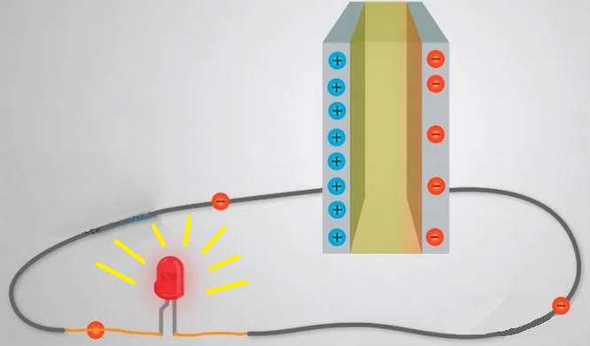

Once it is fully charged, if we take out the battery, the charge will be retained for a long time. As an energy store, the fully charged capacitor lights up the LED briefly. The larger the capacitance value is, the longer the LED will light.

**3. Features**

- **Features**

  1. High capacitance: The capacitance of electrolytic capacitors is relatively high and can store a large amount of charge.

  2. Polarity: It is polar, and the electrodes must be connected correctly, otherwise damage may be resulted.

  	

  3. Voltage dependence: Its capacity changes with the voltage.

  4. Frequency dependence: The equivalent series resistance (ESR) and equivalent series inductance (ESL) vary at different frequencies.

- **Edges**

  1. High capacitance and energy storage capacity
  
  2. Relatively low cost
  
  3. Good performance in low and medium frequency applications

- **Defects**

  1. Capacity drift: After long-term use, its capacity may drift to impact its performance.
  
  2. Corrosion of electrolyte: Some electrolytes may have a corrosion to circuit components, so it is necessary to pay attention to the selection of an appropriate electrolyte.
  
  3. Volatility of the electrolyte: Some electrolytes may be volatile, so please pay attention to the packaging and use environment.

**4. Appearance & Recognition**

1. **Appearance**

   -  The volume of electrolytic capacitors is much larger than that of ordinary fixed ones.

   - There are two pins on it. In a polar electrolytic capacitor, they respectively are positive and negative pins (a short pin and a long pin, the long pin is positive).
   - There is no positive and negative pole for the two pins of the non-polar electrolytic capacitor.

   - They are usually cylindrical, whose shell is common blue or black.

   - Its capacity is generally above 1μF (that of some imported ones is less than this value), and the vast majority of them adopt direct marking.

2. **Pole Recognition** of polar electrolytic capacitors

   There are two categories: cylindrical and sheet. The former is more common. Because the large volume of electrolytic capacitors, there should be a wide area on the shell to mark the parameters and pin polarity. 

   Here we demonstrate the commonly used method to recognize cylindrical electrolytic capacitors.

   On electrolytic capacitors, the nominal capacity, allowable deviation and rated voltage are generally marked directly. For polar ones, poles should also be marked. The followings are some methods to recognize positive and negative pins of polar electrolytic capacitors.

   - The positive pin is represented by the "+" marked on the shell,while the other is negative represented by the "-", as shown in the figure:

     

   - Pins may be with different lengths to indicate positive pole (long pin) and negative pole (short pin). Yet it is impossible to distinguish them if they are cut into the same length after use:

     

     

   - Representation of parameters and materials:

     - Parameters are usually represented on them. Due to the large volume of electrolytic capacitors, the nominal capacity and withstand voltage are all directly marked on the shell.
     - Materials can be distinguished from the model. For example, CD, CA and CN respectively represent aluminum, tantalum and niobium electrolytic capacitors.

3. **Electrolytic Capacitance Meter**

   1. Multimeter: Multimeter measures capacitance by selecting the measurement mode and connecting the test wires to electrodes. Note that some low-grade multimeters may not accurately measure large capacitance values.

    

   2. Capacitance Meter: It is the most commonly used tool for capacitance measurement. It provides more accurate and precise results with different measurement range and accuracy options.

   

   3. Oscilloscope: Although the oscilloscope is mainly used to observe the signal waveform, some of them are also used to measure capacitance. By connecting the electrolytic capacitor to the test point of the oscilloscope, the capacitance value can be measured. However, the test results may not be as accurate and precise as a dedicated capacitance meter.

   

   Regardless of the tool used, make sure that the electrolytic capacitor is fully discharged before the measurement and that the electrodes are properly connected. In addition, pay attention to the measurement range and unit.

**5. Types**

**Aluminum electrolytic capacitor:**


1. Aluminum electrolytic capacitors are one of the most common and widely used types.

2. They adopt aluminum foil as the anode, coated with aluminum oxide as the dielectric. The electrolyte is usually a solution containing sulfuric acid.

3. They feature large capacitance, low cost and wide operating voltage range.

4. They are widely used in power supply filtering, coupling and voltage stabilization circuits.

**Tantalum electrolytic capacitor:**


1. Tantalum electrolytic capacitors are another common type with high performance and stability.

2. They adopt tantalum foil as an anode, coated with tantalum oxide as a dielectric. The electrolyte is usually a solution containing acid.

3. They feature high capacitance, low ESR and small leakage current.

4. They are often used in coupling, winding and high frequency filtering circuits in high performance applications.

**Other types:**


1. In addition to aluminum and tantalum ones, there are tin electrolytic capacitors and magnesium electrolytic capacitors.

2. Tin electrolytic capacitors, with tin foil as an anode and coated tin oxide as a dielectric, are often used in specific applications.

3. Magnesium electrolytic capacitors adopt magnesium foil as anode, coated with magnesium oxide as dielectric, and are suitable for high temperature and special environment applications.

4. They are different in features and applications, so they can be selected and applied according to specific needs.

Aluminum and tantalum electrolytic capacitors are the most common and important types, so they are widely used in the field of electronics. Other types play an important role in specific applications. Their information can help you better choose the right electrolytic capacitor.

**Parameters in this kit:**

| # |  Capacitance  | Dimensions | Voltage |                Capacitance range                | Working temperature |
| :--: | :----: | :------: | :-----: | :------------------------------------: | :---------: |
|  1   | 100uF  |   8mm*12mm   |   50V   |  ±20% (minimum of 80uF, maximum of 120uF)  |  -40~+105℃  |

*Key features and performance metrics are detailed in the specifications. Please review them carefully.*

**6. Applications**

- In power circuits

  

  - They can be used as backup power supplies. When the main power supply is interrupted, they power for a short time to ensure the normal operation of electronic devices.

  - They can also be used to start capacitors in power switching circuits to help power supplies response quickly for stable output.
  
- In filter circuits

  
  
  
    - They plays a role of smoother of output signals in filter circuits. With appropriate capacitance, the high-frequency components in signals can be filtered out, stabilizing output signals.
  
  
  
    - In audio devices, they are often used in low-pass filtering circuits to remove high-frequency noise and stray signals to provide clear audio output.
  
  


- In audio frequency amplifiers

  

  - They become coupler in audio amplifier circuits. They are used to connect the cascade circuits and pass the signal to the next amplifier to prevent the transmission of the DC bias voltage, so that the purity of the audio signals are maintained.
  
- Other applications

  

  - They are also widely used in switching power supplies, inverters and frequency changer for power supply voltage stability, filtering and energy storage.
  
  - They can also be used for current limiting and preventing voltage peaks to protect circuits.

  - In the timing circuits and pulse circuits, they control the delay of signals and adjust pulse shape.


**In summary, electrolytic capacitors play an inevitable role in electronic devices for a variety of applications such as stabilizing power, filtering, coupling, and energy storage.**

**7.  Experiment**

We connect some capacitors in the circuit with an LED. 

When the power is disconnected, the LED will slowly go off like breathing. After the electricity stored in the capacitor runs out, the LED will be off. The more capacitors are, the larger the capacitance is, so the more electricity is stored, the slower the LED will go off.


**8. Selection & Installation**

1. Select the appropriate electrolytic capacitor according to the application requirements:
   
   - Capacitance: Determine the required capacitance according to the needs of the circuit. Ensure that the selected one can meet the capacitance requirements and pay attention to its tolerance range.
   
   - Voltage rating: When selecting an electrolytic capacitor, ensure that its voltage rating is greater than or equal to the maximum operating voltage of the circuit to prevent damage or failure.
   
   - Polarity: Electrolytic capacitors are polar, so it is necessary to correctly connect the positive and negative poles.
   
2. Precautions for installing electrolytic capacitors:
   
   - Polarity connection: The positive and negative electrodes are marked and should be connected in accordance with the correct polarity. When connecting, ensure that the positive is connected to the positive terminal of the power supply and the negative is to the negative, so as to protect the capacitor from damage due to reverse connection.
   
   - Stability: As electrolytic capacitors are sensitive to mechanical vibration and shock, they should be used from them as far as possible. Proper fixing and support will increase its stability.
   
   - Temperature: Their performance is greatly affected by temperature, so the appropriate operating temperature range should be selected according to the application environment. Remember to avoid overheating or being exposed to extreme conditions. Or else their life and performance will have an impact.
   
3. Maintenance and life prediction:
   
   - Temperature management: Keep the electrolytic capacitor within the appropriate operating temperature range to avoid overheating, which will extend its service life.
   
   - No over-voltage: Ensure that the operating voltage is within the rated range and avoid exceeding its rated voltage to prevent damage or failure.
   
   - Electrolyte drying prevention: Its life is influenced by the depletion and drying of its electrolyte. Keep the capacitor in normal use, and regularly check whether the electrolyte dries out or leaks; Replace it if necessary.

   - Frequency limits: Its life is limited by the frequency of AC signals. Exceeding the rated frequency may lead to performance degradation or damage. Please select an appropriate type and frequency range for your application.

**Proper selection, installation and maintenance measures ensure the performance and life of capacitors, and also improve the reliability and stability of electronic devices.**

**9. Troubleshooting**

1. Causes of aging and failure

   - Electrolyte drying: The electrolyte will gradually dry out over time, reducing the performance or even failure of the capacitor.
   
   - Polar board corrosion: Its polar board may corroded due to current and electrolyte, which may damage the capacitor.
   
   - Voltage stress: Extremely high working voltage or peak value may negate the electrolytic capacitor.
   
   - Temperature: In high temperature environments electrolyte evaporation and board corrosion will be accelerated, thereby reducing service life.
   
2. Solutions

   - Leakage: If you find electrolyte leaked on the shell, stop using it immediately and replace with another capacitor. Leakage may damage other circuit components.

   	

   - Capacitance deviation: The capacitance may deviate from the rating over time, resulting in reduced circuit performance. If the deviation is too large, the capacitor should be replaced with a suitable one.

   - Frequency response variation: Capacitors response slowly to high-frequency signals, thus poor filtering occurs. Under that condition, please choose an appropriate capacitor type.

   - Short circuit: electrolytic capacitors may short circuit when they fail, which will lead to abnormal circuit operation or damage other components. If a short circuit is found, replace the capacitor immediately.

   - Polar board corrosion: If the board is corroded, the performance may decline or fail. Please select high quality capacitors when using to reduce the risk of corrosion.

**For the above, the best solution is to detect and replace the defective electrolytic capacitor in time. It is important to take regular inspections of their appearance, capacitance and performance. In addition, the occurrence of failures will also be reduced by correctly selecting electrolytic capacitors suitable for the operating voltage and temperature range, as well as avoiding excessive voltage and overheating.**

**Actually very simple, we can better maintain electrolytic capacitors by understanding the above problem causes and solutions, so as to ensure normal operation and reliability.**

---

### Project 02 Ceramic Capacitor


---

**1. Overview**

- Definition

   Ceramic capacitors are usually integrated on single chips to provide capacitive functions. It is a miniaturized, highly integrated capacitor that can be widely used in various electronic devices and circuits.

- Compared with traditional capacitors:

   - Small in size: Ceramic capacitors come in miniature packages and are smaller than traditional ones, which largely saves space on circuit boards.
   
   - High integration: Ceramic capacitors can be integrated with other electronic components on the same chip, improving the integration and performance of the circuit.
   
   - Low inductance: Due to their structures, the inductance is always lower, making them more effective in high-frequency applications.
   
   - Low temperature coefficient: Ceramic capacitors boast a lower temperature coefficient, so they are suitable for a wider temperature range.
   
   - Long life and good stability: Compared with aluminum electrolytic capacitors, ceramic capacitors have a longer service life and better voltage stability. At the same time, they do not polarize.
   
   - In addition, ceramic capacitors comes with larger capacitance range and lower costs.

**2. Structure/Working Principle**

- Inner Structure

  - Ceramic capacitors (MLCC) are composed of an extremely thin ceramic dielectric diaphragm and an electrode material (mostly nickel) printed on the ceramic board in a misaligned manner. These layers are sintered after a one-time high temperature to form a ceramic chip, whose two ends are then sealed with metal layer (outer electrode) to form a monolith like structure. The internal electrodes are stacked on each other to widen the area of the capacitive bipolar board, thereby increasing the electrical capacity. Ceramic medium is filled internally. Features vary according to the capacitor media, such as large capacity, good temperature, nice frequency features, etc., which is why there are so many kinds of ceramic capacitors ‌.

  

- Working Principle

  - Based on its physical structure, the capacitor works through the layered ceramic medium and the internal electrode material. It generally stores charge and energy. When a voltage is applied, the charge accumulates on the two polar boards to form an electric field that stores energy. When the voltage changes, the capacitor releases or absorbs energy for filtering and coupling.

- How to store and release charge

  1. Ceramic capacitors store charge by creating an electric field between two metal boards, and release charge by disconnecting the power supply so that the electric field gradually disappears.

  

  2. A ceramic capacitor is a passive device that stores energy in the form of an electric field. From its basic structure, we can tell that any two conductors insulated from each other in a very close distance can form a capacitor. When a voltage is applied, an electric field appears in the insulating medium, with electrons flowing from the power negative to the negative electrode, so as to produce charges. They accumulate on the metal board to create an electric field that stores electrical energy. 

  	In simple terms, a capacitor establishes an electric field through an insulating medium between two metal conductors and then converts electricity into stored charges.

  3. The discharge process of ceramic capacitor is to release stored charges. When the capacitor is fully charged, if it is placed in a closed circuit without a power supply, the charge on the negative board will rush to the positive due to electric field force. These charges are neutralized, so the capacitor begins to discharge. Therefore, the capacitor discharges through the gradual disappearance of the electric field by disconnecting the power supply.
  
  To sum up, ceramic capacitors store charges by creating an electric field between two metal boards, while release charges by disconnecting the power supply to vanish the electric field.

**3. Appearance & Measurement**

1. **Package**

   - Surface Mount Type:

     - Rectangular package in dimensions of 0402, 0603, 0805, 1206, whose unit is inches. For instance, 0402 means the length of 0.04 inches and the width of 0.02 inches.
     - QFN (Quad Flat No Leads) or DFN (Dual Flat No Leads), usually used for small size but high density applications.

     

   - Through-Hole Type: Sometimes they are packaged as a plug-in, which are suitable for conventional electronic assembly that is welded through a hole. In this kit, this type is adopted.

     

2. **Ceramic Capacitance Meter**

   1. Multimeter: Multimeter measures capacitance by selecting the measurement mode and connecting the test wires to electrodes. Note that some low-grade multimeters may not accurately measure large capacitance values.

      

   2. Capacitance Meter: It is the most commonly used tool for capacitance measurement. It provides more accurate and precise results with different measurement range and accuracy options.

      

   3. Oscilloscope: Although the oscilloscope is mainly used to observe the signal waveform, some of them are also used to measure capacitance. By connecting the capacitor to the test point of the oscilloscope, the capacitance value can be measured. However, the test results may not be as accurate and precise as a dedicated capacitance meter.

      

   Regardless of the tool used, make sure that the  capacitor is fully discharged before the measurement and that the electrodes are properly connected. In addition, pay attention to the measurement range and unit.

**4. Parameters**

|  #   | Capacitance | Pin spacing | Voltage | Capacitance range | Working temperature |
| :--: | :---------: | :---------: | :-----: | :---------------: | :-----------------: |
|  1   |    100NF    |   3.50mm    |   16V   |       ±10%        |     -25℃ ~ +85℃     |

*Key features and performance metrics are detailed in the specifications. Please review them carefully.*

**5. Applications**

Ceramic capacitors are widely applied to multiple circuits and devices.

1. Power Management: Ceramic capacitors are used for filtering, decoupling and voltage regulation. They reduce power supply noise, provide a stable voltage output, and protect electronic components.

   

2. Signal Coupling: They are commonly used in analog circuits and amplifiers as signal couplers. They transmit signals from one circuit to another and block DC bias.

3. Filter: In filter circuits, they remove noise, filter high-frequency interference, and adjust the frequency response. They play important role in audio equipment, communication devices and power electronics applications.

4. Clock Circuits / Oscillators: In clock circuits and oscillators, they adjust frequencies and stabilize oscillations.

5. Digital / Logic Circuits: They can be used for coupling, decoupling and filtering in digital circuits. They also provide a stable supply voltage and filter out high-frequency noise.

6. Ultra-high Frequency (UHF) and Radio Frequency (RF): They feature low inductance and high frequency response, which make them ideal for UHF and RF applications such as antenna matching networks, RF filters as well as tuned circuits.

7. Sensors / Measuring Instruments: They are key components in sensors and measuring instruments to measure physical quantities, store data and stabilize power supplies.

8. LED Lighting: In LED lighting, they are used for voltage regulation and filtering circuits to ensure the stability and life of LED.

**In short, ceramic capacitors play important role in various electronic devices and circuits. They can be power manager, signal coupler and filter, and they are applied to clock circuits, digital circuits, RF applications and measuring instruments.**

**6. Experiment**

We connect some capacitors in the circuit with an LED. 

When the power is disconnected, the LED will slowly go off like breathing. After the electricity stored in the capacitor runs out, the LED will be off. The more capacitors are, the larger the capacitance is, so the more electricity is stored, the slower the LED will go off.


*In the experiment, only components in the kit is provided.*

**7. Maintaining**

- Measure capacitance: Use a suitable tool (such as a capacitance meter or multimeter) to measure the capacitance of a ceramic capacitor. Compare with ratings to ensure that they match the expected values. If the measured value differs significantly from the rated value, the capacitor may have failed.

- Check rated voltage: Make sure that the voltage does not exceed its rated voltage. If it does, the capacitor may be damaged. Always pay attention to the rated voltage during using.

- Check physical damage: Check the appearance for obvious physical damage, such as cracks, deformation or leakage. They may cause the capacitors to work abnormally.

- Replace capacitors: If a ceramic capacitor is suspected of being damaged or failing, replace with a new one. Select a proper capacitance, rated voltage and package type.

- Working environment: Ceramic capacitors are sensitive to ambient temperature and humidity. So the conditions of the working environment should be considered when selecting capacitors.

- Manufacturer documentation and specification sheets: Please read manufacturer documentation and specification sheets to understand more about their features, limitations, and maintenance requirements. They help you better deal with potential failures.

---

### Project 03 Diode

 

---

**1. Overview**

1. **What is a diode?**

   

   A diode is the simplest semiconductor, which consists of two semiconductor materials with different doping. It boasts two pins called "positive" (anode or P-terminal) and "negative" (cathode or N-terminal).

   A diode is mainly used to control the flow direction of the current. It only allows the current to pass in one specific direction, which is called forward bias, while in the opposite direction, it is reverse bias, so the diode prevents the current from passing through.

2. **What does the structure and circuit symbol of a diode look like?**

   A diode is composed of two semiconductors, including P-type (positive) and N-type (negative). The former is doped with a small amount of impurities inside so with positive charge, while the latter is with negative charge.

   

   As for its symbol, the positive is represented by a triangular arrow, while the negative is a line. The side pointed by the arrow indicates a forward bias, so current is allowed to pass through; For reverse bias (the opposite direction), current is blocked.

3. **How does a diode work?**

   

   The diode works based on the features of PN junction which is a combination of a P-type and an N-type semiconductor. In the junction, the positive charge in the P-type forms a potential difference with the negative charge in the N-type, thus creating an electric field.

   When the diode is in a forward bias, that is, when the positive electrode connects to the P-type while the negative connects to the N-type, the electric field prevents electrons from flowing from N to P. However, if the applied forward voltage is greater than that drop of the diode (generally 0.6-0.7 volts), the electrons are able to overcome the field force and pass through the diode.

   

   Conversely, when the diode is in reverse bias, that is, when the positive electrode connects to the N-type while the negative connects to the P-type, the electric field expands to make electrons harder to pass through. Usually, the current at reverse voltage is too small to take into account.

   

**Summery**

- **The on-state of the diode means that when the forward voltage is applied to the P terminal and the negative voltage is applied to the N terminal, the current can pass through the diode smoothly. Under this state, the diode behaves as a low resistance and current can flow.**

- **The off-state of the diode means that when the negative voltage is applied to the P terminal and the positive voltage is applied to the N terminal, the current cannot pass through the diode. Under this state, the diode behaves as a high resistance, and the current is blocked so then cannot flow.**

**2. Appearance**

1. Rectifier diode (in this kit)

    

2. Photodiode (commonly used LED)

    

3. Power diode

    


4. Schottky diode, and so on. 

**3. Parameters**

|  #   | Model  | Packaging dimensions | Reverse voltage peak maximum (V~RM~) | Effective reverse voltage maximum (V~RMS~) | DC reverse voltage (V~DC~) | Output current (I~AV~) | Output instantaneous current (I~FSM~) | Forward voltage drop (V~F~) |
| :--: | :----: | :------------------: | :----------------------------------: | :----------------------------------------: | :------------------------: | :--------------------: | :-----------------------------------: | :-------------------------: |
|  1   | 1N4007 |        DO-41         |                1000V                 |                    700V                    |           1000V            |           1A           |                  30A                  |       1.1V (=1A hour)       |

*Key features and performance metrics are detailed in the specifications. Please review them carefully.*

**4. Applications**

1. As a rectifier

2. As a switch

3. As a protective device

   

4. As a voltage regulator

5. Photodiodes

   

6. And so on

**5. Measurement**

1. Multimeter: Multimeter is one of the most commonly used tools to measure the on/off states of diodes. In resistance measurement mode, connect the wires of the multimeter to the two pins of the diode, so the state of the diode can be determined by reading the resistance. If the value can be read, the diode is forward-on, otherwise it is in reverse. 

   

2. Oscilloscope: An oscilloscope measures the voltage-time features of a diode. Connect the diode to the input terminal of the oscilloscope, and you can see the voltage changes, including the voltage waveform in the on and off state.

   

3. Diode Tester: It is specially designed to measure diodes, which usually contains a simplified circuit that diodes can directly insert into it for measurement.

    

**6. Experiment**

In the experiment, we serial-connect an LED forward in the circuit. The LED will light up.


If we reverse the connecting direction of the LED, LED will not light up.


*In the experiment, only components in the kit is provided; Others are for reference.*

**7. Troubleshooting**

1. Short circuit: When a diode is short-circuited, the resistance between its two pins becomes very low, thus a large current flows in the circuit, which damages other components.

2. Open circuit: When a diode is open-circuited, the resistance between its two pins becomes extremely high, thus current fails to pass through the diode, causing an open circuit or failure transmission of signals.

3. Poor conduction: A diode should be with low resistance after conduction. Yet if there is a poor conduction, the resistance will be higher than usual. This may be caused by inside damage or material aging.

4. Poor cut-off: A diode should be with high resistance when it is off. Yet if there is a poor cutoff, the resistance will be lower than usual. This may be caused by inside damage or material aging.

5. Polarity error: A diode is polar, so it will not work properly if a forward voltage is applied to N terminal (or a reverse voltage is applied to the P terminal). This may result in poor conduction or invalid cut-offs.

6. Temperature sensitivity: Some diodes are very sensitive to temperature so may perform abnormally in high temperature, including conduction state switching or current leakage increasing.

**If you encounter these problems, please replace the diode or check the circuit connection and polarity to ensure its normal operation. If invalid, it may be necessary to examine the entire circuit or consult a technician.**

---

### Project 04 Hi, Welcome to Keyestudio!

---

**1. Overview**

For Arduino beginners, we will introduce this easy project first. In this experiment, only a main board and a USB cable are adopted to show “Hi, Welcome to keyestudio!” on computer. This simple project tests the communication between the board and your computer. Let’s enter the programming world!

---

**2. Components**

|  |  |
| :----------------------: | :-------------------: |
|UNO R4 WiFi/Minima main board (either-or)|       USB cable x1   |

---

**3. Connection**

<span style="color: rgb(255, 76, 65);">**ATTENTION**</span>

For UNO R4 WiFi board:


For UNO R4 Minima board:


---

**4. Test Code**

Code of this project is saved in “<u>**...\Arduino_C_Code**</u>” (<span style="color: rgb(255, 76, 65);">similarly hereinafter</span>). Open ''<u>**Hi_Welcome_to_keyestudio.ino**</u>".

**Please disconnect the module before uploading code to avoid uploading failure. After uploading code, unplug the USB cable, wire the module up and then connect to USB.** (<span style="color: rgb(255, 76, 65);">similarly hereinafter</span>)

```c++
/*
 * Name       : Hi, Welcome to keyestudio!
 * Function   : Enter the letter“R”, serial port display“Hi, Welcome to keyestudio!”.
 * Compile IDE：ARDUINO 2.3.2
 * Author     : https://www.keyestudio.com/
*/
char val;   // Define the variable Val 

void setup(){
Serial.begin(9600);   // Set baud rate to 9600
}

void loop(){
  if (Serial.available() > 0) {
    val=Serial.read();  // Reads an instruction or character from a PC to an Arduino and assigns the value“Val”.
    if(val=='R') {  // Check that the letter entered is“R”, if it is
       Serial.println("Hi, Welcome to keyestudio!");  //Serial port printing“Hi, Welcome to keyestudio!”.
    }
  }
} 
```

For UNO R4 WiFi board, click “**<u>Tools</u>**”→“**<u>Board</u>**” to choose Arduino UNO R4 Boards→Arduino UNO R4 WiFi.


Click “<u>**Tools**</u>”→“**<u>Port</u>**” to connect to the correct port.

**<span style="background:#ff0;color:#000"> Note that the port will appear only after the board is connected to computer via USB cable.</span>**


Click  to upload the code to UNO R4 WiFi board.


Successfully uploaded:


For UNO R4 Minima board, click “**<u>Tools</u>**”→“**<u>Board</u>**” to choose Arduino UNO R4 Boards→Arduino UNO R4 Minima.


Click “<u>**Tools**</u>”→“**<u>Port</u>**” to connect to the correct port.

**<span style="background:#ff0;color:#000">
Note that the port will appear only after the board is connected to computer via USB cable.</span>**


Click  to upload the code to UNO R4 Minima board.


Successfully uploaded:


---

**5. Test Result**

After uploading code, click  to open serial monitor. Set baud rate to **<u>9600</u>**, input “**<u>R</u>**” and press Enter. The serial monitor prints “**<u>Hi, Welcome to keyestudio!</u>**”.


---

**6. Code Explanation**

| Code                | Explanation                                                  |
| ------------------- | ------------------------------------------------------------ |
| char val            | Define a variable val                                        |
| Serial.begin(9600)  | Set baud rate to 9600                                        |
| Serial.available( ) | Get the number of data bytes that can be read on the serial port, and this data has already arrived and is stored in the receive cache (64 bytes in total). Serial.available() > 0 means that the serial port receives data and can read it. |
| Serial.read( )      | Read the written serial data.                                |
| if( ){ }            | If conditions in “()” are satisfied, execute code in “{ }”.  |
| Serial.println( )   | Wrap to output. Output data from the serial port, followed by a carriage return and a line break. |

---

### Project 05 LED Blinking


---

**1. Overview**

**LED:** Its full name is light-emitting diode made of compounds containing gallium (Ga), arsenic (As), phosphorus (P), nitrogen (N), etc. When electrons are combined with holes, visible light is emitted. So they can be used to produce light-emitting diodes. 

|     LED components      | Emitting light colors |
| :---------------------: | :-------------------: |
| gallium arsenide diode  |          red          |
| gallium phosphide diode |         green         |
|  silicon carbide diode  |        yellow         |
|  gallium nitride diode  |         blue          |

Except by components, they can also be divided into organic ones(OLED) and inorganic ones(LED). 

LED is used as an indicator in circuits and instruments, or as part of a text or numeric display. In this project, we connect an external LED to a digital pin of the board rather than adopting the on-board indicator L (D13).

---

**2. Component Knowledge** 

**(1) LED**


An LED is a semiconductor known as a "light-emitting diode", which is made of semiconductor materials (silicon, selenium, germanium, etc.). It is polar. The short pin is negative that connects to GND, while the long one is positive that connects to 3.3V or 5V.


**(2) Five-color-ring Resistor**

A resistor limits or regulates the flow of current in the circuit. The left picture is the appearance of the resistor and the right one is its circuit symbol. Its unit of R is ohm(Ω). 1 mΩ= 1000 kΩ, 1 kΩ = 1000Ω.


We can use resistors to protect sensitive components, like LED. The resistance is marked on the body with an electronic color code. Each color represents a number, and you can refer to it in the resistance card.


In this kit, we provide four five-color-ring resistor. Here we take three of them as examples.

220Ω resistor

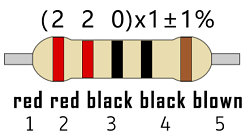

10KΩ resistor


1KΩ resistor


In the same voltage, there will be less current but more resistance. The connection between current(I), voltage(V), and resistance(R) can be expressed: I=U/R. In the figure below, for instance, if the voltage is 3V, the current through R1 equals I = U / R = 3 V / 10 KΩ= 0.0003A= 0.3mA。


Don’t connect a low resistance directly to the two poles of the power supply, as this will cause excessive current to damage the electronic components. Resistors are nonpolar.

**(3) Breadboard**

Breadboards are used to build and test circuits quickly before completing any circuit design. There are many holes in the breadboard so that components such as resistors can be inserted into it. 

A typical breadboard is shown below:


The breadboard comes with many metal strips that run underneath the board to connect holes together. They are laid out as shown below. Note that the top and bottom rows of holes are connected horizontally，while the remaining holes are connected vertically.


The first two rows (top) and the last two rows (bottom) are used for power positive(+) and negative(-) respectively. The conductive layout is shown below:


We should know that the up and low holes of groove in the middle are not connected. So we can connect the DIP(Dual in-line Packages) components (say, integrated circuits, microcontrollers, chips, etc.) as shown below:


---

**3. Components**

|    | ||
| ------------------------ | ------------------------ | ---------------------------- |
|UNO R4 WiFi/Minima main board (either-or)| Red LED x1 | 220Ω resistor x1 |
||||
|Breadboard x1|Jump wires| USB cable x1 |

---

**4. Wiring Diagram** 

We adopt digital pin D10 in this experiment. In the circuit, we connect a 220 ohm resistor in serial, which protect the LED from over-current.

**Schematic diagram:**


**Wiring diagram:**


---

**5. Test Code**

Code of this project is saved in “<u>**...\Arduino_C_Code**</u>” (<span style="color: rgb(255, 76, 65);">similarly hereinafter</span>). Open ''**LED_Blinking.ino**".

**Please disconnect the module before uploading code to avoid uploading failure. After uploading code, unplug the USB cable, wire the module up and then connect to USB.** (<span style="color: rgb(255, 76, 65);">similarly hereinafter</span>)

```c++
/*
 * File name: LED_Blinking
 * Function: LED blinks 1s
 * Compiling IDE: ARDUINO 2.3.2
 * Author: https://www.keyestudio.com/
*/
int ledPin = 10; // Define LED pin to 10.

void setup(){
  pinMode(ledPin, OUTPUT);// Set LED pin to output
}

void loop(){
  digitalWrite(ledPin, HIGH); // LED on.
  delay(1000); // Delay 1s.
  digitalWrite(ledPin, LOW); // LED off.
  delay(1000); // Delay 1s.
}
```

Click “**<u>Tools</u>**”→“**<u>Board</u>**” to choose Arduino Uno. Click “<u>**Tools**</u>”→“**<u>Port</u>**” to connect to the correct port.

**<span style="background:#ff0;color:#000">
Note that the port will appear only after the board is connected to computer via USB cable.</span>**

Click  to upload the code to the board.

---

**6. Test Result**

After uploading the code, unplug the USB cable and wire up. Connect the board to the computer with USB cable and you will see the red LED blinks: it lights up for 1s and goes off for 1s, in a loop.


---

**7. Code Explanation**

| Code                       | Explanation                                           |
| -------------------------- | ----------------------------------------------------- |
| pinMode(ledPin, OUTPUT)    | Set pin mode: OUTPUT / INPUT                          |
| digitalWrite(ledPin, HIGH) | Set the pin output voltage to HIGH or LOW             |
| delay(1000)                | Stop the execution for a while: a delay in unit of ms |

---

### Project 06 Breathing LED


---

**1. Overview**

In previous studies, we know that LEDs have on/off state, so how to enter the intermediate state?  That's what we're going to learn.

Breathing light, that is, LED is turned on/off gradually, just like "breathing". So, how to control the brightness of a LED? It can be achieved by controlling the current flowing through the LED. When the current decreases, the LED darkens, while the current increases and the LED brightens. Therefore, we can adjust the voltage of LED to adjust its brightness. Simply, we use UNO R4 PWM. 

---

**2. Working Principle**


**Analog / Digital signal** 

An Analog Signal is a continuous signal in both time and value. On the contrary, a Digital Signal is a time series consisting of a sequence of quantities. Most signals in life are analog signals. A familiar example of an Analog Signal would be how the temperature throughout the day is continuously changing and could not suddenly change instantaneously from 0℃ to 10℃. However, Digital Signals can instantaneously change in value. This change is expressed in numbers as 1 and 0 (binary). Their differences can more easily be seen when compared when graphed as below. 


PWM, Pulse Width Modulation, is a very effective method for using digital signals to control analog circuits. Common processors cannot directly output analog signals. PWM technology makes it very convenient to achieve this conversion (translation from digital to analog signals). 

PWM technology uses digital pins to send certain frequencies of square waves, that is, the output of high levels and low levels, which alternately last for a certain period. The total time is generally fixed, which is called the **period** (<span style="color: rgb(255, 76, 65);">the reciprocal of the period is frequency</span>). The time of high level outputs are generally called “pulse width”, and the duty cycle is the percentage of the ratio of pulse duration, or pulse width (PW) to the total period (T) of the waveform. The longer the high levels last, the longer the duty cycle and the higher the corresponding voltage in the analog signal will be. 

The following figures show how the analog signal voltages vary between 0V-5V (high level is 5V) corresponding to the pulse width 0%-100%.


PWM is widely applied to adjust light brightness and motor rotation speed. Here are three parameters of it.


1. Duty cycle: The duration proportion of high level to the total period

2. Period: The reciprocal of the pulse frequency in one second

3. There are six PWM interface on Arduino: digital pins 3, 5, 6, 9, 10, 11.

The longer the PWM duty cycle is, the higher the output power will be. So we can use PWM to control the brightness of an LED or the speed of DC motor. PWM is not real analog, but the effective value of the voltage is equivalent to the corresponding analog. Therefore, we can control the output power of output modules. 

---

**3. Components**

|   | ||
| ------------------------ | ------------------------ | ---------------------------- |
|UNO R4 WiFi/Minima main board (either-or)| Red LED x1 | 220Ω resistor x1 |
||||
|Breadboard x1 |Jump wires | USB cable x1 |

---

**4. Wiring Diagram** 

We adopt digital pin D10 in this experiment. In the circuit, we connect a 220 ohm resistor in serial, which protect the LED from over-current.

**Schematic diagram:**


**Wiring diagram:**


---

**5. Test Code**

```c++
/*
 * File name: Breathing_LED
 * Function: with PWM, LED dims and lights up, like breathe
 * Compiling IDE: ARDUINO 2.3.2
 * Author: https://www.keyestudio.com/
*/
int ledPin = 10;  // Define LED pin to 10.

void setup() {
  pinMode(ledPin,OUTPUT); // Set LED pin to output 
}

void loop(){
  for (int value = 0 ; value < 255; value=value+1) {  //gradually lighting
    analogWrite(ledPin, value);
    delay(10);
  }
  for (int value = 255; value >0; value=value-1) {  //dimming
    analogWrite(ledPin, value);
    delay(10);
  } 
} 
```
---

**6. Test Result**

Click  to upload code. After uploading the code, unplug the USB cable and wire up. Connect the board to the computer with USB cable and you can see the LED gradually goes on and off, just like breathing.


---

**7. Code Explanation**

If a statement needs to be execute repeatedly, **for loop** may help.

**for loop:**


The first loop: 1 → 2 → 3 → 4

The second loop: 2 → 3 → 4

…

The loop ends until 2 is not satisfied. 

**Back to the code:**

```c++
for (int value = 0; value < 255; value=value+1){

   ...}

for (int value = 255; value >0; value=value-1){

   ...}
```

*value* increases from 0 to 255 and decreases to 0, and then it back to 255…

**analogWrite()**:

Digital port values can only be 0 or 1, so how to send an analog signal to a digital port? On the Plus board, six digital ports are with a sign “~”, which means they can output PWM signals.

- analogWrite(pin,value)


analogWrite() writes an analog value(0 ~ 255) for PWM ports. *value* ranges from 0 to 255. This function only works for digital pins with PWM, herein including D3, D5, D6, D9, D10, D11.

---

### Project 07 Traffic Lights


---

**1. Overview**

Traffic lights are closely related to people's daily life, which generally show red, yellow, and green. Everyone should obey the traffic rules to avoid many accidents. 

In this project, we will adopt red, green and yellow LED to make a mini traffic lights.

---

**2. Components**

|  |||
| ------------------------ | ------------------------ | ---------------------------- |
| UNO R4 WiFi/Minima main board (either-or) | Red LED x1 |Green LED x1  |
|| ||
|Yellow LED x1  | 220Ω resistor x3 |Breadboard x1 |
|||  |
|Jump wires | USB cable x1 |  |

---

**3. Wiring Diagram** 

**Schematic diagram:**


**Wiring diagram:**


---

**4. Test Code**

```c++
/*

 * File name: Traffic_Lights
 * Function: simulate traffic lights
 * Compiling IDE: ARDUINO 2.3.2
 * Author: https://www.keyestudio.com/
*/
int redled = 10;  // red LED to digital pin 10.
int yellowled = 7;  // yellow LED to digital pin 7.
int greenled = 4;  // green LED to digital pin 4.

void setup() {
  pinMode(redled, OUTPUT);  // red LED pin to output
  pinMode(yellowled, OUTPUT);  // yellow LED pin to output
  pinMode(greenled, OUTPUT);  // green LED pin to output
}

void loop(){
  digitalWrite(greenled, HIGH); // green LED on
  delay(5000); // delya 5s
  digitalWrite(greenled, LOW); // green LEDoff
  for(int i=0;i<3;i++){// blink for three times
    digitalWrite(yellowled, HIGH); //yellow LED on
    delay(500); // delay 0.5s
    digitalWrite(yellowled, LOW); // yellow LED off
    delay(500); // delay 0.5s
  } 
  digitalWrite(redled, HIGH); // red LED on 
  delay(5000); // delya 5s
  digitalWrite(redled, LOW); // red LED off
}
```

---

**5. Test Result**

Click  to upload code.

After uploading the code, unplug the USB cable and wire up. Connect the board to the computer with USB cable and you can see the green LED lights up for 5 seconds and goes off; then the yellow LED blinks for three times; at last the red LED also lights up for 5 seconds and goes off. These actions repeat.


---

**6. Code Explanation**

Please refer to Project 05 and Project 06.

---

### Project 08 Flowing Water Light


---

**1. Overview**

In our daily life, we can see many billboards composed of different colors of LED. They constantly change the light (like water) to attract customers' attention. In this project, we will use UNO R4 board to control 5 LEDs to achieve the effect of flowing water.

**2. Components**

|  |||
| ------------------------ | ------------------------ | ---------------------------- |
| UNO R4 WiFi/Minima main board (either-or) | Red LED x5 | 220Ω resistor x5 |
||||
|Breadboard x1 |Jump wires | USB cable x1 |

---

**3. Wiring Diagram** 

**Schematic diagram:**


**Wiring diagram:**


---

**4. Test Code**

```c++
/*
 * File name: Flowing_Water_Light
 * Function: Flowing_Water_Light
 * Compiling IDE: ARDUINO 2.3.2
 * Author: https://www.keyestudio.com/
*/
byte ledPins[] = {2, 3, 4, 5, 6}; //LED pins
int ledCounts; //set LED numbers

void setup() {
//set LED pins to output
  ledCounts = sizeof(ledPins); 
  for (int i = 0; i < ledCounts; i++) {
    pinMode(ledPins[i], OUTPUT);
  }
}

void loop() {
  for (int i = 0; i < ledCounts; i++) { //The five leds will turn on and off from right to left
    digitalWrite(ledPins[i], HIGH);
    delay(100);
    digitalWrite(ledPins[i], LOW);
  }
  for (int i = ledCounts - 1; i > -1; i--) { //The five leds will turn on and off from left to right
    digitalWrite(ledPins[i], HIGH);
    delay(100);
    digitalWrite(ledPins[i], LOW);
  }
}
```

---

**5. Test Result**

Click  to upload code. 

After uploading the code, unplug the USB cable and wire up. Connect the board to the computer with USB cable and these LEDs gradually light up and go off in sequence.


---

**6. Code Explanation**

Please refer to Project 04.

---

### Project 09 RGB LED


---

**1. Overview**

RGB is composed of three colors (red, green and blue),which can emit different colors of light by mixing these three basic colors. 

In this project, we will introduce the RGB and show you how to use UNO R4 board to control the RGB to emit different colors. 

---

**2. Component Knowledge**

Most monitors adopt the RGB color standard, and all colors on a computer screen are a mixture of red, green and blue in varying proportions. There are common cathode and common anode RGB. In this kit, we use the first one.


The brightness of RGB LED can be adjusted by PWM.

**3. Components**

|  |||
| ------------------------ | ------------------------ | ---------------------------- |
| UNO R4 WiFi/Minima main board (either-or) | RGB LED x1  | 220Ω resistor x3 |
||||
|Breadboard x1 |Jump wires | USB cable x1 |

---

**4. Wiring Diagram** 

**Schematic diagram:**


**Wiring diagram:**


---

**5. Test Code**

```c++
/*
 * File name: RGB_LED
 * Function: RGB LED lights up in various colors
 * Compiling IDE: ARDUINO 2.3.2
 * Author: https://www.keyestudio.com/
*/
int redpin = 11; //red LED pin to 11.
int greenpin = 10; // green LED pin to 10.
int bluepin = 9; // blue LED pin to 9.

int val = 0; //define a variable named val

void setup() {
  pinMode(redpin, OUTPUT);
  pinMode(greenpin, OUTPUT);
  pinMode(bluepin, OUTPUT);
  digitalWrite(redpin,LOW);
  digitalWrite(greenpin,LOW);
  digitalWrite(bluepin,LOW);
}

void loop() {
  for(val=255; val>0; val--){
    analogWrite(redpin,val);
    analogWrite(greenpin,(255 - val));
    analogWrite(bluepin,(128 - val));
    delay(0.001 * 1000);
  }
  for(val=0; val<255; val++){
    analogWrite(redpin,val);
    analogWrite(greenpin,(255 - val));
    analogWrite(bluepin,(128 - val));
    delay(0.001 * 1000);
  }
}
```

---

**6. Test Result**

Click  to upload code.

After uploading the code, unplug the USB cable and wire up. Connect the board to the computer with USB cable and the RGB LED shows many colors.


---

**7. Code Explanation**

Please refer to Project 05 and Project 06.

---

### Project 10 1-bit Digital Tube


---

**1. Overview**

1-bit Digital Tube is widely used to display digital information for electronic devices such as induction cooker, automatic washing machine, water temperature display and electronic clock. 

In this project, we control the module to show number from 0 to 9.

---

**2. Component Knowledge**

**Working principle:**

Digital tube is a semiconductor, whose basic unit is a light-emitting diode (LED). It can be divided into 7-segment and 8-segment. The 8-segment one boasts one more LED than the 7-segment one (decimal point). Each segment is a separate LED. According to the connection mode of LED units, it can be divided into common anode and common cathode.

In the common cathode 7-segment display, all the cathodes (negative electrodes) of LEDs are shared and should be connected to GND. To light up an LED, you can set its pin to “HIGH”.

On the contrary, all anodes (positive electrodes) of a common anode 7-segment display are shared and should be connected to “+5V”. To light up an LED, you can set its pin to “LOW”.


Each part of the digital tube is an LED. So a current limiting resistor is required when using. Otherwise, the LED will be damaged. 

In this experiment, we use <span style="color: rgb(255, 76, 0);">a common cathode one-bit digital tube</span>. As we mentioned above, we connect the common cathode to GND and set pin to “HIGH” to light it up.

---

**3. Components**

|  |||
| ------------------------ | ------------------------ | ---------------------------- |
|UNO R4 WiFi/Minima main board (either-or)| 1-bit Digital Tube x1 | 220Ω resistor x8 |
||||
|Breadboard x1 |Jump wires | USB cable x1 |

---

**4. Wiring Diagram**

**Schematic diagram:**


**Wiring diagram:**


---

**5. Test Code** 

7 segments are for number display and one is for the decimal point. When certain numbers are displayed, the corresponding segment will be on. For example, when the number 1 is displayed, segments b and c will be turned on.

We write a code for each number and shows them for each 2 seconds, including integers from 0 ~ 9. The longer the delay is, the longer the display time of the number will be.

```c++
/*
 * File name: 1-Digit_Digital_Tube
 * Function: 1-Digit_Digital_Tube shows number 0-9
 * Compiling IDE: ARDUINO 2.3.2
 * Author: https://www.keyestudio.com/
*/
// Set the IO pins of each segment
int a=7;// Set a-segment pin to digital pin 7
int b=6;// Set b-segment pin to digital pin 6
int c=5;// Set c-segment pin to digital pin 5
int d=10;// Set d-segment pin to digital pin 10
int e=11;// Set e-segment pin to digital pin 11
int f=8;// Set f-segment pin to digital pin 8
int g=9;// Set g-segment pin to digital pin 9
int dp=4;// Set dp-segment pin to digital pin 4

void setup(){
  int i;// Set variable
  for(i=4;i<=11;i++)
  pinMode(i,OUTPUT);// Set pins 4-11 to output
}

void loop(){
  while(1){
    digital_0();// Display number  0
    delay(1000);// Delay 1s
    digital_1();// Display number  1
    delay(1000);// Delay 1s
    digital_2();// Display number  2
    delay(1000); // Delay 1s
    digital_3();// Display number  3
    delay(1000); // Delay 1s
    digital_4();// Display number  4
    delay(1000); // Delay 1s
    digital_5();// Display number  5
    delay(1000); // Delay 1s
    digital_6();// Display number  6
    delay(1000); // Delay 1s
    digital_7();// Display number  7
    delay(1000); // Delay 1s
    digital_8();// Display number  8
    delay(1000); // Delay 1s
    digital_9();// Display number  9
    delay(1000); // Delay 1s
  }
}

void digital_0(void) { // Display number 0
  digitalWrite(a,HIGH);
  digitalWrite(b,HIGH);
  digitalWrite(c,HIGH);
  digitalWrite(d,HIGH);
  digitalWrite(e,HIGH);
  digitalWrite(f,HIGH);
  digitalWrite(g,LOW);
  digitalWrite(dp,LOW);
}
void digital_1(void) { // Display number  1
  unsigned char j;
  digitalWrite(c,HIGH);// Set pin 5 to high, light up segment c
  digitalWrite(b,HIGH);// light up segment b
  for(j=7;j<=11;j++)// turn off other segments
  digitalWrite(j,LOW);
  digitalWrite(dp,LOW);// turn off segment dp
}
void digital_2(void) { // Display number  2
  unsigned char j;
  digitalWrite(b,HIGH);
  digitalWrite(a,HIGH);
  for(j=9;j<=11;j++)
  digitalWrite(j,HIGH);
  digitalWrite(dp,LOW);
  digitalWrite(c,LOW);
  digitalWrite(f,LOW);
}
void digital_3(void) { // Display number  3
  digitalWrite(g,HIGH);
  digitalWrite(a,HIGH);
  digitalWrite(b,HIGH);
  digitalWrite(c,HIGH);
  digitalWrite(d,HIGH);
  digitalWrite(dp,LOW);
  digitalWrite(f,LOW);
  digitalWrite(e,LOW);
}
void digital_4(void) { // Display number  4
  digitalWrite(c,HIGH);
  digitalWrite(b,HIGH);
  digitalWrite(f,HIGH);
  digitalWrite(g,HIGH);
  digitalWrite(dp,LOW);
  digitalWrite(a,LOW);
  digitalWrite(e,LOW);
  digitalWrite(d,LOW);
}
void digital_5(void) { // Display number  5
  unsigned char j;
  digitalWrite(a,HIGH);
  digitalWrite(b, LOW);
  digitalWrite(c,HIGH);
  digitalWrite(d,HIGH);
  digitalWrite(e, LOW);
  digitalWrite(f,HIGH);
  digitalWrite(g,HIGH);
  digitalWrite(dp,LOW);
}
void digital_6(void) { // Display number  6
  unsigned char j;
  for(j=7;j<=11;j++)
  digitalWrite(j,HIGH);
  digitalWrite(c,HIGH);
  digitalWrite(dp,LOW);
  digitalWrite(b,LOW);
}
void digital_7(void) { // Display number  7
  unsigned char j;
  for(j=5;j<=7;j++)
  digitalWrite(j,HIGH);
  digitalWrite(dp,LOW);
  for(j=8;j<=11;j++)
  digitalWrite(j,LOW);
}
void digital_8(void) { // Display number  8
  unsigned char j;
  for(j=5;j<=11;j++)
  digitalWrite(j,HIGH);
  digitalWrite(dp,LOW);
}
void digital_9(void) { // Display number  9
  unsigned char j;
  digitalWrite(a,HIGH);
  digitalWrite(b,HIGH);
  digitalWrite(c,HIGH);
  digitalWrite(d,HIGH);
  digitalWrite(e, LOW);
  digitalWrite(f,HIGH);
  digitalWrite(g,HIGH);
  digitalWrite(dp,LOW);
}
```
---

**6. Test Result**

Click  to upload code. 

After uploading the code, unplug the USB cable and wire up. Connect the board to the computer with USB cable and the digital tube shows integer number from 0-9. 

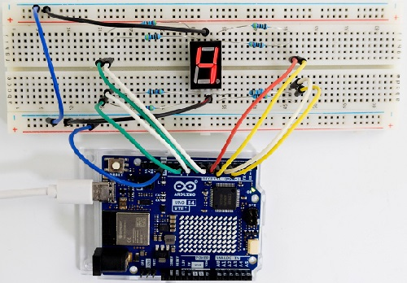


---

**7. Code Explanation**

Please refer to Project 05 and Project 06.

---

### Project 11 4-bit Digital Tube


---

**1. Overview**

4-bit Digital Tube is very practical for devices such as electronic clocks, score counters and counters of number. In this project, we use UNO R4 board to control it to display four digits 0000-9999.

---

**2. Component Knowledge**

For common cathode or anode, their working principle is similar to that of 1-bit Digital Tube. Yet there are four bits on this module, so 4 GPIO pins are required to light up one bit. The shift is too fast to be caught by human eyes, so it looks like the bits light up at the same time. 

In this experiment, we use <span style="color: rgb(255, 76, 0);">a common cathode four-bit digital tube</span>. 

Here are the pins, among which G1, G2, G3 and G4 are used to control bit.


Internal wiring schematic diagram:


---

**3. Components**

|  |||
| ------------------------ | ------------------------ | ---------------------------- |
|UNO R4 WiFi/Minima main board (either-or)| 4-bit Digital Tube x1 | 220Ω resistor x8 |
||||
|Breadboard x1 |Jump wires | USB cable x1 |

---

**4. Wiring Diagram**

**Schematic diagram:**


**Wiring diagram:**


---

**5. Test Code** 

```c++
/*
 * File name: 4-Digit_Digital_Tube
 * Function: 4-Digit_Digital_Tube shows number 0000-9999
 * Compiling IDE: ARDUINO 2.3.2
 * Author: https://www.keyestudio.com/
*/
int d_a = 6;   //Define digital tube a-segment to pin 6
int d_b = 7;
int d_c = 8;
int d_d = 9;
int d_e = 10;
int d_f = 11;
int d_g = 12;
int d_dp = 13;

int G1 = 2;   //Define digital tube the first group G1 to pin 2
int G2 = 3;
int G3 = 4;
int G4 = 5;

//the code number of digital tube 0-F
unsigned char num[17][8] =
{
 //a  b  c  d  e  f  g  dp 
  {1, 1, 1, 1, 1, 1, 0, 0},     //0
  {0, 1, 1, 0, 0, 0, 0, 0},     //1
  {1, 1, 0, 1, 1, 0, 1, 0},     //2
  {1, 1, 1, 1, 0, 0, 1, 0},     //3
  {0, 1, 1, 0, 0, 1, 1, 0},     //4
  {1, 0, 1, 1, 0, 1, 1, 0},     //5
  {1, 0, 1, 1, 1, 1, 1, 0},     //6
  {1, 1, 1, 0, 0, 0, 0, 0},     //7
  {1, 1, 1, 1, 1, 1, 1, 0},     //8
  {1, 1, 1, 1, 0, 1, 1, 0},     //9
  {1, 1, 1, 0, 1, 1, 1, 1},     //A
  {1, 1, 1, 1, 1, 1, 1, 1},     //B
  {1, 0, 0, 1, 1, 1, 0, 1},     //C
  {1, 1, 1, 1, 1, 1, 0, 1},     //D
  {1, 0, 0, 1, 1, 1, 1, 1},     //E
  {1, 0, 0, 0, 1, 1, 1, 1},     //F
  {0, 0, 0, 0, 0, 0, 0, 1},     //.
};

void setup(){
  pinMode(d_a,OUTPUT);    //Set pin d_a to output
  pinMode(d_b,OUTPUT);
  pinMode(d_c,OUTPUT);
  pinMode(d_d,OUTPUT);
  pinMode(d_e,OUTPUT);
  pinMode(d_f,OUTPUT);
  pinMode(d_g,OUTPUT);
  pinMode(d_dp,OUTPUT);

  pinMode(G1,OUTPUT);
  pinMode(G2,OUTPUT);
  pinMode(G3,OUTPUT);
  pinMode(G4,OUTPUT);
}

void loop(){
  //Start counting from 0, gradually increase by 1 to 9999, and repeat.
  for(int l = 0;l < 10;l++ )
  {
    for(int k = 0; k < 10;k++)
    {
      for(int j = 0; j < 10; j++)
      {
        for(int i = 0;i < 10;i++)
        {
          //125 flashes per second
          //1000/8=125
          for(int q = 0;q<125;q++)
          {
            Display(1,l);//The first digit tube displays the value of 1.
            delay(2);
            Display(2,k);
            delay(2);
            Display(3,j);
            delay(2);
            Display(4,i);
            delay(2);
          }

        }
      }
    }
  }
  

}

//Display function :g ranges from 1 to 4,num ranges from 0 to 9
void Display(unsigned char g,unsigned char n) 
{
  digitalWrite(d_a,LOW);      //
  digitalWrite(d_b,LOW);
  digitalWrite(d_c,LOW);
  digitalWrite(d_d,LOW);
  digitalWrite(d_e,LOW);
  digitalWrite(d_f,LOW);
  digitalWrite(d_g,LOW);
  digitalWrite(d_dp,LOW);

  switch(g)           //switch
  {
    case 1:
      digitalWrite(G1,LOW);   //choose the first bit
      digitalWrite(G2,HIGH);
      digitalWrite(G3,HIGH);
      digitalWrite(G4,HIGH);
      break;
    case 2:
      digitalWrite(G1,HIGH);
      digitalWrite(G2,LOW);   //choose the second bit
      digitalWrite(G3,HIGH);
      digitalWrite(G4,HIGH);
      break;
    case 3:
      digitalWrite(G1,HIGH);
      digitalWrite(G2,HIGH);
      digitalWrite(G3,LOW);   //choose the third bit
      digitalWrite(G4,HIGH);
      break;
    case 4:
      digitalWrite(G1,HIGH);
      digitalWrite(G2,HIGH);
      digitalWrite(G3,HIGH);
      digitalWrite(G4,LOW);   //choose the forth bit
      break;
    default:break;
  }

  digitalWrite(d_a,num[n][0]);      //a Queries the code value table
  digitalWrite(d_b,num[n][1]);
  digitalWrite(d_c,num[n][2]);
  digitalWrite(d_d,num[n][3]);
  digitalWrite(d_e,num[n][4]);
  digitalWrite(d_f,num[n][5]);
  digitalWrite(d_g,num[n][6]);
  digitalWrite(d_dp,num[n][7]);
}
```
---

**6. Test Result**

Click  to upload the code.

After uploading the code, unplug the USB cable and wire up. Connect the board to the computer with USB cable and the digital tube repeatedly shows four same number from 0000-9999.


---

**7. Code Explanation**

Please refer to Project 05 and Project 06.

---

### Project 12  74HC595N Control 7 LED

---

**1. Overview**

With only 22 IO ports on UNO R4 board, how do we light up a lot of LEDs? Sometimes it is possible to run out of pins on the board, so we need to extend them with the shift register. Therefore, 74HC595N chip can be used to control 8 outputs at once, taking up only a few pins on microcontroller. In addition, multiple registers can connects to each other for further output expansion. 

In this project, we will use UNO R4 board and 74HC595 chip to turn on/off 7 red LEDs.

---

**2. Component Knowledge**


**74HC595N chip:**

In simple terms, it comes with an 8-bit shift register and a memory with tristate output. 

The shift register and memory are synchronized to different clocks. Data is input on the rising edge of the shift register clock (SCK) and enters into the memory register on the rising edge of the memory register clock (RCK). 

If two clocks are connected, the shift register is always one pulse ahead of the memory register. The shift register boasts a serial shift input (SI) and a serial output (SQH) for concatenation. The 8-bit shift register can be reset asynchronously (low level reset), while the memory register boasts an 8-bit tristate parallel bus output. 

When the Output Enable (OE) is enabled (available at low), the pin (bus) output to 74HC595N is stored in the register.


**Pin-out:**


---

**3. Components**

|  ||  ||
| ------------------------ | ------------------------ | ---------------------------- |---------------------------- |
|UNO R4 WiFi/Minima main board (either-or)| 74HC595N chip x1 | Red LED x7 | 220Ω resistor x7 |
||||  |
|Breadboard x1 |Jump wires | USB cable x1 |  |

---

**4. Wiring Diagram**

**Schematic diagram:**


**Wiring diagram:**

<span style="color: rgb(255, 76, 65);">Note the orientation in which the 74HC595N chip is inserted.</span>


---

**5. Test Code** 

```c++
/*
 * File name: 74HC595N_control_7_LEDS
 * Function: 74HC595N_control_7_LEDS
 * Compiling IDE: ARDUINO 2.3.2
 * Author: https://www.keyestudio.com/
*/
int data = 4;// set 74hc595 pin 4 to data input pin SI 
int clock = 6;// set 74hc595 pin 6 to clock pin SCK
int latch = 5;// set 74hc595 pin 5 to output latch RCK
int ledState = 0;
const int ON = HIGH;
const int OFF = LOW;

void setup(){
  pinMode(data, OUTPUT);
  pinMode(clock, OUTPUT);
  pinMode(latch, OUTPUT);
}

void loop(){
  for(int i = 0; i < 256; i++){ //
    updateLEDs(i);
    delay(500);
  }
}

void updateLEDs(int value){
  digitalWrite(latch, LOW);//
  shiftOut(data, clock, MSBFIRST, ~value);// serial data output, high first
  digitalWrite(latch, HIGH);// latch
}
```

---

**6. Test Result**

Click  to upload the code.

After uploading the code, unplug the USB cable and wire up. Connect the board to the computer with USB cable and you can see the state (on/off) of 7 LEDs.


---

**7. Code Explanation**

Please refer to Project 05 and Project 06.

---

### Project 13 Buzzer Beep


---

**1. Overview**

Active buzzer is a sound component that is widely used as a sound component for computers, printers, alarms ,electronic toys and phones, timers etc. It comes with an internal vibration source, so it can continuously buzz after connecting to 5V power supply. 

In this project, we will use UNO R4 board to control the active buzzer to beep.

---

**2. Component Knowledge**


**(1) Active Buzzer** 

In the active buzzer, a simple oscillator circuit is integrated to convert constant direct current into pulse signals with a certain frequency. Once it receives a high level, it will emit sound. 

However, passive buzzer is without vibration source, so it must be driven by 2k ~ 5k square waves, rather than a DC signal. 

They are very similar in appearance, but the passive one buzzer is with a green circuit board, while the active one is with black tape. Passive buzzers are not polar, yet active ones are. 

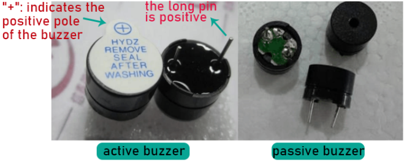

**(2) Transistor**

As buzzer requires large current but GPIO of UNO R4 output capability cannot meet this requirement, a NPN transistor is needed to amplify the current. 


Transistor is a semiconductor that controls current. It amplifies weak signals or works as a non-contact switch. 

According to structures, it can be divided into NPN and PNP. Both of them comes with three electrodes: base(B), collector(C) and emitter(E). The PN junction between E and B is also named “emitting junction”, and that between C and B is also called “collecting junction”. 

As shown below, the arrow points to the direction of current flow.


When there is current passing between "BE", "CE" will allow several-folded current pass (amplified by the transistor). At this point, transistor works in the amplifying area. When current between "BE" exceeds a certain value, "CE" will not allow current to increase any longer. Now the transistor works in the saturation area.

Here are the two types of transistor: PNP and NPN


<span style="color: rgb(255, 76, 65);">In this kit, we mark PNP transistor as 8550, and NPN as 8050.</span>

It is often used as a switch in digital circuits. As microcontroller's capacity to output current is very weak, transistor is a perfect choice to amplify current and drive large-current components. 

NPN transistor drives buzzer: If GPIO outputs high, current will flow through R1, the transistor will get conducted, and the buzzer will emit sound. If GPIO outputs low, no current flows through R1, so the transistor will not be conducted to enable buzzer to sound. 

PNP transistor drives buzzer: If GPIO outputs low, current will flow through R1, the transistor will get conducted, and the buzzer will emit sound. If GPIO outputs high, no current flows through R1, so the transistor will not be conducted to enable buzzer to sound. 


---

**3. Components**

|   ||||
| ------------------------ | ------------------------ | ---------------------------- |---------------------------- |
|UNO R4 WiFi/Minima main board (either-or)| NPN transistor (S8050) x1 | active buzzer x1 | 1kΩ resistor x1 |
|||||
|Breadboard x1 |Jump wires | USB cable x1 | 10kΩ resistor x1 |

---

**4. Wiring Diagram**

**Schematic diagram:**


**Wiring diagram:**


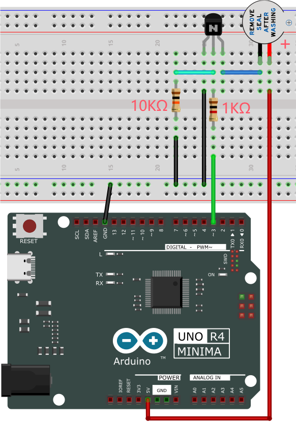

---

**5. Test Code** 

```c++
/*
 * File name: Active buzzer
 * Function: Active buzzer emit sound
 * Compiling IDE: ARDUINO 2.3.2
 * Author: https://www.keyestudio.com/
*/
int buzzer = 3;   //define buzzer pin to D3
void setup() {
  pinMode(buzzer, OUTPUT);    //set to output
}

void loop() {
  digitalWrite(buzzer, HIGH); //emit sound
  delay(1000);
  digitalWrite(buzzer, LOW);  //stop emitting sound
  delay(1000);
}
```
---

**6. Test Result**

Click  to upload the code. 

After uploading the code, unplug the USB cable and wire up. Connect the board to the computer with USB cable and the active buzzer in the circuit will beep.


---

**7. Code Explanation**

Please refer to Project 05.

---

### Project 14 Play Music


---

**1. Overview**

In a previous project, we studied an active buzzer, which can only make one single sound. Unlike it, passive buzzer can emit sounds of different frequencies. In this project, we will control a passive buzzer with UNO R4 board to play music. 

---

**2. Component Knowledge**

A passive buzzer is not integrated with internal vibration source. It must be driven by 2K-5K square waves, rather than DC signals. 


---

**3. Components**

|  ||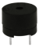||
| ------------------------ | ------------------------ | ---------------------------- |---------------------------- |
|UNO R4 WiFi/Minima main board (either-or)| NPN transistor (S8050) x1 | active buzzer x1 | 1kΩ resistor x1 |
|||| |
|Breadboard x1 |Jump wires | USB cable x1 | 10kΩ resistor x1 |

---

**4. Wiring Diagram**

**Schematic diagram:**


**Wiring diagram:**


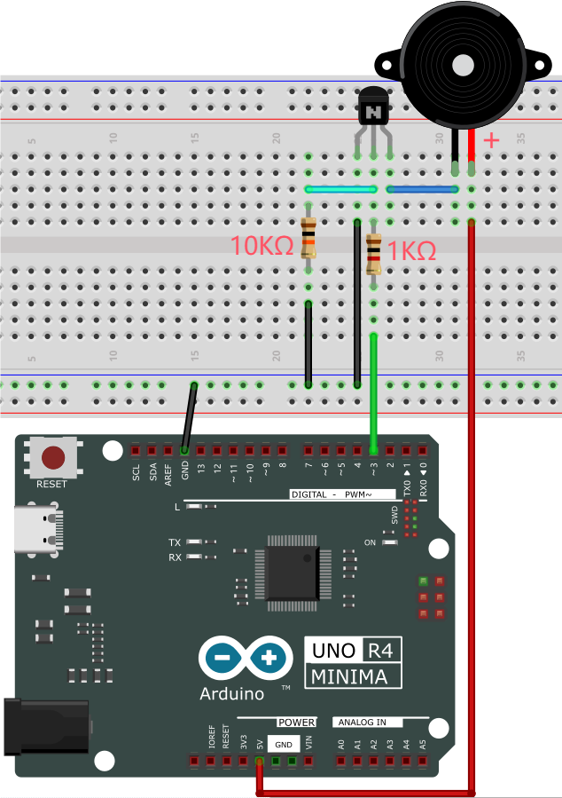

---

**5. Test Code** 

```c++
/*
 * File name: Passive Buzzer
 * Function: Passive Buzzer plays music
 * Compiling IDE: ARDUINO 2.3.2
 * Author: https://www.keyestudio.com/
*/
#define NOTE_B0  31
#define NOTE_C1  33
#define NOTE_CS1 35
#define NOTE_D1  37
#define NOTE_DS1 39
#define NOTE_E1  41
#define NOTE_F1  44
#define NOTE_FS1 46
#define NOTE_G1  49
#define NOTE_GS1 52
#define NOTE_A1  55
#define NOTE_AS1 58
#define NOTE_B1  62
#define NOTE_C2  65
#define NOTE_CS2 69
#define NOTE_D2  73
#define NOTE_DS2 78
#define NOTE_E2  82
#define NOTE_F2  87
#define NOTE_FS2 93
#define NOTE_G2  98
#define NOTE_GS2 104
#define NOTE_A2  110
#define NOTE_AS2 117
#define NOTE_B2  123
#define NOTE_C3  131
#define NOTE_CS3 139
#define NOTE_D3  147
#define NOTE_DS3 156
#define NOTE_E3  165
#define NOTE_F3  175
#define NOTE_FS3 185
#define NOTE_G3  196
#define NOTE_GS3 208
#define NOTE_A3  220
#define NOTE_AS3 233
#define NOTE_B3  247
#define NOTE_C4  262
#define NOTE_CS4 277
#define NOTE_D4  294
#define NOTE_DS4 311
#define NOTE_E4  330
#define NOTE_F4  349
#define NOTE_FS4 370
#define NOTE_G4  392
#define NOTE_GS4 415
#define NOTE_A4  440
#define NOTE_AS4 466
#define NOTE_B4  494
#define NOTE_C5  523
#define NOTE_CS5 554
#define NOTE_D5  587
#define NOTE_DS5 622
#define NOTE_E5  659
#define NOTE_F5  698
#define NOTE_FS5 740
#define NOTE_G5  784
#define NOTE_GS5 831
#define NOTE_A5  880
#define NOTE_AS5 932
#define NOTE_B5  988
#define NOTE_C6  1047
#define NOTE_CS6 1109
#define NOTE_D6  1175
#define NOTE_DS6 1245
#define NOTE_E6  1319
#define NOTE_F6  1397
#define NOTE_FS6 1480
#define NOTE_G6  1568
#define NOTE_GS6 1661
#define NOTE_A6  1760
#define NOTE_AS6 1865
#define NOTE_B6  1976
#define NOTE_C7  2093
#define NOTE_CS7 2217
#define NOTE_D7  2349
#define NOTE_DS7 2489
#define NOTE_E7  2637
#define NOTE_F7  2794
#define NOTE_FS7 2960
#define NOTE_G7  3136
#define NOTE_GS7 3322
#define NOTE_A7  3520
#define NOTE_AS7 3729
#define NOTE_B7  3951
#define NOTE_C8  4186
#define NOTE_CS8 4435
#define NOTE_D8  4699
#define NOTE_DS8 4978
#define REST 0
int tempo=114;   // Change this to make the song slower or faster
int buzzer = 3;  // control pin D3, You can change this to any pin you want to use
// The notes of the piece are followed by the duration.
// A 4 means a quarter note, 8 means a eighteenth note, 16 means a sixteenth note, and so on
// !!!!! Negative numbers are used to indicate dotted comments
// So -4 means a dotted quarter note, that is, a quarter plus an eighteenth
int melody[] = {
  NOTE_E4,4,  NOTE_E4,4,  NOTE_F4,4,  NOTE_G4,4,//1
  NOTE_G4,4,  NOTE_F4,4,  NOTE_E4,4,  NOTE_D4,4,
  NOTE_C4,4,  NOTE_C4,4,  NOTE_D4,4,  NOTE_E4,4,
  NOTE_E4,-4, NOTE_D4,8,  NOTE_D4,2,
  NOTE_E4,4,  NOTE_E4,4,  NOTE_F4,4,  NOTE_G4,4,//4
  NOTE_G4,4,  NOTE_F4,4,  NOTE_E4,4,  NOTE_D4,4,
  NOTE_C4,4,  NOTE_C4,4,  NOTE_D4,4,  NOTE_E4,4,
  NOTE_D4,-4,  NOTE_C4,8,  NOTE_C4,2,
  NOTE_D4,4,  NOTE_D4,4,  NOTE_E4,4,  NOTE_C4,4,//8
  NOTE_D4,4,  NOTE_E4,8,  NOTE_F4,8,  NOTE_E4,4, NOTE_C4,4,
  NOTE_D4,4,  NOTE_E4,8,  NOTE_F4,8,  NOTE_E4,4, NOTE_D4,4,
  NOTE_C4,4,  NOTE_D4,4,  NOTE_G3,2,
  NOTE_E4,4,  NOTE_E4,4,  NOTE_F4,4,  NOTE_G4,4,//12
  NOTE_G4,4,  NOTE_F4,4,  NOTE_E4,4,  NOTE_D4,4,
  NOTE_C4,4,  NOTE_C4,4,  NOTE_D4,4,  NOTE_E4,4,
  NOTE_D4,-4,  NOTE_C4,8,  NOTE_C4,2
};
// Given type of the number of bytes, each int value consists of two bytes (16 bits)
// Each note has two values (pitch and duration), so each note has four bytes
int notes=sizeof(melody)/sizeof(melody[0])/2; 
// This calculates the duration of the entire note in ms (60s/ beat)*4 beats
int wholenote = (60000 * 4) / tempo;
int divider = 0, noteDuration = 0;
void setup() {
  // Repeat melodic notes
  // Remember, the array is twice the number of notes (note + duration)
  for (int thisNote = 0; thisNote < notes * 2; thisNote = thisNote + 2) {
    // Calculate the duration of each sound
    divider = melody[thisNote + 1];
    if (divider > 0) {
    noteDuration = (wholenote) / divider; // General tips. Continue
    } else if (divider < 0) {
      // Dashed comments have a negative duration
      noteDuration = (wholenote) / abs(divider);
      noteDuration *= 1.5; // Increase the duration of the dotted note by half
    }
    // Only play the note 90% of the time, leaving 10% as a pause
    tone(buzzer, melody[thisNote], noteDuration*0.9);
  // Wait a certain amount of time before playing the next note.
    delay(noteDuration);
    noTone(buzzer);  // The next statement before the next syllable stops before the waveform is produced.
  }
}
void loop() {
// If you want to repeat this song forever, copy and paste the code in setup() here.
}
```
---

**6. Test Result**

Click  to upload code. 

After uploading the code, unplug the USB cable and wire up. Connect the board to the computer with USB cable and the passive buzzer in the circuit plays music.


---

**7. Code Explanation**

Please refer to Project 05.

---

### Project 15 Small Fan


---

**1. Overview**

In hot summer, we need electric fans to cool us down, so in this project, we control 130 motor with transistor and UNO R4 board to rotate the fan. 

---

**2. Component Knowledge**

**(1) DC Motor**

A DC motor converts electrical energy into mechanical one. The motor consists of a stator and a rotor. When working, the fixed part is the stator while the rotating part is the rotor. 

Generally, the stator is its shell whose terminal connects to the power supply. The rotor is usually the shaft  that drives other mechanical devices. 

Below is a small DC motor with two pins.


After powering on, it will rotate in one direction. Reverse the polarity of the power supply, and it rotates in the opposite direction.


**(2) Parameters**

Operating voltage: DC 4.5V~6V 

---

**3. Components**

|  ||||
| ------------------------ | ------------------------ | ---------------------------- |---------------------------- |
|UNO R4 WiFi/Minima main board (either-or)| S8050 transistor x1 |S8550 transistor x1 |1kΩ resistor x2|
| | |||
| DC motor x1 |Breadboard x1 |Jump wires | USB cable x1 |
|||||
|Fan x1|Battery holder x1|1.5V AA battery (<span style="color: rgb(255, 76, 65);">Provide for yourself</span>) x6| 10kΩ resistor x1 |
| |   |   |   |
|Diode x1|   |   |   |

<span style="color: rgb(255, 76, 65);">**Please mount the fan to motor first.**</span>

---

**4. Experiment 1**

<span style="color: rgb(255, 76, 65);">S8050 NPN transistor controls motor.</span>

**(1) Schematic Diagram**


**(2) Wiring Diagram**


**(3) Test Code**

```c++
/*
 * File name: Small_Fan1
 * Function: Small_Fan rotates 1
 * Compiling IDE: ARDUINO 2.3.2
 * Author: https://www.keyestudio.com/
*/
void setup() {
  // initialize digital pin 9 to output
  pinMode(9, OUTPUT);
}

void loop() {
  digitalWrite(9, HIGH);   // turn on motor (HIGH)
  delay(4000);              // delay 4s
  digitalWrite(9, LOW);    // Reduce the voltage and turn off the motor
  delay(3000);              // delay 3s
}
```
**(4) Test Result**

**Please do not hold the fan blade with your hands. Keep it facing an open place to avoid injury.**

<span style="color: rgb(255, 76, 65);">ATTENTION:</span> The fan requires a larger current than other sensors when it is rotating, thus voltage and current fluctuations may appear, especially when changing direction. This will greatly reduce the voltage and current of the main board, resulting in a reset.

Mount the fan to the DC motor. Click  to upload code. 

After uploading the code, unplug the USB cable and wire up. Connect the board to the computer with USB cable and the fan rotates clockwise for 4 seconds and stops for 3 seconds. It repeats these actions.


---

**5. Experiment 2**

<span style="color: rgb(255, 76, 65);">S8550 PNP transistor controls motor.</span>

**(1) Schematic Diagram**


**(2) Wiring Diagram**


**(3) Test Code**

```c++
/*
 * File name: Small_Fan2
 * Function: Small_Fan rotates 2
 * Compiling IDE: ARDUINO 2.3.2
 * Author: https://www.keyestudio.com/
*/
void setup() {
  // Initialize digital pin 9 to output
  pinMode(9, OUTPUT);
}

void loop() {
  digitalWrite(9, LOW);   // turn on motor (LOW)
  delay(4000);              // Delay 4s
  digitalWrite(9, HIGH);    // Turn the voltage up and turn off the motor
  delay(3000);              // Delay 3s
}
```
**(4) Test Result**

**Please do not hold the fan blade with your hands. Keep it facing an open place to avoid injury.**

<span style="color: rgb(255, 76, 65);">ATTENTION:</span> The fan requires a larger current than other sensors when it is rotating, thus voltage and current fluctuations may appear, especially when changing direction. This will greatly reduce the voltage and current of the main board, resulting in a reset.

Mount the fan to the DC motor. Click  to upload code. 

After uploading the code, unplug the USB cable and wire up. Connect the board to the computer with USB cable and the fan rotates counterclockwise for 4 seconds (in the opposite direction) and stops for 3 seconds. It repeats these actions.

---

**6. Code Explanation**

Please refer to Project 05.

---

### Project 16 Servo Rotation


---

**1. Overview**

In this project, we control the servo to rotate to certain angles through UNO R4 board. 

---

**2. Parameters**

- Operating voltage: DC 3.3V~5V 

- Operating temperature: -10°C ~ +50°C

- Dimensions: 32.25mm x 12.25mm x 30.42mm

- Interface: 3pin interface spacing 2.54mm


---

**3. Working Principle**

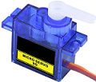

Servo is a kind of position driver, which is mainly composed of housing, DC motor, circuit board, variable gear group with torque, a potentiometer and a control board.


The angle range of most servos is 180 degrees. 

As the output torque of the servos is higher than that of DC motors, so they are widely used to control model of cars, planes and robots. 

Generally, servo comes with three wires, two of which are used for the power positive (2-positive wire, red) and negative (3-negative wire, brown). The remaining one is for signal (1-signal wire, orange). 


We drive the servo via PWM signals, whose duty cycle is fixed and frequency is 50Hz. In a single PWM cycle, the high level duration is 0.5ms ~ 2.5ms, which corresponds linearly to 0° ~ 180° of the servo. Some corresponding values are as follows:


Change the signal value of the servo and it will rotate to the specified angle. The angle may vary from servos of different brands after receiving the same signal.

---

**4. Components**

|  || ||
| ------------------------ | ------------------- | --------------------- | --------------------- |
| UNO R4 WiFi/Minima main board (either-or) | Servo x1 | Jump wires | USB cable x1 |

---

**5. Experiment 1**

**(1) Schematic Diagram**


**(2) Wiring Diagram**


**(3) Test Code**

```c++
/*
 * File name: Servo_1
 * Function: servo rotates to angle 0 -> 90 -> 180 repeatedly
 * Compiling IDE: ARDUINO 2.3.2
 * Author: https://www.keyestudio.com/
*/
#include <Servo.h>

Servo myservo;  //create a servo object to control servo

int servoPin = 3;  // define servo pin to 3

void setup() {
  myservo.attach(servoPin);  //choose servo pin 3
}

void loop() {
  myservo.write(0); //rotate to 0 degree
  delay(1000); //delay 1s
  myservo.write(90); //rotate to 90 degree
  delay(1000); //delay 1s
  myservo.write(180); //rotate to 180 degree
  delay(1000); //delay 1s
}
```

**(4) Test Result**

Click  to upload code. If “**Servo.h: No such file or directory**”, please import library first. Check [How to import Arduino library](https://docs.keyestudio.com/projects/KS0590-KS0594/en/latest/docs/Arduino_C_Tutorial.html#import-arduino-library).

After uploading the code, unplug the USB cable and wire up. Connect the board to the computer with USB cable and the servo rotates from 0 degree to 90 degree and then to 180 degree, with a pause of 1 second at each position. Then it backs to 0 degree. These actions repeat.


---

**6. Experiment 2**

**(1) Wiring Diagram**


**(2) Test Code**

```c++
/*
 * File name: Servo_2
 * Function: Control servo for sweeping
 * Compiling IDE: ARDUINO 2.3.2
 * Author: https://www.keyestudio.com/
*/
#include <Servo.h>

Servo myservo;  //create a servo object to control servo

int posVal = 0;    // define a variable to store the position of the servo
int servoPin = 3;  // define servp pin to 3

void setup() {
  myservo.attach(servoPin);  //choose servo pin 3
}

void loop() {
  
  for (posVal = 0; posVal <= 180; posVal += 1) { // Attach the servo on the servoPin to the servo object
    // set step to 1 degree
    myservo.write(posVal);       // Tell the servo to the position of the variable "pos"
    delay(15);                   // Wait 15ms for the servo to arrive
  }
  for (posVal = 180; posVal >= 0; posVal -= 1) { // from 180° to 0°
    myservo.write(posVal);       // Tell the servo to the position of the variable "pos"
    delay(15);                   // Wait 15ms for the servo to arrive
  }
}
```

**(3) Test Result**

<span style="color: rgb(255, 169, 0);">If you have not loaded “**Servo.h**” library, please refer to Experiment 1 to import “**Servo.h**” first.</span>

Click  to upload code. 

After uploading the code, unplug the USB cable and wire up. Connect the board to the computer with USB cable and the servo rotates forwards and backwards within 0 to 180 degree. It moves one degree every 15ms.


---

**7. Code Explanation**

| Code                           | Explanation                                              |
| ----------------------------------- | ------------------------------------------------------------ |
|#include <Servo.h>             | Arduino servo library |
| Servo myservo                       | create a servo object to control the servo |
| myservo.attach(servoPin) | set the servo control pin |
| myservo.write(posVal)               | write a value to contrl the servo shaft and angle. Servo rotates to angle of posVal. |

---

### Project 17 Stepper Motor


---

**1. Overview**

Stepper motor is the most important part of mechanical equipment with accurate positioning such as industrial robots, 3D printer and lathes. In this project, we will control ULN2003 stepper motor to rotate with UNO R4 board.

---

**2. Component Knowledge**


**(1) Stepper Motor** 

It is a motor controlled by a series of electromagnetic coils. It can rotate by the exact number of degrees (or steps) needed, allowing you to move it to a precise position and keep it there. It does this by supplying power to the coil inside the motor in a very short time, but you must always supply power to the motor to keep it in the position you want. There are two basic types of stepping motors, namely uni-polar stepping motor and bipolar stepping motor. In this project, we use a 28-BYJ48 uni-polar stepper motor.


**(2) Working Principle of 28BYJ-48 Stepper Motor**

The stepper motor is mainly composed of a stator and a rotor. The stator is fixed. As shown in the figure below, the part of the coil group A, B, C, and D will generate a magnetic field when the coil group is energized. The rotor is the rotating part. As follows, the middle part of the stator, two poles are permanent magnets.


Single -phase four beat: At the beginning, the coils of group A are turned on, and the poles of the rotor point at A coil. Next, the group A coil are disconnected, and the group B coils are turned on. The rotor will turn clockwise to the group B. Then, group B is disconnected, group C is turned on, and the rotor is turned to group C. After that, group C is disconnected, and group D is turned on, and the rotor is turned to group D. Finally, group D is disconnected, group A is turned on, and the rotor is turned to group A coils. Therefore, rotor turns 180° and continuously rotates B-C-D-A, which means it runs a circle (eight phase). As shown below, he rotation principle of stepper motor is A - B - C - D - A.

You make order inverse(D - C - B - A - D .....) if you want to make stepper motor rotate anticlockwise.


Half-phase and eight beat: 8 beat adopts single and dual beat way，A - AB - B - BC - C - CD - D - DA - A ......，rotor will rotate half phase in this order. For example, when A coil is electrified, rotor faces to A coil, then A and B coil are connected, on this condition, the strongest magnetic field produced lies in the central part of AB coil, which means rotating half-phase clockwise.

**(3) Parameters**

The rotor rotates one circle when the stepper motor we provide rotates 32 phases and with the output shaft driven by 1:64 reduction geared set. Therefore the rotation (a circle) of output shaft requires  32 * 64 = 2048 phases.

The step angle of 4-beat mode of 5V and 4-phase stepper motor is 11.25. And the step angle of 8-beat mode is 5.625, the reduction ratio is 1:64.

**(4) Drive Board for ULN2003 Stepper Motor**

Stepper motor driver converts the weak signal into a stronger control signal to drive the stepper motor. 

The following schematic diagram shows how to use the ULN2003 stepper motor driver board interface to connect a unipolar stepper motor to the pins of the UNO R4, and shows how to use four TIP120 interfaces.


---

**3. Components**

|  |||
| ------------------------ | ------------------------ | ---------------------------- |
|UNO R4 WiFi/Minima main board (either-or)| ULN2003 stepper motor drive board x1 | Stepper motor x1 |
||||
|Battery holder x1|Breadboard x1 |Jump wires | 
||||
|DuPont wires|1.5V AA battery (<span style="color: rgb(255, 76, 65);">Provide for yourself</span>) x6|USB cable x1 |

---

**4. Wiring Diagram**

**Schematic diagram:**


**Wiring diagram:**


---

**5. Test Code** 

```c++
/*
 * File name: Stepper_Motor
 * Function: Stepper_Motor rotates
 * Compiling IDE: ARDUINO 2.3.2
 * Author: https://www.keyestudio.com/
*/
// Connect the digital port of the stepper motor drive board
int outPorts[] = {8, 9, 10, 11};

void setup() {
  // Set the pin of the stepper motor drive board to output mode
  for (int i = 0; i < 4; i++) {
    pinMode(outPorts[i], OUTPUT);
  }
}

void loop(){
  // The stepper motor rotates one cycle
  moveSteps(true, 32 * 64, 3);
  delay(1000);
  // rotate one cycle in the other direction
  moveSteps(false, 32 * 64, 3);
  delay(1000);
}

//Recommendation: When the motor rotates accurately, the millisecond range is 3 to 20
void moveSteps(bool dir, int steps, byte ms) {
  for (unsigned long i = 0; i < steps; i++) {
    moveOneStep(dir); // rotate one step
    delay(constrain(ms,3,20)); // control the speed
  }
}

void moveOneStep(bool dir) {
  // Define a variable that uses four lows to represent the state of the port
  static byte out = 0x01;
  // Determine the shift direction according to the direction of rotation
  if (dir) {  // Loop shift left
    out != 0x08 ? out = out << 1 : out = 0x01;
  }
  else {   // Loop shift right
    out != 0x01 ? out = out >> 1 : out = 0x08;
  }
  // Output signals to each port
  for (int i = 0; i < 4; i++) {
    digitalWrite(outPorts[i], (out & (0x01 << i)) ? HIGH : LOW);
  }
}

void moveAround(bool dir, int turns, byte ms){
  for(int i=0;i<turns;i++)
    moveSteps(dir,32*64,ms);
}
void moveAngle(bool dir, int angle, byte ms){
  moveSteps(dir,(angle*32*64/360),ms);
}
```
---

**6. Test Result**

Click  to upload code. 

After uploading the code, unplug the USB cable and wire up. Connect the board to the computer with USB cable. Power the UNO R4 main control board with external power supply, and the stepper motor starts to rotate.


---

**7. Code Explanation**

Please refer to Project 05.

---

### Project 18 Buttons


---

**1. Overview**

Button controls the ON/OFF state of a circuit, such as the start-up of electrical devices, light colors and sound volume.

---

**2. Component Knowledge**

If a button is connect to a circuit, the circuit is opened when the button is not pressed. Press the button to close the circuit. Before pressing it, current in the circuit is blocked on one side. It is the metal sheet in the button that becomes a bridge for the current to flow over the circuit. 


Button structure: 

- Not pressed: 1 and 2 are connected, 3 and 4 are connected, yet 1/2 and 3/4 sides are disconnected.
- Pressed: all are connected.

Button circuit symbol: 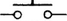

Button changes the high/low power levels. Here are three commonly seen circuits:

**A. Circuit with pull-up resistor**  


If the button is released, digital pin 7 will be connected to 5V power through resistor to output high, so digitalRead(7) function returns 1.

If the button is pressed, digital pin 7 is connected to GND to output low, so digitalRead(7) function returns 0. 

Therefore, the 10 KΩ resistor in the circuit is called pull-up resistor.

**B. Circuit with pull-down resistor**


If the button is released, digital pin 7 will be connected to GND to output low, so digitalRead(7) function returns 0.

If the button is pressed, digital pin 7 is connected to 5V power through resistor to output low, so digitalRead(7) function returns 1. 

Therefore, the 10 KΩ resistor in the circuit is called pull-down resistor.

If the digital pin is set to INPUT mode, the following wiring methods are both wrong:


When the button is not pressed, in the left wiring, the digital pin 7 connects to neither power nor ground. This is called suspension, and digitalRead() returns an unsure value, including HIGH or LOW.

When the button is pressed, in the right wiring, the power is directly connect to ground, forming a short sircuit.

Therefore, at INPUT mode, a pull-up/down resistor is essential in a circuit, usually a 10 KΩ resistor. 

**C. Internal pull-up circuit**  

Except those, ATmega328 controller integrates a pull-up resistor of 20KΩ. We can set mode of pinMode() function to INPUT_PULLUP to enable the internal pull up resistor.

After that, an external resistor can be omitted. Here is the internal pull-up circuit diagram:


When the button is not pressed, digitalRead() returns 1. Otherwise it returns 0. In this condition, one terminal of the button is connected to the digital pin, while the other is linked to GND.

<span style="color: rgb(255, 76, 65);">**In this project, we adopt the internal pull-up circuit.**</span>

---

**3. Components**

|  |||
| ------------------------ | ------------------------ | ---------------------------- |
| UNO R4 WiFi/Minima main board (either-or) | button x1 | 10kΩ resistor x1 |
||||
|Breadboard x1 |Jump wires | USB cable x1 |

---

**4. Wiring Diagram** 

**Schematic diagram:**


**Wiring diagram:**


---

**5. Test Code**

```c++
/*
 * File name: button
 * Function: read button value
 * Compiling IDE: ARDUINO 2.3.2
 * Author: https://www.keyestudio.com/
*/
int val = 0;            //initialize a variable to store the button value
int button = 7;         //set button pin to D7

void setup() {
  Serial.begin(9600);      //start serial monitor and set baud rate to 9600
  pinMode(button, INPUT);  //set button pin to input
}

void loop() {
  val = digitalRead(button);  //read button value and assign it to val
  Serial.print(val);          //print val
  if (val == 0) {             //press the button to read low, and print related messages
    Serial.print("    ");  
    Serial.println("Press the botton"); 
    delay(100);
  }
  else {               //release the button
    Serial.print("    ");
    Serial.println("Loose the botton");
    delay(100);
  }
}
```
---

**6. Test Result**

Click  to upload code. After uploading the code, unplug the USB cable and wire up. Connect the board to the computer with USB cable and open serial monitor to set baud rate to **<u>9600</u>**.

press the button, value = 0, and serial monitor prints “**0     Press the button**”; 

Release the button, value = 1, and serial monitor prints “**1   Loose the botton**”.


---

**7. Code Explanation**

| Code              | Explanation                                              |
| ---------------------- | ------------------------------------------------------------ |
| pinMode(button, INPUT) | “ int button = 7; ”: button pin is D7<br />“INPUT”: set the pin to input mode<br />When pinMode() is INPUT, a pull-up/down resistor should be required. Here we use the internal resistor R1, which will control the pin to a certain state after the button is opened. Usually it is 4.7K/10K ohm, as it is low enough to prevent input suspension. This resistance also consumes little current. |
| if( ){ } else{ }       | If condition in () is true, execute codes in if { }. If it is false, run codes in else { }. |
| digitalRead(button)    | Read the digital power level of the button: HIGH or LOW. If the pin connects to nothing, digitalRead( ) outputs either HIGH or LOW. |
| Serial.begin(9600)     | Initialize serial monitor and set baud rate to 9600. |
|Serial.println(" ")|serial monitor wraps to print the messages.|
|Serial.print(" ")|serial monitor prints the messages without wrapping.|

---

### Project 19 Tilt Switch


---

**1. Overview**

There is a ball inside the tilt switch. It can output different power levels according to its tilt states, and is widely used to detect tilt and make alarms.

---

**2. Component Knowledge**


Tilt switch is also called digital switch. Inside is a metal ball that can roll. The principle of rolling the metal ball to contact with the conductive plate at the bottom, which is used to control the on and off of the circuit. 

When it is a rolling ball tilt sensing switch with single directional trigger, the tilt sensor is tilted toward the trigger end (two gold-plated pin ends), the tilt switch is in a closed circuit and the voltage at the analog port is about 5V (high level 1023). In this way, the LED will light up. 

When the switch is in horizontal position or tilting to the other end, the tilting switch is in open state the voltage of the analog port is about 0V (low level 0), and the LED will turn off. 

In the program, we judge the state of the switch based on the voltage value of the digital port. Here is the internal structure of a tilt switch: 


---

**3. Components**

|  |||
| ------------------------ | ------------------------ | ---------------------------- |
| UNO R4 WiFi/Minima main board (either-or) | tilt switch x1 | 10kΩ resistor x1 |
||||
|Breadboard x1 |Jump wires | USB cable x1 |
---

**4. Wiring Diagram**

**Schematic diagram:**


**Wiring diagram:**


---

**5. Test Code** 

```c++
/*
 * File name: Tilt_Switch
 * Function: read the value of Tilt_Switch
 * Compiling IDE: ARDUINO 2.3.2
 * Author: https://www.keyestudio.com/
*/
int SWITCH_PIN = 7; // connect the tilt switch to pin D7
int val = 0;       //store the value of the tilt switch

void setup(){
  Serial.begin(9600); //start the serial monitor and set baud rate to 9600
  pinMode(SWITCH_PIN, INPUT); //set the sensor to input
} 

void loop(){
  val = digitalRead(SWITCH_PIN); //read sensor value and assign it to val
  Serial.print(val);  //print val
  if (val == 1) { //read high and print related messages
    Serial.print("    ");  
    Serial.println("Tilt"); 
    delay(100); 
  }
  else {               //when it is not tilt, read low
    Serial.print("    ");
    Serial.println("No tilt");
    delay(100);
  }
}
```
---

**6. Test Result**

Click  to upload code. After uploading the code, unplug the USB cable and wire up. Connect the board to the computer with USB cable and open serial monitor to set the baud rate to **<u>9600</u>**.

When the module tilts to a certain angle, value = 1, and serial monitor shows “**1  Tilt**”. Or else, value = 0 and serial monitor displays “**0  No tilt**”.


---

**7. Code Explanation**

Please refer to Project 18.

---

### Project 20 Human Nearby or Not


---

**1. Overview**

In this project, we use a PIR motion sensor to detect the surrounding movement. This sensor mainly adopts an RE200B-P sensing component, which detects infrared ray from human or animals. The detection range will be much wider with Fresnel lens. We display the test result on the serial monitor by reading the power level of terminal S.

---

**2. Parameters**

- Operating voltage: DC 3.3V~5V 

- Operating current: 3.6mA

- Maximum power: 0.018W

- Static current: <50 uA

- Output signal: digital signal

- Trigger mode: L Non-repeatable trigger /H repeatable trigger

- Field of view: Y = 90°, X = 110° (theoretical values)

- Maximum detection distance: ≤5 meters

- Operating temperature: -10°C ~ +50°C

- Dimensions: 32mm x 23.8mm x 7.4mm

- Interface: 3pin anti-reverse interface spacing 2.54mm


---

**3. Schematic Diagram**


First, the 5V input voltage is converted into a 3.3V input voltage, as the sensor cannot be directly connect to 5V. With this voltage conversion, both 3.3V and 5V input are compatible with this sensor.

When it detects no infrared signals, sensor pin 1 outputs low. There will be a voltage difference between the two ends of LED, so current passes to light LED up; MOS tube Q1 is conducted (Q1 is NPN MOS tube in the model of 2N7002. Pin 1 outputs low, so Q1 source electrode Vs = 0, while Q1 grid electrode Vg = 3.3V, so voltage difference Vgs = 3.3V is greater than Q1 threshold voltage 2.5V. Q1 is conducted). Signal terminal S detects low.

When an infrared signal is detected, pin 1 outputs high and the LED goes off. MOS tube Q1 is not conducted, so the signal terminal S detects a high level pulled up by the 10K resistor. 

---

**4. Components**

|  ||||
| ------------------------ | ------------------------ | ---------------------------- |---------------------------- |
| UNO R4 WiFi/Minima main board (either-or) | PIR motion sensor x1 |DuPont wires | USB cable x1 |

---

**5. Wiring Diagram**

**Schematic diagram:**


**Wiring diagram:**


---

**6. Test Code**

```c++
/*
 * File name: PIR motion
 * Function: read PIR motion sensor value
 * Compiling IDE: ARDUINO 2.3.2
 * Author: https://www.keyestudio.com/
*/
int val = 0;
int pirPin = 3;   //define PIR motion sensor pin to D3
void setup() {
  Serial.begin(9600);   //baud rate to 9600
  pinMode(pirPin, INPUT);    //set sensor to input
}

void loop() {
  val = digitalRead(pirPin);    //read sensr value
  Serial.print(val);    //print sensor value
  if (val == 1) {    //if someone moves around, output high
    Serial.print("        ");
    Serial.println("Some body is in this area!");
    delay(100);
  }
  else {    //if not, output low
    Serial.print("        ");
    Serial.println("No one!");
    delay(100);
  }
}
```
---

**7. Test Result**

Click  to upload code. After uploading the code, unplug the USB cable and wire up. Connect the board to the computer with USB cable and open serial monitor to set the baud rate to **<u>9600</u>**.

If a human motion is detected by the sensor, value = 1 and LED goes off; serial monitor shows “**1   Somebody is in this area!**”. If there is no human nearby, value = 0 and LED lights up; serial monitor prints “**0   No one!**”.


---

**8. Code Explanation**

Please refer to Project 18.

---

### Project 21 Potentiometer Value


---

**1. Overview**

Potentiometer is an analog sensor. The middle value of, for example, 0~5V, cannot be read by digital IO ports so they only output high(5V) and low(0). Yet, analog sensors are able to read them to output analog values within a range.

---

**2. Component Knowledge**

**(1) Potentiometer Working Principle**


The brush slides on the resistor and obtains the output voltage in a certain relationship with the input voltage in the circuit. 

The potentiometer uses a 10K adjustable resistor. By rotating the handle, we can change the resistance, so the signal S detects a voltage change (0~5V). This change is a continuously analog value within 0~5V. 

However, we must first perform ADC acquisition on this analog value for measurement (it converts Analog to Digital, short for ADC). The board has integrated ADC acquisition so can be used directly.

The board default resolution is 10 bits, which means the ADC bits are also 10. An n-bit ADC means that the ADC has a total of 2^n scales. 10-bit ADC outputs a total of 1024 digital values from 0 to 1023, that is, 2^10 scales, with each scale 5V/1024 ≈ 0.0049V. This is also called resolution.

**(2) ADC**

An ADC is an electronic integrated circuit used to convert analog signals such as voltages to digital or binary form consisting of 1s and 0s. The range of our ADC on the board is 10 bits (The bits of an ADC represent the number of bits of binary used to convert an analog value to a digital one), whose range of numbers that can be stored is 0 ~ 2^10 (i.e. 0 ~ 1023).

For instance, reference voltage is 5V, so the minimum resolution is 5V/1024. 

The rage of analog values correspond to ADC values. So the more bits the ADC has, the denser the partition of analog will be and the greater the precision of the resulting conversion will be.


Ordinate number 0: analog within 0V ~ 5.0/1024 V (abscissa);

Ordinate number 1: analog within 5.0/1024 V ~ 2 * 5.0/1024 V (abscissa);

......

The following analog will be divided accordingly. The conversion formula is as follows:

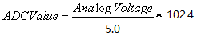

**(3) DAC**

The reversing of this process requires a DAC, Digital-to-Analog Converter. The digital I/O ports can output high and low level (0 or 1), rather than intermediate voltage values. This is where a DAC works. 

The board boasts DAC with 8-bit accuracy, which can divide VCC (here is 5.0V) into 2^8=256 parts. For example, when the digital value is 1, the output voltage value is 5.0V/256 * 1=0.0195V; when it is 128, the output voltage value is 5.0V/256 * 128=2.5V. The higher the accuracy of DAC is, the higher the that of output voltage will be.

The conversion formula is as follows: 

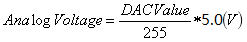

---

**3. Components**

|  |||
| ------------------------ | ------------------------ | ---------------------------- |
| UNO R4 WiFi/Minima main board (either-or) | potentiometer x1 |Breadboard x1 |
|||  |
|Jump wires | USB cable x1 |  |

---

**4. Wiring Diagram**

**Schematic diagram:**


**Wiring diagram:**


---

**5. Test Code** 

```c++
/*  
 * File name: Potentiometer
 * Function: read the Potentiometer value
 * Compiling IDE: ARDUINO 2.3.2
 * Author: https://www.keyestudio.com/
*/
int PIN_ANALOG_IN = A0;   //define Potentiometer pin to A0

void setup() {
  Serial.begin(9600);   //set baud rate to 9600
  pinMode(PIN_ANALOG_IN, INPUT);    //set Potentiometer pin to input
}

void loop() {
  int adcVal = analogRead(PIN_ANALOG_IN);    //read analog signal of Potentiometer
  int dacVal = map(adcVal, 0, 1023, 0, 255);
  double voltage = adcVal / 1023.0 * 5.0;
  Serial.print("ADC Val: ");    //Print string ADC Val:
  Serial.print(adcVal);    //Print adcVal
  Serial.print(" |DAC Val: ");    //Print string   DAC Val:  
  Serial.print(adcVal);    //Print adcVal
  Serial.print(" |Voltage: ");    //Print string   Voltage:  
  Serial.println(voltage);    //Print voltage
  delay(200);
}
```
---

**6. Test Result**

Click  to upload code. After uploading the code, unplug the USB cable and wire up. Connect the board to the computer with USB cable and open serial monitor to set the baud rate to **<u>9600</u>**.

The serial monitor prints the ADC Val, DAC Val and Voltage of the potentiometer. Rotate the handle and these values change.


---

**7. Code Explanation**

| Code                                  | Explanation                                                  |
| ------------------------------------- | ------------------------------------------------------------ |
| pinMode(PIN_ANALOG_IN, INPUT);        | define potentiometer pin to A0 and set it to INPUT.          |
| analogRead(PIN_ANALOG_IN)             | Reads the analog value from the specified pin. For compatibility, the default analogRead() resolution is 10 bits. For details, please visit [https://vimsky.com/examples/usage/arduino-language-functions-analog-io-analogread-ar.html](https://vimsky.com/examples/usage/arduino-language-functions-analog-io-analogread-ar.html). In this function, it read the analog signal of the potentiometer from the specified analog pin PIN_ANALOG_IN. The analog signal ranges from 0 to 1023. |
| adcVal = analogRead(PIN_ANALOG_IN);   | Assign the analog signal of the potentiometer to the variable adcVal. |
| dacVal = map(adcVal, 0, 1023, 0, 255) | Map the potentiometer's analog signal (0~1023)               |

---

### Project 22 Light Intensity Detection


---

**1. Overview**

Sensors or components are ubiquitous in our daily life. For example, some public street lamps will automatically turn on at night and turn off during the day. Why? In fact, this make use of a photosensitive element that senses the intensity of ambient light. When the outdoor brightness decreases at night, the street lights will turn on automatically; In the daytime, the street lights will automatically turn off. In this Project, we use photoresistor to determine the ambient light intensity. 

---

**2. Component Knowledge**

**photoresistor**: Based on photoconductivity effect, photoresistor is a kind of resistor made of  semiconductor materials such as cadmium sulfide or cadmium selenide, whose resistance changes with the ambient light intensity. The brighter the light is, the lower the resistance will be. 

With the increase of light intensity, the resistance value decreases rapidly to as small as 1KΩ. Its dark resistance is generally up to 1.5MΩ in dark.


To increase sensitivity, the photoresistor's two electrodes are often shaped like a comb. It is non-polar. Here is its circuit symbol:


In the circuit, in order to read the change of photoresistor with light intensity, a resistor needs to be connected in series for voltage division. When the photoresistor resistance changes, the voltage at the analog input pin will change accordingly, and so does the read value. 

The following circuits are used to detect the change of its resistance value:


When the resistance changes due to a change in light intensity, the voltage between R2 and R1 will also change. Thus, the intensity of the light can be obtained by measuring this voltage.

<span style="color: rgb(255, 76, 65);">**In this experiment, figure (a) is adopted. For figure (b), please have a try by yourself!**</span>

---

**3. Components**

|  |||
| ------------------------ | ------------------------ | ---------------------------- |
| UNO R4 WiFi/Minima main board (either-or) | photoresistor x1 |Breadboard x1 |
|||  |
|Jump wires | USB cable x1 | 10kΩ resistor x1 |

---

**4. Wiring Diagram**

**Schematic diagram:**


**Wiring diagram:**


---

**5. Test Code** 

```c++
/*  
 * File name: Photoresistor
 * Function: read Photoresistor value to determine the light intensity
 * Compiling IDE: ARDUINO 2.3.2
 * Author: https://www.keyestudio.com/
*/
int PIN_ANALOG_IN = A0;   //define Photoresistor pin to A0

void setup() {
  Serial.begin(9600);   //baud rate to 9600
  pinMode(PIN_ANALOG_IN, INPUT);    //set Photoresistor pin to input
}

void loop() {
  int adcVal = analogRead(PIN_ANALOG_IN);    //read the analog value of Photoresistor
  int dacVal = map(adcVal, 0, 1023, 0, 255);
  double voltage = adcVal / 1023.0 * 5.0;
  Serial.print("ADC Val: ");    //print string ADC Val:
  Serial.print(adcVal);    //print adcVal
  Serial.print(" |DAC Val: ");    //print string   DAC Val:  
  Serial.print(dacVal);    //print adcVal
  Serial.print(" |Voltage: ");    //print string   Voltage:  
  Serial.println(voltage);    //print voltage
  delay(200);
}
```
---

**6. Test Result**

Click  to upload code. After uploading the code, unplug the USB cable and wire up. Connect the board to the computer with USB cable and open serial monitor to set the baud rate to **<u>9600</u>**.

The serial monitor prints the ADC Val, DAC Val and Voltage of the photoresistor. Cover the module and these values change. The brighter the light is, the lower the values will be.


---

**7. Code Explanation**

Please refer to Project 21. 

---

### Project 23 Flame Detection


---

**1. Overview**

Fire is a terrible disaster and fire alarm systems are very useful in houses、commercial buildings and factories. In this project, we will use the sensor to detect flame.

---

**2. Component Knowledge**


**Flame sensor**: The flame emits a certain amount IR light that is invisible to the human eye, but the flame sensor can detect it and alert UNO R4 board that a fire has been detected. It comes with a specially designed infrared receiver to detect the flame and convert the flame brightness into a fluctuating level signal. 

The short pin of the receiving triode is negative and the other long pin is positive. We should connect the short pin (negative) to 5V and the long pin (positive) to the analog pin, a resistor and GND. 

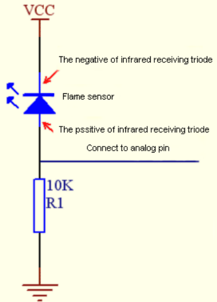

<span style="color: rgb(255, 76, 65);">**ATTENTION**: Since vulnerable to radio frequency radiation and temperature changes, the flame sensor should be kept away from heat sources like radiators, heaters and air conditioners, as well as direct irradiation of sunlight, headlights and incandescent light.</span>

---

**3. Components**

|  |||
| ------------------------ | ------------------------ | ---------------------------- |
| UNO R4 WiFi/Minima main board (either-or) | flame sensor x1 |Breadboard x1 |
|||  |
|Jump wires | USB cable x1 | 10kΩ resistor x1 |

---

**4. Wiring Diagram**

**Schematic diagram:**


**Wiring diagram:**


---

**5. Test Code** 

```c++
/*  
 * File name: Flame_Sensor
 * Function: read Flame_Sensor value
 * Compiling IDE: ARDUINO 2.3.2
 * Author: https://www.keyestudio.com/
*/
int PIN_ANALOG_IN = A0;   //define Flame_Sensor pin to A0

void setup() {
  Serial.begin(9600);   //baud rate to 9600
  pinMode(PIN_ANALOG_IN, INPUT);    //set Flame_Sensor pin to input
}

void loop() {
  int adcVal = analogRead(PIN_ANALOG_IN);    //read the analgo value of Flame_Sensor
  int dacVal = map(adcVal, 0, 1023, 0, 255);
  double voltage = adcVal / 1023.0 * 5.0;
  Serial.print("ADC Val: ");    //print string ADC Val:
  Serial.print(adcVal);    //print adcVal 
  Serial.print(" |DAC Val: ");    //print string   DAC Val:  
  Serial.print(adcVal);    //print adcVal 
  Serial.print(" |Voltage: ");    //print string   Voltage:  
  Serial.println(voltage);    //print voltage 
  delay(200);
}
```
---

**6. Test Result**

Click  to upload code. After uploading the code, unplug the USB cable and wire up. Connect the board to the computer with USB cable and open serial monitor to set the baud rate to **<u>9600</u>**.

The serial monitor prints the ADC Val, DAC Val and Voltage of the flame sensor. Approach the fire source to the sensor, and these values increase. 


---

**7. Code Explanation**

Please refer to Project 21.

---

### Project 24 Thermistor


---

**1. Overview**

Similar to photoresistor, thermistor changes its resistance with temperature. 

We connect the signal end of thermistor to the analog port of the UNO R4 motherboard to read the corresponding analog value, voltage and temperature. We can use a formula to calculate the ambient temperature. 

It is widely used in thermometers, gardening and home alarm system.

---

**2. Component Knowledge**

**Thermistor**: Thermistor is a temperature-sensitive resistance. When thermistor senses a change in temperature, its resistance changes. So it can be used to detect temperature. Its circuit symbol is shown below.


As the temperature increases, the resistance decreases, and the voltage at both ends of the 10KΩ resistor (R1) rises, which causes a voltage change of the signal A0.


**NTC thermistor Temperature Calculation Formula: Rt = R * EXP ( B * (1/T1-1/T2) ) **

T1 and T2 refer to kelvin degree. K degrees = 273.15(absolute temperature) + degrees Celsius.

Rt is the resistance value of thermistor when the ambient temperature is T1 (the current temperature).

R is the nominal resistance value of thermistor when the ambient temperature is room temperature T2 (25℃). Referring to the specification, NTC-MF52AT analog temperature sensor we used has a zero power resistance of 10KΩ ± 5% (i.e. R=10K) and T2=(273.15+25) at 25℃.

B  is the material constant measured at 25 ° C. Reference to the specification shows that B is 3950±1%.

EXP() is e^(), e^n.

The relationship between temperature T1 and resistance Rt: T1=1/ (ln(Rt/R) /B+1/T2), where ln can be converted to log, that is, T1=1/ (log(Rt/R)/B +1/T2).

So the only thing we need to know is the value of Rt. 

Back to the schematic diagram above, set the voltage at both ends of thermistor to VRt, and the voltage at both ends of the fixed R1 resistor to VR. So from VR/VRt = R1/Rt: **Rt = R1 *(5.0-VR)/VR**. The VR we actually obtained is the converted analog value, which needs to be converted into a voltage value, i.e. VR = AnalogValue / 1023 * 5.0.

**ATTENTION**: The calculated temperature is Kelvin degrees, so Celsius temperature **t = T1-273.15**, and add an error correction of 0.5.

---

**3. Components**

|  |||
| ------------------------ | ------------------------ | ---------------------------- |
| UNO R4 WiFi/Minima main board (either-or) | thermistor x1 |Breadboard x1 |
|||  |
|Jump wires | USB cable x1 | 4.7KΩ resistor x1 |

---

**4. Wiring Diagram**

**Schematic diagram:**


**Wiring diagram:**


---

**5. Test Code** 

```c++
/*  
 * File name: Thermistor
 * Function: detect temperature via Thermistor
 * Compiling IDE: ARDUINO 2.3.2
 * Author: https://www.keyestudio.com/
*/
#define PIN_ANALOG_IN   A0

float Rt=0;      //NTC Thermistor
float R=10000;   //10K resistors with fixed resistance values
float T2=273.15+25; //Convert to Kelvin temperature
float B=3950;    //B value is an important parameter of thermistor
float K=273.15;  //Kelvin (K°)
float VR=0;

void setup() {
  Serial.begin(9600);
}

void loop() {
  int AnalogValue = analogRead(PIN_ANALOG_IN);    //read analog value of pin A0
  VR = (float)(AnalogValue / 1023.0 * 5.0);  //convert to voltage value
  Rt = (5.0 - VR) / VR * 10000;    //calculate NTC Thermistor
  float temp = 1/(1/T2+log(Rt/R)/B)-K+0.5;//calculate temperature 
  Serial.print("Analog value:");
  Serial.print(AnalogValue);
  Serial.print("  |  Voltage:");
  Serial.print(VR);
  Serial.print("V");
  Serial.print("  |  Temperature:");
  Serial.print(temp);
  Serial.println("℃");
  delay(1000);
}
```
---

**6. Test Result**

Click  to upload code. After uploading the code, unplug the USB cable and wire up. Connect the board to the computer with USB cable and open serial monitor to set the baud rate to **<u>9600</u>**.

Serial monitor prints the ambient analog value, voltage and temperature value of the thermistor.


---

**7. Code Explanation**

| Code                                    | Explanation                                                  |
| --------------------------------------- | ------------------------------------------------------------ |
| VR = (float)(AnalogValue / 1023 * 5.0)  | Convert the analog values converted at both ends of the R1 resistor to voltage, and the data type is single-precision float |
| Rt = (5.0 - VR) / VR * 4700             | Calculate the resistance of thermistor at the current temperature. |
| float temp = 1/(1/T2+log(Rt/R)/B)-K+0.5 | Calculates the temperature of the current environment. The data type is single-precision float |

---

### Project 25 LM35 Temperature Sensor


---

**1. Overview**

LM35 is a common used and easy-to-use temperature sensor. It doesn't require any other hardware and you only need an analog port. The difficulty lies in compiling the code and converting the analog values to Celsius temperature. 

In this project, we connect the signal end to the analog port of the board to read the corresponding analog value, voltage and temperature. With these values and a specific formula, the Celsius temperature can be calculated.

---

**2. Component Knowledge**


LM35 temperature sensor is a widely used temperature sensor with a variety of package types. At room temperature, it can achieve the accuracy of 1/4°C without additional calibration processing.


LM35 temperature sensor can produce different voltage according to different temperatures, when the temperature is 0 ℃, it output 0V; If increasing 1 ℃, the output voltage will increase 10mv. The output temperature is 0℃ to 100℃, the conversion formula is as follows:


---

**3. Components**

|  |||
| ------------------------ | ------------------------ | ---------------------------- |
| UNO R4 WiFi/Minima main board (either-or) | LM35 x1  |Breadboard x1 |
|||  |
|Jump wires | USB cable x1 |  |

---

**4. Wiring Diagram**

**Schematic diagram:**


**Wiring diagram:**


---

**5. Test Code** 

```c++
/*  
 * File name: LM35
 * Function: detect temperature via LM35
 * Compiling IDE: ARDUINO 2.3.2
 * Author: https://www.keyestudio.com/
*/
int lm35Pin = A0;  //define lm35 pin
float temperature = 0; //define a variable temperature with an initial value of 0
long value = 0; //define a variable value with an initial value of 0

void setup() {
  Serial.begin(9600); //set baud rate to 9600
  pinMode(lm35Pin, INPUT);  //set lm35Pin to input
}

void loop() {
  value = analogRead(lm35Pin); //read analog input

  //Voltage and Celsius conversion:
  //0.00488125=5/1024，0 ~ 5V corresponds to the analog port reading 1 ~ 1024, and every 10 millivolts corresponds to 1°C
  temperature = (value * 0.0048828125 * 100);
  
  Serial.print("Temper =  ");
  Serial.print(temperature);
  Serial.println("℃");
  delay(100);
}
```
---

**6. Test Result**

Click  to upload code. After uploading the code, unplug the USB cable and wire up. Connect the board to the computer with USB cable and open serial monitor to set the baud rate to **<u>9600</u>**.

The serial monitor shows the voltage and ambient temperature detected by the LM35 temperature sensor.


---

**7. Code Explanation**

Please refer to Project 24.

---

### Project 26 Joystick


---

**1. Overview**

Have you ever seen a game-pad? There are buttons joysticks on it. 

In this kit, there is a joystick made of PS2 controller. We connect the X and Y pins of the module to the analog port and B pin to the digital port. Pin V is connected to the power output (3.3-5V) and G to GND. By reading two analog values and the high/low level of the digital port, the working state of the module can be known.

---

**2. Component Knowledge**

It mainly uses PS2 joystick components. In fact, the joystick module has 3 signal terminal pins, which simulate a three-dimensional space. The pins of the joystick module are GND, VCC, and signal terminals (B, X, Y). The signal terminals X and Y simulate the X-axis and Y-axis of the space. When controlling, the X and Y signal terminals of the module are connected to the analog port of the microcontroller. The signal terminal B simulates the Z axis of the space, it is generally connected to the digital port and used as a button.

VCC is connected to the power output V/VCC (3.3/5V), GND is connected to G/GND, the voltage in the original state is about 1.65V/2.5V. 

In the X-axis direction, when moving in the direction of the arrow, the voltage value increases, and the maximum voltage can be reached. Moving in the opposite direction, the voltage value gradually decreases to the minimum voltage. 

In the Y-axis direction, the voltage value decreases gradually as it moves in the direction of the arrow on the module, till to the minimum voltage. As the arrow is moved in the opposite direction, the voltage value increases till to the maximum voltage. 

In the Z-axis direction, the signal terminal B is connected to the digital port and outputs 0 in the original state and outputs 1 when pressed. 

In this way, we can read the two analog values and the high/low level of the digital port to determine the operating status of the joystick.

---

**3. Parameters**

- Operating voltage: DC 3.3V~5V 

- Operating current: 12mA

- Maximum power: 0.06W

- Output signal: Signal terminal X, Y are analog voltage output (analog signal), signal terminal B is digital level output (digital signal)

- Operating temperature: -10°C ~ +50°C

- Dimensions: 47.6mm x 23.8mm x 34.5mm

- Interface: 5pin anti-reverse interface spacing 2.54mm


---

**4. Schematic Diagram**


To put it simple, the joystick is equivalent to two potentiometers (left-right and up-down) and a button. 

When the button is not pressed, R1 is pulled down to low. When the button is pressed, VCC is turned on to the high level. Rotate the joystick, and the internal potentiometer is adjusted accordingly, so as to output different voltages and analog values.

---

**5. Components**

|  ||||
| ------------------------ | ------------------------ | ---------------------------- |---------------------------- |
|UNO R4 WiFi/Minima main board (either-or)| joystick x1 | DuPont wires |USB cable x1|

---

**6. Wiring Diagram**

**Schematic diagram:**


**Wiring diagram:**


---

**7. Test Code** 

```c++
/*  
 * File name: Joystick
 * Function: read Joystick value
 * Compiling IDE: ARDUINO 2.3.2
 * Author: https://www.keyestudio.com/
*/
int VRx = A0;  //define axis-X pin
int VRy = A1;  //define axis-Y pin
int SW = 7;    //define axis-Z pin
int xPosition = 0;  //set variable xPosition with an initial value of 0
int yPosition = 0;  //set variable yPosition with an initial value of 0
int SW_state = 0;  //set variable SW_state with an initial value of 0

void setup() {
Serial.begin(9600); 
pinMode(VRx, INPUT);  //axis-X pin  to output
pinMode(VRy, INPUT);  //axis-Y pin  to output
pinMode(SW, INPUT_PULLUP);   //axis-Z pin to pull-up
}

// In loop(), use analogRead() to read the values for the X and Y axes
// And use digitalRead() to read the z-axis values and then display them
void loop() {
  xPosition = analogRead(VRx); 
  yPosition = analogRead(VRy);
  SW_state = digitalRead(SW);
  Serial.print("X: ");
  Serial.print(xPosition);
  Serial.print(" | Y: ");
  Serial.print(yPosition);
  Serial.print(" | Button: ");
  Serial.println(SW_state);
  delay(100);
}
```
---

**8. Test Result**

Click  to upload code. After uploading the code, unplug the USB cable and wire up. Connect the board to the computer with USB cable and open serial monitor to set the baud rate to **<u>9600</u>**.

The serial monitor prints the analog values of the axis-X and Y and the digital value of axis-Z(pin B). Pull the joystick and these values change. Press it and Button = 1, Release it and Button = 0. From left to right, X value corresponds to 0 to 1023. From down to up, Y value corresponds to 0 to 1023.


Pull the joystick on axis-X and the X value changes.


Pull the joystick on axis-Y and the Y value changes.


Press the joystick:


---

**9. Code Explanation**

| Code                         | Explanation            |
| --------------------------------- | -------------------------- |
|pinMode(SW, INPUT_PULLUP) | Set the pin to pull-up mode |
|other codes | Please refer to Project 18 and Project 21. |

---

### Project 27 Temperature and Humidity Detection


---

**1. Overview**

XH11 temperature and humidity sensor detects humidity and temperature in the air, and its signal transmission distance can reach more than 20 meters. It features ultra-fast response, strong anti-interference ability and high performance.

---

**2. Component Knowledge**

This sensor includes calibrated digital signal output. Its precision of humidity is ±5%RH, temperature is ±2℃, detection range of humidity is 5 ~ 95%RH, and temperature is -25 ~ +60℃. The temperature and humidity sensor applies dedicated digital module acquisition technology and temperature and humidity sensing technology to ensure extremely high reliability and excellent long-term stability of the product. It also integrates a resistive-type humidity measurer and an NTC temperature measurer, which is very suitable for temperature and humidity measurement applications where accuracy and real-time performance are not required.

**Single bus format definition of XH11 temperature and humidity sensor**

|      Name       |Definition |
| :--: | :--- |
|  Start signal   | Microprocessor pulls data bus (SDA) down at least 18ms for a period of time(Maximum is 30ms), notifying the sensor to prepare data. |
| Response signal | The sensor pulls the data bus (SDA) low for 83µs, and then pulls up for 87µs to respond to the host's start signal. |
|    Humidity     | The high humidity is an integer part of the humidity data, and the low humidity is a fractional part of the humidity data. |
|   Temperature   | The high temperature is the integer part of the temperature data, the low temperature is the fractional part of the temperature data. And the low temperature Bit8 is 1, indicating a negative temperature, otherwise, it is a positive temperature. |
|   Parity bit    | Parity bit = Humidity high bit + Humidity low bit + temperature high bit+temperature low bit |

**Data sequence diagram of XH11 temperature and humidity sensor**

When MCU sends a start signal, the Temperature and Humidity Sensor changes from the low-power-consumption mode to the high-speed mode, waiting for MCU completing the start signal. Once it is completed, the Temperature and Humidity Sensor sends a response signal of 40-bit data and triggers a signal acquisition. The signal is sent as shown in the figure:

 


The communication and synchronization between the MCU and XHT11, adopt single bus data format, with once communication time of about 4ms. The data includes decimal and integer, as described below. The current decimal part is used for future expansion, and now it is zero

Operation process: a complete data transmission for 40bit, high bit first.

**Data format:** 8bit Humidity integer + 8bit humidity decimal + 8bit Temperature integer + 8bit temperature decimal +8bit parity sum.

**8-bit parity sum:** The last eight digits of the sum of “8bit Humidity integer + 8bit humidity decimal + 8bit Temperature integer + 8bit temperature decimal”.

Combined with the code, you can understand better.

The sensor can easily add temperature and humidity data to your DIY electronic projects. It is perfect for remote weather stations, home environmental control systems, and farm or garden monitoring systems.

---

**3. Parameters**

Operating voltage: DC 3.3V~5V 

Operating current: 2.1mA

Maximum power: 0.015W

Temperature detection range: -25 ~ +60°C (± 2℃)

Humidity detection range: 5 ~ 95%RH (at 25C°, ±5%RH)

---

**4. Components**

|  ||||
| ------------------------ | ------------------------ | ---------------------------- |---------------------------- |
|UNO R4 WiFi/Minima main board (either-or)|XH11 temperature and humidity sensor x1| Jump wires | USB cable x1 |

---

**5. Wiring Diagram**

**Schematic diagram:**


**Wiring diagram:**


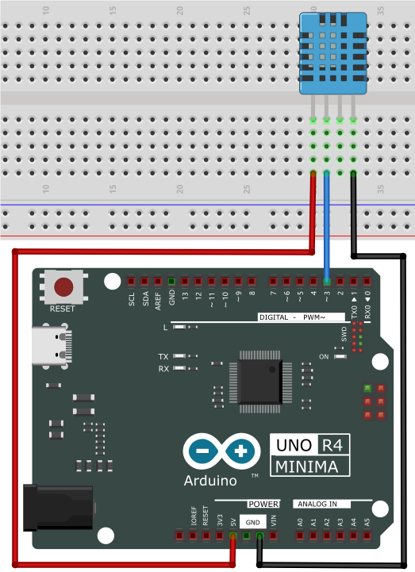

---

**6. Test Code**

```c++
/*  
 * File name: xht11
 * Function: detect temperature and humidity via xht11
 * Compiling IDE: ARDUINO 2.3.2
 * Author: https://www.keyestudio.com/
*/
#include "DHT.h"  //DHT library
#define DHTPIN 3  //define XHT11 pin to digital pin 3
DHT dht(DHTPIN, DHT11);  //initialize

void setup() {
  Serial.begin(9600); //start serial monitor and set baud rate to 9600
  Serial.println(F("DHTxx test!")); //serial monitor shows “DHTxx test!”
  dht.begin(); //dht works
}

void loop() {
  // Wait a few seconds between measurements.
  delay(500);
  // Reading the temperature or humidity takes about 250 milliseconds!
  // Sensor readings can also be as high as 2 seconds (this is a very slow sensor)
  float h = dht.readHumidity();
  // Read temperature in degrees Celsius (default)
  float t = dht.readTemperature();
  // The reading temperature is degrees Fahrenheit (isFahrenheit = true)
  float f = dht.readTemperature(true);
  // Check for read failures and exit early (try again).
  if (isnan(h) || isnan(t) || isnan(f)) {
    Serial.println(F("Failed to read from DHT sensor!"));
    return;
  }
  // Calculate the Fahrenheit Temperature index (default)
  float hif = dht.computeHeatIndex(f, h);
  // The heat index is calculated in Celsius (isFahreheit = false)
  float hic = dht.computeHeatIndex(t, h, false);

  Serial.print(F("Humidity: "));
  Serial.print(h);
  Serial.print(F("%  Temperature: "));
  Serial.print(t);
  Serial.print(F("°C "));
  Serial.print(f);
  Serial.print(F("°F  Heat index: "));
  Serial.print(hic);
  Serial.print(F("°C "));
  Serial.print(hif);
  Serial.println(F("°F"));
}
```
---

**7. Test Result**

Click  to upload code. If “**DHT.h: No such file or directory**” appears, please load library first. Please visit [How to import Arduino library](https://docs.keyestudio.com/projects/KS0590-KS0594/en/latest/docs/Arduino_C_Tutorial.html#import-arduino-library).

After uploading the code, unplug the USB cable and wire up. Connect the board to the computer with USB cable and open serial monitor to set the baud rate to **<u>9600</u>**.

The serial monitor shows the ambient temperature and humidity value detected by the XH11 temperature and humidity sensor.


---

**8. Code Explanation**

| Code                                | Explanation                                                  |
| ----------------------------------- | ------------------------------------------------------------ |
| unsigned char dht[4] = {0, 0, 0, 0} | store the read temperature and humidity value in the array dht[4]. |

---

### Project 28 Ultrasonic Ranger


**1. Overview**

Bats and some marine animals are able to use high frequencies of sound for echolocation or communication. They can emit ultrasonic waves from the larynx through the mouth or nose and use the sound waves that bounce back to orient and determine the position, size and whether nearby objects are moving.

Ultrasonic is a frequency higher than 20000 Hz sound wave, which has a good direction, a strong penetration ability, and is easy to obtain more concentrated sound energy as well as spread far in the water. It can be used for ranging, speed measurement, cleaning, welding, gravel, sterilization and disinfection. What’s more, it has many applications in medicine, military, industry and agriculture.

Because its lower frequency is greater than the upper limit of human hearing, so it is called ultrasound. The number of vibrations per second is its frequency, whose unit is Hertz (Hz).

In this kit, there is an HC-SR04 ultrasonic sensor. It can emit the ultrasonic signals that cannot be heard by humans. When these signals hit an obstacle, they come back immediately. The distance between the sensor and the obstacle can be calculated by the time gap of emitting signals and receiving signals.

---

**2. Parameters**

- Ultrasonic sensor operating voltage: DC 5V 

- Ultrasonic sensor operating current: 15mA

- Ultrasonic sensor operating frequency: 40Hz

- Ultrasonic sensor detection range: 2cm~4m

- Ultrasonic sensor measuring angle: <= 15 degrees

- Ultrasonic sensor input trigger signal: TTL pulse of 10 uS

- Ultrasonic sensor output echo signal: The output TTL level signal is proportional to the range

- Operating temperature：-10°C ~ +50°C

- Ultrasonic sensor dimensions: 45.5mm x 26.7mm x 17.6mm

- Ultrasonic sensor  adapter dimensions: 32mm x 23.8mm x 18.5mm

- Ultrasonic sensor  adapter interface: 4pin interface spacing 2.54mm


---

**3. Working Principle**

The most common ultrasonic ranging method is the echo detection. As shown below; when the ultrasonic emitter emits the ultrasonic waves towards certain direction, the counter will count. The ultrasonic waves travel and reflect back once encountering the obstacle. Then the counter will stop counting when the receiver receives the ultrasonic waves coming back.

The ultrasonic wave is also sound wave, and its speed of sound V is related to temperature. Generally, it travels 340m/s in the air. According to time t, we can calculate the distance s from the emitting spot to the obstacle.

<span style="font-size: 24px;">s=340t/2</span>


The HC-SR04 ultrasonic ranging module can provide a non-contact distance sensing function of 2cm-400cm, and the ranging accuracy can reach as high as 3mm; the module includes an ultrasonic transmitter, receiver and control circuit. 

**Basic working sequence:**

(1) First pull down the TRIG, and then trigger it with at least 10us high level signal;

(2) After triggering, the module will automatically transmit eight 40KHZ square waves, and automatically detect whether there is a signal to return.

(3) If there is a signal returned back, through the ECHO to output a high level, the duration time of high level is actually the time from emission to reception of ultrasonic.


---

**4. Components**

|  ||||
| ------------------------ | ------------------------ | ---------------------------- |---------------------------- |
|UNO R4 WiFi/Minima main board (either-or)|Ultrasonic sensor x1| DuPont wires | USB cable x1 |

---

**5. Wiring Diagram**

**Schematic diagram:**


**Wiring diagram:**

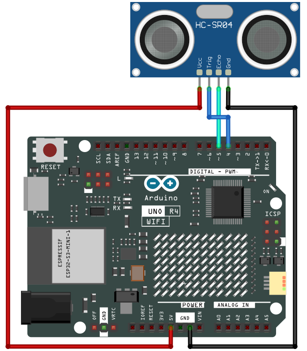


---

**6. Test Code**

```c++
/*  
 * File name: Ultrasonic
 * Function: detect distance via Ultrasonic sensor
 * Compiling IDE: ARDUINO 2.3.2
 * Author: https://www.keyestudio.com/
*/
const int TrigPin = 4; // define TrigPin
const int EchoPin = 5; // define EchoPin
int duration = 0; // define the initial value of the duration as 0
int distance = 0; // define the initial value of the distance as 0

void setup() {
  Serial.begin(9600);        // set baud rate to 9600
  pinMode(TrigPin, OUTPUT); // set trigPin to output
  pinMode(EchoPin, INPUT);  // set echoPin to input
}

void loop(){
  // Keep trigPin output high for 10μs to trigger HC_SR04
  digitalWrite(TrigPin , HIGH);
  delayMicroseconds(10);
  digitalWrite(TrigPin , LOW);
  // Wait for HC-SR04 to return to high and measure this wait time
  duration = pulseIn(EchoPin , HIGH);
  // Calculate distance based on time
  distance = (duration/2) / 28.5 ;
  Serial.print("Distance: ");
  Serial.print(distance); //serial monitor prints distance value
  Serial.println("cm");
  delay(100); //Wait 100 milliseconds between pings (about 20 pings per second).
}
```
---

**7. Test Result**

Click  to upload code. After uploading the code, unplug the USB cable and wire up. Connect the board to the computer with USB cable and open serial monitor to set the baud rate to **<u>9600</u>**.

Put an object in front of the detection area of the ultrasonic sensor, and the serial monitor prints the distance value between the sensor and the object.


---

**8. Code Explanation**

| Code                               | Explanation                                                  |
| ---------------------------------- | ------------------------------------------------------------ |
| duration = pulseIn(EchoPin , HIGH) | pulseIn is a built-in function used to read the duration of the pulse. The read high level time here is the time from ultrasonic emitting to returning. |
| distance = (duration/2) / 28.5     | Ultrasonic data conversion                                   |

---

### Project 29 Remote Control and IR Receiving


---

**1. Overview**

An infrared(IR) remote control is a low-cost and easy-to-use wireless communication technology. IR light is very similar to visible light, except that its wavelength is slightly longer. This means that infrared rays cannot be detected by the human eye, which is perfect for wireless communication. 

For example, when you press a button on the TV remote control, an infrared LED will switch on and off repeatedly at a frequency of 38,000 times per second, transmitting information (such as volume or channel control) to the infrared sensor on the TV. 

We'll start by explaining how common infrared communication protocols work. Then we will start the project with a remote control and an infrared receiver.

---

**2. Component Knowledge**

**Remote control:**

It is currently the most common means of communication and remote control. As it features small size, low power consumption, strong function and low cost, it is widely used in small electrical equipment, like recorders, audio equipment, air conditioners and electrical toys.

Its transmitting circuit uses infrared light-emitting diode to emit modulated infrared waves. The infrared receiving circuit consists of an infrared receiving diode and a triode / a silicon photocell, which converts the emitted infrared light into corresponding electrical signals and then sends them to the post amplifier.

The remote control in this kit is coded by NEC.


**IR receiver:**

It is the VS1838B infrared receiving sensor element, which can receive infrared light, so it can be used to detect the infrared signal emitted by remote control.


IR receiver integrates reception, amplification and demodulation. The received infrared signal has been adjusted in its internal IC (converting the infrared signal back to binary), so the output is a digital signal. It can receive the standard 38KHz modulated remote control signal.

**Infrared signal modulation process diagram:**


---

**3. Components**

|  ||||
| ------------------------ | ------------------------ | ---------------------------- |---------------------------- |
| UNO R4 WiFi/Minima main board (either-or) | IR receiver x1 |Breadboard x1 |Jump wires |
|||  |   |
|remote control x1 | USB cable x1 | 10kΩ resistor x1 |   |

---

**4. Wiring Diagram**

**Schematic diagram:**


**Wiring diagram:**


---

**5. Test Code** 

```c++
/*  
 * File name: IR Receiver
 * Function: Decode infrared remote control, print it on serial monitor
 * Compiling IDE: ARDUINO 2.3.2
 * Author: https://www.keyestudio.com/
*/
#include <IRremote.hpp>

#define IR_RECEIVE_PIN   3   // Defines infrared receiver module pin
IRrecv irrecv(IR_RECEIVE_PIN);     // Creates a class object that receives the class
decode_results results;     // Create a decoded result class object

void setup() {
  Serial.begin(9600);       // set baud rate to 9600
  IrReceiver.begin(IR_RECEIVE_PIN, ENABLE_LED_FEEDBACK);  // start receiver
}

void loop() {
  if (IrReceiver.decode()) {
      Serial.println(IrReceiver.decodedIRData.decodedRawData, HEX);  // Print raw data
      IrReceiver.printIRResultShort(&Serial); // Print the complete received data in one line
      IrReceiver.printIRSendUsage(&Serial);  // Print the statement needed to send this data
      IrReceiver.resume(); // Enable receiving the next value
  }
  delay(100);
}
```
---

**6. Test Result**

Click  to upload code. If “**IRremote.hpp: No such file or directory**” appears, please load library first. Please visit [How to import Arduino library](https://docs.keyestudio.com/projects/KS0590-KS0594/en/latest/docs/Arduino_C_Tutorial.html#import-arduino-library).

After uploading the code, unplug the USB cable and wire up. Connect the board to the computer with USB cable and open serial monitor to set the baud rate to **<u>9600</u>**.

Remove the insulating strip on the remote control, and align it to the IR receiver. Press any button on the remote control, and the serial monitor will display the received button value. At the same time, the red LED on the receiver will blink. 


The value corresponding to each  button:


---

**7. Code Explanation**

| Code                                  | Explanation                                                  |
| ------------------------------------- | ------------------------------------------------------------ |
| irrecv.enableIRIn();                  | Initialize the infrared remote control.                      |
| irrecv.decode(&results)               | Wait for decoding                                            |
| serialPrintUint64(results.value, HEX) | Print the decoded value                                      |
| irrecv.resume();                      | recover to prepare for the receiving of the next infrared signal |

---

### Project 30 Thin-film 4X4 Key Pad


---

**1. Overview**

Commonly used digital button comes with one IO port, so sometimes we need many buttons. To save IO ports, multiple buttons are made into a matrix to control them through less IO ports. In this project, we program the UNO R4 board to control the thin film 4x4 matrix key pad to read value.

---

**2. Component Knowledge**

This sensor integrates 4x4 = 16 matrix keys:

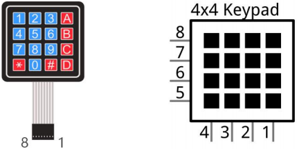

In a 4x4 key pad, each row / column of keys is connected with a pin, which reduces the processor ports. The internal circuit is shown below.

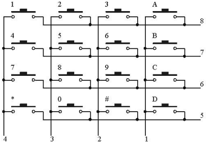

We detect the state of keys by scanning each column and row. Take the column scanning as an example, send low level to column 4 (Pin4), detect the level status of row 1, 2, 3 and 4 to determine whether A, B, C and D are pressed. The low levels are then sent to columns 3, 2, and 1 in turn to detect if any other keys have been pressed. Then, you can get the state of all the keys.

---

**3. Components**

|  ||||
| ------------------------ | ------------------------ | ---------------------------- |---------------------------- |
| UNO R4 WiFi/Minima main board (either-or) | thin film 4x4 matrix key pad x1 |Jump wires |USB cable x1 |

---

**4. Wiring Diagram**

**Schematic diagram:**


**Wiring diagram:**


---

**5. Test Code** 

```c++
/*  
 * File name: 4x4_Keypad
 * Function: read 4x4_Keypad key value 
 * Compiling IDE: ARDUINO 2.3.2
 * Author: https://www.keyestudio.com/
*/
#include "Adafruit_Keypad.h"  // Adafruit_Keypad library

// Define the number of rows and columns for the 4x4 keypad
const byte ROWS = 4;
const byte COLS = 4;

// Define characters that map to each button on the 4x4 keypad
char keys[ROWS][COLS] = {
  { '1', '2', '3', 'A' },
  { '4', '5', '6', 'B' },
  { '7', '8', '9', 'C' },
  { '*', '0', '#', 'D' }
};

// Define the Arduino pins connected to the 4x4 keypad row pins
byte rowPins[ROWS] = { 2, 3, 4, 5 };
// Define the Arduino pins connected to the column pins of the 4x4 keypad
byte colPins[COLS] = { 6, 7, 8, 9 };

// Initialize a custom 4x4 keypad instance
Adafruit_Keypad myKeypad = Adafruit_Keypad(makeKeymap(keys), rowPins, colPins, ROWS, COLS);

void setup() {
  Serial.begin(9600); // set baud rate to 9600
  myKeypad.begin();   // Initialize the 4x4 keypad
}

void loop() {
  //Update button status of 4x4 keypad
  myKeypad.tick();

  //Check for new keypad status
  while (myKeypad.available()) {
    // Read keypad status
    keypadEvent e = myKeypad.read();
    // Print the key value of the triggered state
    Serial.print((char)e.bit.KEY);
    // Print Key status Type: Press or release
    if (e.bit.EVENT == KEY_JUST_PRESSED) Serial.println(" pressed");
    else if (e.bit.EVENT == KEY_JUST_RELEASED) Serial.println(" released");
  }
  delay(10);
}
```
---

**6. Test Result**

Click  to upload code. If “**Adafruit_Keypad.h: No such file or directory**” appears, please load library first. Please visit [How to import Arduino library](https://docs.keyestudio.com/projects/KS0590-KS0594/en/latest/docs/Arduino_C_Tutorial.html#import-arduino-library).

After uploading the code, unplug the USB cable and wire up. Connect the board to the computer with USB cable and open serial monitor to set the baud rate to **<u>9600</u>**.

Press the key and the corresponding value will show on the serial monitor.


---

### Project 31 On-board Matrix


<span style="color: rgb(255, 76, 65);">**ATTENTION: Only UNO R4 WiFi board boasts a 12X8 LED matrix, while UNO R4 Minima does not. So this project requires UNO R4 WiFi board**.</span>

---

**1. Overview**

The matrix is made from 12X8=96 light emitting diodes. Each of them is placed at the intersection of row and column lines. In this project, we control the display of the UNO R4 WiFi 12X8 LED matrix. 

---

**2. Component Knowledge**

**LED Matrix:**

The UNO R4 WiFi comes with a 12x8 red LED matrix (U_LEDMATRIX) and is connected through a technology called Charlie Plexair. The pins for the matrix on the RA4M1 MCU are: P003, P004, P011, P012, P013, P015, P204, P205, P206, P212, P213.

**Circuit diagram:**


They can be accessed as an array through a specific library. See the mapping below:


The LED matrix can be used for multiple projects and prototyping, supporting animation, simple game design, scrolling text, and so on.

---

**3. Components**

|   |  |
| :----------------------: | :-------------------: |
|UNO R4 WiFi main board x1|       USB cable x1   |

---

**4. Connection**


---

**5. Test Code**

UNO R4 WiFi board built-in LED matrix codes are included in Arduino IDE (<span style="color: rgb(255, 76, 65);">only **Arduino IDE2.1.1 or later versions** support UNO R4</span>) so we can directly open one code. Here we demonstrate with “DisplaySingleFrame. io ”. 

1. Connect UNO R4 WiFi board to the computer via USB cable.


2. Open Arduino IDE. Click “<u>**Tools**</u>”→“**<u>Board</u>**” and set board model to Arduino UNO R4 WiFi. Click “<u>**Tools**</u>”→“**<u>Port</u>**” to connect to the correct port.


3. Click “**<u>File</u>**”→“**<u>Examples</u>**”→“**<u>LED_Matrix</u>**”→“**<u>DisplaySingleFrame</u>**”, open “DisplaySingleFrame. io ”.


<span style="color: rgb(255, 76, 65);">**Special note**</span>: If you are copying code directly into the Arduino IDE, you need to add the **frames.h** library file, which is in the code folder we provided (<span style="color: rgb(0, 209, 0);">31 LED Matrix</span>). It is better to use the code we passed directly.


```c++
/*
  Single Frame
  
  Displays single frames using matrix.loadFrame
  
  See the full documentation here:
  https://docs.arduino.cc/tutorials/uno-r4-wifi/led-matrix
*/

#include "Arduino_LED_Matrix.h"   // Include the LED_Matrix library
#include "frames.h"               // Include a header file containing some custom icons

ArduinoLEDMatrix matrix;          // Create an instance of the ArduinoLEDMatrix class

void setup() {
  Serial.begin(115200);           // Initialize serial communication at a baud rate of 115200
  matrix.begin();                 // Initialize the LED matrix
}

void loop() {
  // Load and display the "chip" frame on the LED matrix
  matrix.loadFrame(chip);
  delay(500);  // Pause for 500 milliseconds (half a second)

  // Load and display the "danger" frame on the LED matrix
  matrix.loadFrame(danger);
  delay(500);

  // Load and display the "happy" frame on the LED matrix
  matrix.loadFrame(happy);
  delay(500);

  // Load and display the "big heart" frame provided by the library
  matrix.loadFrame(LEDMATRIX_HEART_BIG);
  delay(500);

  // Turn off the display
  matrix.clear();
  delay(1000);

  // Print the current value of millis() to the serial monitor
  Serial.println(millis());
}
```


---

**6. Test Result**

Click  to upload code. After uploading the code, connect the board to the computer with USB cable and the on-board LED matrix starts to show many icons.


---

**7. Code Explanation**

| Code                          | Explanation                                              |
| ---------------------------------- | ------------------------------------------------------------ |
|#include "Arduino_LED_Matrix.h"  |LED _Matrix library|
| #include "frames.h"| header files |
|ArduinoLEDMatrix matrix; |Create ArduinoLEDMatrix example|
| matrix.begin();| Initialize LED matrix |
|matrix.loadFrame(chip);|Load and show the “chip” framework on LED matrix|
|matrix.clear();| Clear dislay |
|Serial.println(millis());|Print the current value of milis () on serial monitor|

---

**8. Please refer to more information：**

[Using the Arduino UNO R4 WiFi LED Matrix](https://docs.arduino.cc/tutorials/uno-r4-wifi/led-matrix/)

---

### Project 32 I2C 1602 LCD


---

**1. Overview**

In everyday life, we can do all kinds of experiments with the display module and also DIY a variety of small objects. For example, you can make a temperature  meter with a temperature sensor and display, or make a distance meter with an ultrasonic module and display.

In this project, we will use the 1602 I2C LCD as the display and connect it to UNO R4, which will be used to control the LCD to show various English words, common symbols and numbers.

---

**2. Component Knowledge**


**LCD 1602 display:**

This I2C  LCD 1602 display is able to show a maximum of 16 x 2 letters. Except letters, it also displays numbers, symbols and even ASCII codes.

Here is a one-color LCD 1602 display (<span style="color: rgb(255, 76, 65);">seven I/O ports of the control board are required for operation</span>) and its pins: 


It integrates I2C interface, serial input and parallel output, which allows us to operate LCD1602 by only 4 wires.


The IC chip used in this module is PCF8574T (PCF8574AT), and its default I2C address is 0x27(0x3F).

There's a metal potentiometer on the back. You can adjust the contrast by the potentiometer with a screwdriver (provided by yourself).


<span style="color: rgb(255, 76, 65);">Note</span>: When you rotate the potentiometer, the screen will become lighter or darker to make the font clearer.

**I2C 1602 LCD Schematic diagram:**


**I2C 1602 LCD parameters:**

- Display pixel: 16 * 2 characters
- Chip operating voltage: 4.5 ~ 5.5V
- Operating current: 2.0mA (5.0V)
- Best operating voltage: 5.0V
- I2C address: 0x27
- Back-light (blue background and white back-light)

---

**3. Components**

|  ||| |
| ------------------------ | ------------------------ | ---------------------------- |---------------------------- |
|UNO R4 WiFi/Minima main board (either-or)|I2C 1602 LCD x1| DuPont wires |4.7KΩ resistor x2 |
||||   |
|Breadboard x1 | USB cable x1 | Jump wires |   |

---

**4. Wiring Diagram**

**Schematic diagram:**


**Wiring diagram:**


---

**5. Test Code**

```c++
/*  
 * File name: IIC_1602_LCD
 * Function: IIC_1602_LCD shows character strings
 * Compiling IDE: ARDUINO 2.3.2
 * Author: https://www.keyestudio.com/
 */
#include <LiquidCrystal_I2C.h>

LiquidCrystal_I2C lcd(0x27, 16, 2);  // initialize the Liquid Crystal Display object with the I2C address 0x27, 16 columns and 2 rows

void setup() {
  lcd.init();       // initialize the LCD
  lcd.clear();      // clear the LCD display
  lcd.backlight();  // Make sure backlight is on
}

void loop() {
  // Print a message on both lines of the LCD.
  lcd.setCursor(2, 0);  //Set cursor to character 2 on line 0
  lcd.print("Hello world!");

  lcd.setCursor(2, 1);  //Move cursor to character 2 on line 1
  lcd.print("keyestudio!");
}
```
---

**6. Test Result**

Click  to upload code. If “**LiquidCrystal_I2C.h: No such file or directory**” appears, please load library first. Please visit [How to import Arduino library](https://docs.keyestudio.com/projects/KS0590-KS0594/en/latest/docs/Arduino_C_Tutorial.html#import-arduino-library).

After uploading the code, unplug the USB cable and wire up. Connect the board to the computer with USB cable and I2C 1602  LCD shows “Hello World!” on the first line and “Hi, Welcome!” on the second line.


**Note: If the LCD display does not display any information after uploading the code, try pressing the RESET button on the UNO R4 motherboard.**


---

**7. Code Explanation**

| Code         | Explanation |
| ----------------- | -------------- |
|LiquidCrystal_I2C lcd(0x27,16,2)|show characters of 16 columns and 2 rows, address 0x27|
|lcd.backlight()|turn on back light|
| lcd.init()        | initialize display |
| lcd.clear()       | clear display |
| lcd.setCursor(  ,  ) | set the cursor position to display |
| lcd.print("  ") | set the display content |

---

### Project 33 OLED


---

**1. Overview**

OLED display is the most commonly used mobile phone display, with the advantages of fine picture quality, small size and high brightness. In this project, we will learn about OLED.

---

**2. Component Knowledge**


OLED is an organic light-emitting diode, also known as organic dot laser display. It has self-luminous properties, because it uses a very thin coating of organic materials and glass substrate, which will light up when a current is passed through. So there is no need for backlight (not only powering on, but also with the driver and correct wiring to light it up).

OLED boasts wide viewing Angle and low power consumption, high contrast, thin thickness, simple structure, wide temperature range and fast reaction speed. It can be used for flexion plate.

It uses SSD1306 chip, whose communication mode is IIC. Its dimensions are 0.96 inches, resolution is 128*96 pixels (128 columns, 64 rows of pixels on the screen), and display color is blue.

Its interfaces include V, G, SDA, SCL, which are compatible with IIC(I2C) interface SDA, SCL on the board.

---

**3. Parameters**

- Operating voltage: DC 3.3V-5V
- Operating current: 30mA
- Interface: Interface spacing 2.54mm
- Communication mode: I2C communication
- Internal driver chip: SSD1306
- Resolution: 128*64
- Viewing Angle: greater than 150°

---

**4. Components**

|  ||||
| ------------------------ | ------------------------ | ---------------------------- |---------------------------- |
|UNO R4 WiFi/Minima main board (either-or)|OLED x1| DuPont wires | USB cable x1 |

---

**5. Wiring Diagram**

**Schematic diagram:**


**Wiring diagram:**


---

**6. Test Code**

```c++
/*  
 * File name: OLED
 * Function: OLED display
 * Compiling IDE: ARDUINO 2.3.2
 * Author: https://www.keyestudio.com/
 */
#include <SPI.h>
#include <Wire.h>
#include <Adafruit_GFX.h>
#include <Adafruit_SSD1306.h>

#define SCREEN_WIDTH 128  // OLED display width, in pixels
#define SCREEN_HEIGHT 64  // OLED display height, in pixels

// Declaration for SSD1306 display connected using I2C
#define OLED_RESET -1  // Reset pin # (or -1 if sharing Arduino reset pin)
#define SCREEN_ADDRESS 0x3C
Adafruit_SSD1306 display(SCREEN_WIDTH, SCREEN_HEIGHT, &Wire, OLED_RESET);

//Bitmap data
static const unsigned char PROGMEM sunfounderIcon[] = {
	0xff, 0xff, 0xff, 0xff, 0xff, 0xff, 0xff, 0xff, 0xff, 0xff, 0xff, 0xf8, 0x7f, 0xff, 0xff, 0xff, 
	0xff, 0xff, 0xff, 0xf0, 0x1f, 0xff, 0xff, 0xff, 0xff, 0xff, 0xff, 0xe0, 0x0f, 0xff, 0xff, 0xff, 
	0xff, 0xff, 0xff, 0xc0, 0x07, 0xff, 0xff, 0xff, 0xff, 0xff, 0xff, 0x80, 0x03, 0xff, 0xff, 0xff, 
	0xff, 0xff, 0xff, 0x00, 0x01, 0xff, 0xff, 0xff, 0xff, 0xff, 0xfe, 0x00, 0x00, 0x7f, 0xff, 0xff, 
	0xff, 0xff, 0xfc, 0x00, 0x00, 0x3f, 0xff, 0xff, 0xff, 0xff, 0xf8, 0x00, 0x00, 0x1f, 0xff, 0xff, 
	0xff, 0xff, 0xf0, 0x00, 0x00, 0x0f, 0xff, 0xff, 0xff, 0xff, 0xe0, 0x01, 0x00, 0x07, 0xff, 0xff, 
	0xff, 0xff, 0xc0, 0x07, 0xc0, 0x01, 0xff, 0xff, 0xff, 0xff, 0x80, 0x0f, 0xe0, 0x00, 0xff, 0xff, 
	0xff, 0xff, 0x00, 0x1f, 0xf0, 0x00, 0x7f, 0xff, 0xff, 0xfe, 0x00, 0x3f, 0xf8, 0x00, 0x3f, 0xff, 
	0xff, 0xfc, 0x00, 0x7f, 0xfe, 0x00, 0x0f, 0xff, 0xff, 0xfc, 0x00, 0xfe, 0xff, 0x00, 0x07, 0xff, 
	0xff, 0xf8, 0x01, 0xfc, 0x7f, 0x80, 0x03, 0xff, 0xff, 0xf0, 0x03, 0xf8, 0x3f, 0xc0, 0x01, 0xff, 
	0xff, 0xe0, 0x07, 0xf0, 0x0f, 0xe0, 0x00, 0xff, 0xff, 0xc0, 0x0f, 0xe0, 0x07, 0xf8, 0x00, 0x3f, 
	0xff, 0x80, 0x0f, 0xc0, 0x03, 0xfc, 0x00, 0x7f, 0xff, 0x00, 0x1f, 0xc0, 0x01, 0xfe, 0x00, 0xff, 
	0xff, 0x00, 0x0f, 0xe0, 0x00, 0x7f, 0x81, 0xff, 0xff, 0x00, 0x0f, 0xf0, 0x00, 0x3f, 0xc3, 0xff, 
	0xff, 0x80, 0x03, 0xfc, 0x00, 0x1f, 0xe7, 0xff, 0xff, 0xc0, 0x01, 0xfe, 0x00, 0x0f, 0xff, 0xff, 
	0xff, 0xe0, 0x00, 0xff, 0x00, 0x03, 0xff, 0xff, 0xff, 0xf0, 0x00, 0x7f, 0x80, 0x01, 0xff, 0xff, 
	0xff, 0xf8, 0x00, 0x1f, 0xe0, 0x00, 0xff, 0xff, 0xff, 0xfe, 0x00, 0x0f, 0xf0, 0x00, 0x7f, 0xff, 
	0xff, 0xff, 0x00, 0x07, 0xf8, 0x00, 0x3f, 0xff, 0xff, 0xff, 0x80, 0x03, 0xfc, 0x00, 0x0f, 0xff, 
	0xff, 0xff, 0xc0, 0x00, 0xff, 0x00, 0x07, 0xff, 0xff, 0xff, 0xe0, 0x00, 0x7f, 0x80, 0x03, 0xff, 
	0xff, 0xff, 0xf8, 0x00, 0x3f, 0xc0, 0x01, 0xff, 0xff, 0xf3, 0xfc, 0x00, 0x1f, 0xe0, 0x00, 0xff, 
	0xff, 0xe1, 0xfe, 0x00, 0x07, 0xf8, 0x00, 0x7f, 0xff, 0xc0, 0x7f, 0x00, 0x03, 0xf8, 0x00, 0x7f, 
	0xff, 0x80, 0x3f, 0xc0, 0x01, 0xfc, 0x00, 0xff, 0xff, 0x00, 0x1f, 0xe0, 0x03, 0xf8, 0x00, 0xff, 
	0xfe, 0x00, 0x0f, 0xf0, 0x03, 0xf0, 0x01, 0xff, 0xff, 0x80, 0x07, 0xf8, 0x07, 0xe0, 0x03, 0xff, 
	0xff, 0xc0, 0x01, 0xfc, 0x0f, 0xc0, 0x07, 0xff, 0xff, 0xe0, 0x00, 0xff, 0x1f, 0xc0, 0x0f, 0xff, 
	0xff, 0xf0, 0x00, 0x7f, 0xbf, 0x00, 0x1f, 0xff, 0xff, 0xf8, 0x00, 0x3f, 0xff, 0x00, 0x3f, 0xff, 
	0xff, 0xfe, 0x00, 0x0f, 0xfe, 0x00, 0x7f, 0xff, 0xff, 0xff, 0x00, 0x07, 0xfc, 0x00, 0xff, 0xff, 
	0xff, 0xff, 0x80, 0x03, 0xf8, 0x01, 0xff, 0xff, 0xff, 0xff, 0xc0, 0x01, 0xf0, 0x03, 0xff, 0xff, 
	0xff, 0xff, 0xf0, 0x00, 0x00, 0x07, 0xff, 0xff, 0xff, 0xff, 0xf8, 0x00, 0x00, 0x0f, 0xff, 0xff, 
	0xff, 0xff, 0xfc, 0x00, 0x00, 0x0f, 0xff, 0xff, 0xff, 0xff, 0xfe, 0x00, 0x00, 0x1f, 0xff, 0xff, 
	0xff, 0xff, 0xff, 0x00, 0x00, 0x3f, 0xff, 0xff, 0xff, 0xff, 0xff, 0xc0, 0x00, 0x7f, 0xff, 0xff, 
	0xff, 0xff, 0xff, 0xe0, 0x00, 0xff, 0xff, 0xff, 0xff, 0xff, 0xff, 0xf0, 0x01, 0xff, 0xff, 0xff, 
	0xff, 0xff, 0xff, 0xf8, 0x03, 0xff, 0xff, 0xff, 0xff, 0xff, 0xff, 0xfc, 0x07, 0xff, 0xff, 0xff, 
	0xff, 0xff, 0xff, 0xff, 0x0f, 0xff, 0xff, 0xff, 0xff, 0xff, 0xff, 0xff, 0xff, 0xff, 0xff, 0xff
};

void setup() {
  Serial.begin(9600);

  // initialize the OLED object
  if (!display.begin(SSD1306_SWITCHCAPVCC, SCREEN_ADDRESS)) {
    Serial.println(F("SSD1306 allocation failed"));
    for (;;)
      ;
  }

  // Clear the buffer.
  display.clearDisplay();

  // Display Text
  display.setTextSize(1);       // Set text size
  display.setTextColor(WHITE);  // Set text color
  display.setCursor(0, 28);     // Set cursor position
  display.println("Hello world!");
  display.display();  // Display the content on the screen
  delay(2000);
  display.clearDisplay();  // Clear the screen

  // Display Inverted Text
  display.setTextColor(BLACK, WHITE);  // 'inverted' text
  display.setCursor(0, 28);
  display.println("Hello world!");
  display.display();
  delay(2000);
  display.clearDisplay();

  // Changing Font Size
  display.setTextColor(WHITE);
  display.setCursor(0, 24);
  display.setTextSize(2);
  display.println("Hello!");
  display.display();
  delay(2000);
  display.clearDisplay();

  // Display Numbers
  display.setTextSize(1);
  display.setCursor(0, 28);
  display.println(123456789);
  display.display();
  delay(2000);
  display.clearDisplay();

  // Display ASCII Characters
  display.setCursor(0, 24);
  display.setTextSize(2);
  for (int i = 1; i < 8; i++) {
    display.write(i);
  }
  display.display();
  delay(2000);
  display.clearDisplay();

  // Scroll full screen
  display.setCursor(0, 0);
  display.setTextSize(1);
  display.println("Full");
  display.println("screen");
  display.println("scrolling!");
  display.display();
  display.startscrollright(0x00, 0x07);  // Scroll the screen to the right
  delay(5000);
  display.stopscroll();
  delay(1000);
  display.startscrollleft(0x00, 0x07);  // Scroll the screen to the left
  delay(5000);
  display.stopscroll();
  delay(1000);
  display.clearDisplay();

  // Scroll part of the screen
  display.setCursor(0, 0);
  display.setTextSize(1);
  display.println("Scroll");
  display.println("some part");
  display.println("of the screen.");
  display.display();
  display.startscrollright(0x00, 0x00);  // Scroll the first column of the screen to the right
  delay(4000);
  display.stopscroll();
  display.clearDisplay();

  // Display bitmap
  display.drawBitmap(32, 0, sunfounderIcon, 64, 64, WHITE);
  display.display();
}

void loop() {
}
```
---

**7. Test Result**

Click  to upload code. If “**Adafruit_GFX.h: No such file or directory**” and “**Adafruit_SSD1306.h: No such file or directory**” appear, please load library first. Please visit [How to import Arduino library](https://docs.keyestudio.com/projects/KS0590-KS0594/en/latest/docs/Arduino_C_Tutorial.html#import-arduino-library).

After uploading the code, unplug the USB cable and wire up. Connect the board to the computer with USB cable and OLED shows Phenomena such as the following:


1\. Display text: Print "Hello world!" on the screen. 

2\. Invert text: The text "Hello world!" Displayed in an inverted color scheme.

3\. Font size: Text "Hello!" Display in increased font size.

4\. Numeric display: Displays the number of 123456789.

5\. ASCII characters: Displays a set of ASCII characters.

6\. Scroll: Text scrolls horizontally across the display.

7\. Bitmap display: Predefined bitmap images are displayed on the OLED screen.

**Note: If the OLED display does not display any information after uploading the code, try pressing the RESET button on the UNO R4 motherboard.**


---

**8. Code Explanation**

**Library Inclusion and initial definition**: Includes the libraries required to connect to the OLED. After that, the definition of OLED size and I2C address is provided.
- **Adafruit SSD1306** : This library is designed to help SSD1306 OLED display interface. It provides ways to initialize the display, control its Settings, and display content.
- **Adafruit GFX Library** : This is a core graphics library for displaying text, generating colors, drawing shapes, and more on a variety of screens including OLeds.

**Bitmap data** : Bitmap data used to display custom ICONS on the OLED screen. This data represents the image in a format that OLED can interpret.

You can use the online tool called [image2cpp](https://javl.github.io/image2cpp/) , it can convert your images to the array.

<span style="color: rgb(255, 76, 65);" >PROGMEM</span> keyword indicates that the array is stored in the program memory of the Arduino microcontroller. Storing data in program memory (PROGMEM) instead of **RAM** is helpful for large amounts of data that would otherwise take up too much **RAM** space.

```c
static const unsigned char PROGMEM sunfounderIcon[] = {... };

```

**setup function (initialization and display)**: This setup() function initializes the OLED and displays a series of patterns, text, and animations.

```c
void setup() {
... // Serial initialization and OLED object initialization
... // Displaying various text, numbers, and animations
}

```
---

### Project 34 RFID RC522


---

**1. Overview**

There is a Keyestudio RFID module in the kit. RFIDRFID-RC522 radio frequency module on it adopts a Philips MFRC522 original chip to design card reading circuit, easy to use and low cost, suitable for advanced application, such as equipment development and card reader development. This module can be directly loaded into a variety of card reader mold and connected with the user any CPU board or MCU communication through the IIC interface.

In the experiment, the data read by the module is 4 hexadecimal numbers, and we print these four hexadecimal numbers as strings. For example, we read the data of the IC card below: 0xCA, 0xE0, 0x7E, 0xBE, and the information string displayed in the serial monitor is CA E0 7E BE; the data read from the keychain is 0x39, 0xB6, 0x46, 0xC2, and the string displayed in the serial monitor is 39 B6 46 C2. Sometimes you see only one-bit, because the “0” is omitted. For instance, 0a will be printed as a. 

Different IC cards and key chains have diverse data.

---

**2. Parameters**

- Operating voltage: DC 3.3V~5V

- Operating current: 13~100mA /DC 5V 

- Idle current: 10~13mA /DC 5V

- Hibernation current: < 80uA

- Peak current: < 100mA

- Operating frequency: 13.56MHz
- Maximum power: 0.5W

- Supported card types: mifare1 S50, mifare1 S70, mifare UltraLight, mifare Pro, mifare Desfire

- Data transfer rate: Maximum 10Mbit/s
- Operating temperature: -10°C ~ +50°C

- Dimensions: 47.6mm x 23.8mm x 9.3mm

- Interface: 4pin anti-reverse interface spacing 2.54mm


---

**3. Schematic Diagram**


**Radio frequency identification(RFID):**

Its card reader is composed of a radio frequency module and a high-level magnetic field. The Tag transponder is a sensing device, and this device does not contain a battery. It only contains tiny integrated circuit chips and media for storing data and antennas for receiving and transmitting signals. To read the data in the tag, first put it into the reading range of the card reader. The reader will generate a magnetic field, and because the magnetic energy generates electricity according to Lenz’s law, the RFID tag will supply power, thereby activating the device.

**Schematic diagram:**


---

**4. Components**

|  | ||
| ------------------------ | ------------------------ | ---------------------------- |
|UNO R4 WiFi/Minima main board (either-or)|RFID module x1    | DuPont wires |
|||  |
|Key chain / IC card x1| USB cable x1 |  |

---

**5. Wiring Diagram**

**Schematic diagram:**


**Wiring diagram:**

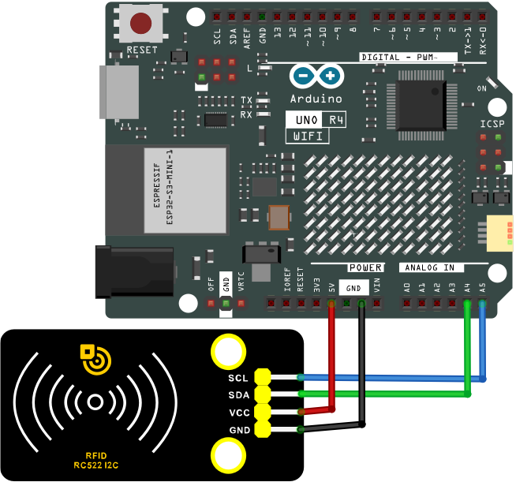


---

**6. Test Code**

```c++
/*  
 * File name: RFID
 * Function: RFID read UID
 * Compiling IDE: ARDUINO 2.3.2
 * Author: https://www.keyestudio.com/
*/
#include "MFRC522_I2C_SOFT.h"

// 0x28 is the i2c address on the SDA. If it doesn't match, check your address with i2cscanner.
MFRC522 mfrc522(0x28, A4, A5);   // Create an instance of MFRC522.

void setup() {
  Serial.begin(115200);           // Initialize serial communication with the PC
  mfrc522.PCD_Init();             // Initialize MFRC522
  ShowReaderDetails();            // Display detailed PCD-MFRC522 card reader details
  Serial.println(F("Scan PICC to see UID, type, and data blocks..."));
}

void loop() {
  // Look for new cards and choose one if available
  if ( ! mfrc522.PICC_IsNewCardPresent() || ! mfrc522.PICC_ReadCardSerial() ) {
    delay(50);
    return;
  }
  
  // Select a key card whose UID and SAK are mfrc522.uid, respectively
  // save UID
  Serial.print(F("Card UID:"));
  for (byte i = 0; i < mfrc522.uid.size; i++) {
    Serial.print(mfrc522.uid.uidByte[i] < 0x10 ? " 0" : " ");
    Serial.print(mfrc522.uid.uidByte[i], HEX);
  } 
  Serial.println();
}

void ShowReaderDetails() {
  //attain MFRC522 software
  byte v = mfrc522.PCD_ReadRegister(mfrc522.VersionReg);
  Serial.print(F("MFRC522 Software Version: 0x"));
  Serial.print(v, HEX);
  if (v == 0x91)
    Serial.print(F(" = v1.0"));
  else if (v == 0x92)
    Serial.print(F(" = v2.0"));
  else
    Serial.print(F(" (unknown)"));
  Serial.println("");
  // return 0x00 or 0xFF: The communication signal may have failed to transmit
  if ((v == 0x00) || (v == 0xFF)) {
    Serial.println(F("WARNING: Communication failure, is the MFRC522 properly connected?"));
  }
}
```
---

**7. Test Result**

Click  to upload code. If “**MFRC522_I2C_SOFT.h: No such file or directory**” appears, please load library first. Please visit [how to import Arduino library](https://docs.keyestudio.com/projects/KS0590-KS0594/en/latest/docs/Arduino_C_Tutorial.html#import-arduino-library)

After uploading the code, unplug the USB cable and wire up. Connect the board to the computer with USB cable and open serial monitor to set the baud rate to **<u>115200</u>**. 

Approach the IC card and key chain to the sensing area of the RFID module, and the serial monitor shows the read values of the RFID module.


**The values of IC cards and key chains are unique. Each one is different.** <span style="background:#ff0;color:#000">Please write down your UID of them, as they will be useful later.</span>

**<span style="color: rgb(255, 76, 65);">Note</span>: If the serial port monitor is turned on and the baud rate is set, the UID code of the IC card or key chain is still not displayed in the serial port monitor window when the white IC card or blue key chain is sensed in the sensor area on the RFID card swipe module, you can try to press the RESET button on the UNO R4 motherboard.**


---

**8. Code Explanation**

| Code                                      | Explanation                                      |
| ----------------------------------------- | ------------------------------------------------ |
| Wire.begin()                              | IIC initialization                               |
| mfrc522.PCD_Init()                        | MFRC522 initialization                           |
| Serial.print(mfrc522.uid.uidByte[i], HEX) | Converts the read hexadecimal value into string. |

---

### Project 35 MP3 Play Audio


---

**1. Overview**

MP3 is a music module for learning, whose core is YX5200-24SS voice chip and perfectly integrated MP3, WAV, WMA hard interface. It supports TF card driver, and is easy to use, stable and reliable. You can usually use the MP3 module to play audio.

---

**2. Component Knowledge**

**MP3 module:**

It integrates voice chip, buttons, TF card slot, headset hnterface, audio amplifier chip and speaker Interface. Before using MP3 module, let’s first understand some basic knowledge and technical parameters of the chip.

**Chip pin number:**  

The pin numbering principle of the DIP chip is: the package of the chip has a circular hole, and when the hole is upward, the first pin on the left side of the hole is labeled 1. Other pins are labeled in a counterclockwise direction. 

The following figure shows the schematic diagram of the pin number of the YX5200-24QS chip on the MP3 module.


The function description of the YX5200-24QS chip pin:


**YX5200-24QS Chip Introduction:**

YX5200-24QS chip is a compact new high-quality voice chip, which is flexible and convenient. It supports WAV, MP3 audio decoding and FTA file system, and it also supports SPI-FLASH, TF card, or USB flash drive as storage media. With USB interface, you can freely change the memory audio content through the PC. In addition, the software supports industrial grade serial port communication protocols and 3.3V TTL serial communication, so we can play the voice through a simple serial command, without any complicated low-level operations.

There is no need to burn recorder and host computer, as USB wire directly burns on FLASH.

**YX5200-24QS Chip Function:**

- Supported sampling rate (KHz) : 8/11.025/12/16/22.05/24/32/44.1/48.
- 24-bit DAC output, dynamic range support 90dB, SNR support 85dB.
- Fully support FAT16, FAT32 file system, maximum 32G TF card, support 32G U disk.
- Multiple control modes are available. TTL serial port mode, ADK button control mode.
- Radio interjection function, you can pause the background music that is playing. Continue to play the music after broadcasting.
- Audio data is sorted by folder, up to 100 folders are supported, and each folder can be assigned 255 tracks.
- Volume of 30 levels are adjustable, 5 kinds of EQ are optional. 

**Main functions of MP3 module:**

- With TF card slot to directly read and play the music in the card.
- With 1 serial port communication Interface (UART), which can control music playback through serial port communication.
- With micro USB interface (USB1) to read SD card contents and download music.
- With headphones Interface (P1) to easily access headphones for listening.
- Integrated audio amplifier chip (U1) and speaker Interface (S-OUT), which can be directly connected to the external speaker for playback. Audio magnification is 8x. The power of the speaker must be large enough. By default, the initial sound for playback is the maximum. Before playback, please turn down the volume.
- External six commonly used buttons to control and verify instructions.

---

**3. Parameters**

- Operating voltage: DC 5V
- Operating current: maximum 1A
- Maximum power consumption: 5W
- Operating temperature: 10 ~ 40 ° C
- Audio magnification: 8x
- Support TF card: maximum 32G
- The MP3 module has 4 pins: G, V, TX, RX

---

**4. Components**

|  |||
| ------------------------ | ------------------------ | ---------------------------- |
|UNO R4 WiFi/Minima main board (either-or)|MP3 module x1| DuPont wires |
||||
|mini speaker ×1|TF card (<span style="color: rgb(255, 76, 65);">provided by yourself</span>)×1| USB cable x1 |

---

**5. Import Audio**

Insert the TF card into the card slot on the MP3 module, and then connect the computer to the MP3 module with a USB cable. When the green LED2 light on the module flashes, the computer is connected to the TF card.

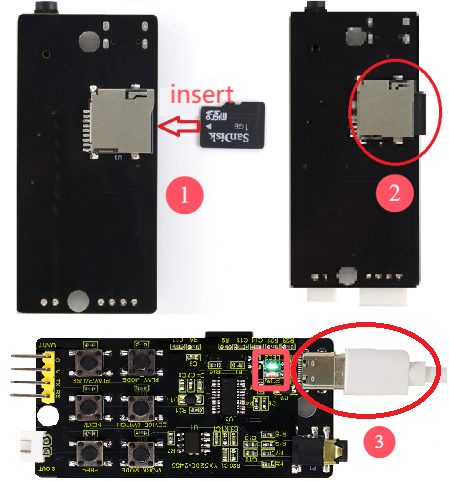

Click "**My Computer (This PC)**" and a new USB flash drive will appear. Open it and copy and paste (or directly drag) the audio folder "<span style="color: rgb(0, 209, 0);">01</span>" and "<span style="color: rgb(0, 209, 0);">02</span>" into TF card (USB flash drive).


After a while, open the "**U disk**" and you can see audio folders 01 and 02, indicating that they have been successfully transferred to TF card. <span style="color: rgb(255, 76, 65);">(Here, the audio folders 01 and 02 have been transferred to the TF card, so there is no need to repeat this step later.)</span>

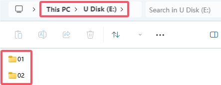

Then, disconnect the USB cable from the MP3 module and connect the mini speaker to the module.


---

**6. How to Play Audio (Method 1)**

We control audio playback in the TF card via the buttons on the MP3 module.

**Schematic diagram:**


**Wiring diagram:**


**Button function description:**

| WORK_MODE | Play mode |   |Loop |
| :--: | :--: | :--: |:--: |
|PRE/- | Previous song | Volume down |   |
| NEXT/+ |Next song |  Volume up  |   |
|DEVICE_SWITCH | Player switching |  | U/TF/SPI/sleep |
| PLAY_MODE |Working mode |   | shift to interrupt/non-interrupt |
|PLAY/PAUSE | Play/pause |   |   |

---

**7. MP3 Operation**

After powering, press the “PLAY/PAUSE” button and the speaker plays audio. Press "NEXT/+" to play the next song; Press "PRE/-" to play the previous song; Press "WORK_MODE" to loop playback; The green LED2 on the module flashes continuously while the audio is playing.


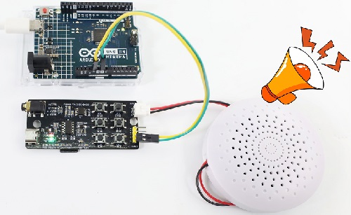

---

**8. How to Play Audio (Method 2)**

We program to control the playback of MP3 module audio.

**Schematic diagram:**


**Wiring diagram:**


---

**9. Test Code**

```c++
/*  
 * File name: Mp3_Playing
 * Function: Mp3 play audio
 * Compiling IDE: ARDUINO 2.3.2
 * Author: https://www.keyestudio.com/
*/
#include <SoftwareSerial.h>  //Soft serial port library

SoftwareSerial mySerial(10, 11); //MP3 TX pin to 10，RX pin to 11

void setup() {
  Serial.begin(9600); // initialize hard serial monitor
  mySerial.begin(9600); //initialize soft serial monitor
}

void loop() {
  int cmd1[]={0x7e, 0xff, 0x06, 0x0f, 0x00, 0x01, 0x01, 0xef}; //song 01 corresponding command, hexadecimal
  for(char i=0; i<8; i++){  
    mySerial.write(cmd1[i]); 
  }
  delay(3000);

  int cmd2[]={0x7e, 0xff, 0x06, 0x0f, 0x00, 0x01, 0x02, 0xef}; //song 02 corresponding command, hexadecimal
  for(char i=0; i<8; i++){
    mySerial.write(cmd2[i]);
  }
  delay(3000);

  int cmd3[]={0x7e, 0xff, 0x06, 0x0f, 0x00, 0x01, 0x03, 0xef}; //song 03 corresponding command, hexadecimal
  for(char i=0; i<8; i++){
    mySerial.write(cmd3[i]);
  }
  delay(3000);

  int cmd4[]={0x7e, 0xff, 0x06, 0x0f, 0x00, 0x01, 0x04, 0xef}; //song 04 corresponding command, hexadecimal
  for(char i=0; i<8; i++){
    mySerial.write(cmd4[i]);
  }
  delay(3000);

  int cmd5[]={0x7e, 0xff, 0x06, 0x0f, 0x00, 0x01, 0x05, 0xef}; //song 05 corresponding command, hexadecimal
  for(char i=0; i<8; i++){
    mySerial.write(cmd5[i]);
  }
  delay(3000);

  int cmd6[]={0x7e, 0xff, 0x06, 0x0f, 0x00, 0x01, 0x06, 0xef}; //song 06 corresponding command, hexadecimal
  for(char i=0; i<8; i++){
    mySerial.write(cmd6[i]);
  }
  delay(3000);

  int cmd7[]={0x7e, 0xff, 0x06, 0x0f, 0x00, 0x01, 0x07, 0xef}; //song 07 corresponding command, hexadecimal
  for(char i=0; i<8; i++){
    mySerial.write(cmd7[i]);
  }
  delay(3000);

  int cmd8[]={0x7e, 0xff, 0x06, 0x0f, 0x00, 0x01, 0x08, 0xef}; //song 08 corresponding command, hexadecimal
  for(char i=0; i<8; i++){
    mySerial.write(cmd8[i]);
  }
  delay(125000);

  int cmd9[]={0x7e, 0xff, 0x06, 0x0f, 0x00, 0x01, 0x09, 0xef}; //song 09 corresponding command, hexadecimal
  for(char i=0; i<8; i++){
    mySerial.write(cmd9[i]);
  }
  delay(205000);

  int cmd10[]={0x7e, 0xff, 0x06, 0x0f, 0x00, 0x01, 0x0A, 0xef}; //song 10 corresponding command, hexadecimal
  for(char i=0; i<8; i++){
    mySerial.write(cmd10[i]);
  }
  delay(88000);
}
```
---

**10. Test Result**

Click  to upload code. After uploading the code, unplug the USB cable and wire up. Connect the board to the computer with USB cable and power on, and the speaker will repeatedly play the audio in TF card.


---

## Comprehensive Projects

The previous projects are related to single sensor or module. In the following part, we will combine various sensors and modules to create some comprehensive experiments to perform special functions. 

There are multiple sensors/modules in the kit so we just design a few classic combination experiments. You can also set up your own experimental code according to your own ideas.

---

### Project 36 Mini Lamp


---

**1. Overview**

In previous experiment, we have learned that the MCU reads low when the button is pressed and reads high when the button is released. In this project, we combine a red LED and a button to simulate a mini lamp. Press the button to turn on the red LED and press it again to turn light off.

---

**2. Components**

|  |||
| ------------------------ | ------------------------ | ---------------------------- |
| UNO R4 WiFi/Minima main board (either-or) | button x1 | 10kΩ resistor x1 | 
|| ||
|Breadboard x1 |Red LED x1|Jump wires |
||||
|220Ω resistor x1 | USB cable x1 |Ceramic capacitor x1|

---

**3. Button Jitters**

**What is button jitters?**

We think of the switch circuit as "press the button and turn it on immediately", "press it again and turn it off immediately". In fact, this is not the case.

The button is usually a mechanical elastic switch which will produce a series of jitters due to the elastic action at the moment when the mechanical contact is opened and closed (usually about 50ms). As a result, the button will not immediately and stably close the circuit when it is pressed, and the same is true when you release it. 


**How to eliminate button jitters?**

There are two common methods, namely fix jitters by software or hardware. 

There are two common methods, namely fix jitters by software or hardware. 

- Software:

	We already know that the jitters time generated by elasticity is about 50ms, so we can use a delay putt off the execution time of the next command. Therefore, we delay 0.05s in the code to eliminate the button jitters. 

	

- Hardware:

	We can also use 100NF-104-ceramic capacitors or 10NF-103-ceramic capacitors to eliminate button jitters. 

	In this project, 100NF-104-ceramic capacitor is connected in parallel at both ends of the button to discharge and absorb its jitters levels, so as to eliminate button jitters.

---

**4. Wiring Diagram**

**Schematic diagram:**


**Wiring diagram:**

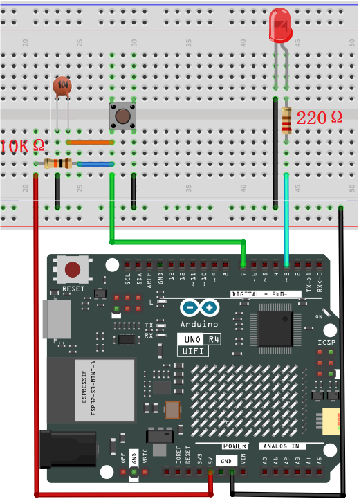


---

**5. Code Flow**

The flow chart of the whole program is shown in the left. 

Flow chart is a method to express program ideas with intuitive graphics, which is easy to understand. Common flowchart symbols are shown in the right.


Before designing programs, please draw a flow first to help us better clarify the idea!

---

**6. Test Code**

```c++
/*  
 * File name: Small Table Lamp
 * Function: button control LED on and off to simulate small table lamp
 * Compiling IDE: ARDUINO 2.3.2
 * Author: https://www.keyestudio.com/
*/
int buttonPin = 7;               //button pin to digital pin 7
int ledPin = 3;                 //LED pin to digital pin 3
int ledState = LOW;            // ledState record LED state
int buttonState;                 // buttonState record button state
int lastButtonState = HIGH;     // lastbuttonState record button last state
long lastDebounceTime = 0;
long debounceDelay = 50;        //Jitter removal time

void setup() {
  pinMode(buttonPin, INPUT); //set button pin to input
  pinMode(ledPin, OUTPUT);  //set LED pin to output
  digitalWrite(ledPin, ledState);  //set LED initial state to off
}

void loop() {
  int reading = digitalRead(buttonPin);  //reading is used to store buttonPin data
  if (reading != lastButtonState) {   // Once a change in data is detected, record the current time
    lastDebounceTime= millis();
  }
  // Wait for 50ms and check again whether the buttonstate is the same as the current ButtonState
  // If it is different from the current state, change buttonstate
  // At the same time, if the buttonstate is low (pressed), then change the state of the led
  if ((millis() - lastDebounceTime) > debounceDelay) {
    if (reading != buttonState) {
      buttonState = reading;
      if (buttonState == LOW) {
          ledState= !ledState;
      }
    }
  }
  digitalWrite(ledPin, ledState);
  lastButtonState = reading;  // change buttonlast state value
}
```
---

**7. Test Result**

Click  to upload code. After uploading the code, unplug the USB cable and wire up. Connect the board to the computer with USB cable and power on. After that, press the button and the LED turns on. Press it again and the LED goes off. Doesn't it look like a little lamp?


---

**8. Code Explanation**

| Code                              | Explanation                                              |
| -------------------------------------- | ------------------------------------------------------------ |
| val = digitalRead(PIN_BUTTON) | read the button value and assign it to the variable val |
| if( ){ }  | Condition statement: If condition in the () is true, execute the codes in if { }. |
|digitalWrite(ledPin, ledState)|LED off|
|lastButtonState = reading|change the last state value of button|
|ledState= !ledState|LED on|
|(millis() - lastDebounceTime) > debounceDelay|delay 50ms to determine again whether the state is the same as the current button state|

---

### Project 37 DIP Switch Control LED


---

**1. Overview**

DIP switch is a very common and easy to use component. In this experiment, we use a DIP switch to control the LED on and off.

---

**2. Component Knowledge**


DIP switch controls circuit on or off via the handle. It commonly used varieties are single-pole double-bit, single-pole three-bit, bipolar double-bit and bipolar three-bit. It is flexible, stable and reliable. Generally, it is used in low-voltage circuits, including a variety of electronic products such as instrument equipment, electric toys, fax machines, audio equipment, medical equipment and beauty equipment.

---

**3. Code Flow**


---

**4. Components**

|  |||
| ------------------------ | ------------------------ | ---------------------------- |
| UNO R4 WiFi/Minima main board (either-or) | 10kΩ resistor x2 | 220Ω resistor x2 |
|| ||
| DIP switch x1 |Red LED x1|Green LED x1|
||||
|Breadboard x1 |Jump wires | USB cable x1 |

---

**5. Wiring Diagram**

**Schematic diagram:**


**Wiring diagram:**


---

**6. Test Code**

```c++
/*  
 * File name: Dip_Switch_Controls_Leds
 * Function: Dip_Switch_Controls_Leds
 * Compiling IDE: ARDUINO 2.3.2
 * Author: https://www.keyestudio.com/
*/
int redpin = 3; //define red LED to digital pin 3
int greenpin = 5; //define green LED to digital pin 5
int redled = 11;  //define red LED to digital pin 11
int greenled = 10; //define green LED to digital pin 10

void setup() {
  pinMode(redled,OUTPUT);   //set red LED pin to output
  pinMode(greenled, OUTPUT);   //set green LED pin to output 
  pinMode(redpin, INPUT);   //set red LED pin to input
  pinMode(greenpin,INPUT);   //set green LED pin to input
}

void loop(){
  int val = digitalRead(redpin); //read red LED value and assign it to variable val
  if (val == HIGH){  //If red LED value is HIGH 
    digitalWrite(redled, HIGH);  //red LED on
  }
  else{ //otherwise, red LED value is not HIGH 
    digitalWrite(redled,LOW);  //red LED off
  }
  int val1 = digitalRead(greenpin); //read green LED value and assign it to variable val1
  if (val1 == HIGH) { //If green LED value is HIGH 
    digitalWrite(greenled, HIGH);  //green LED on
  }
  else{  //otherwise, green LED value is not HIGH 
    digitalWrite(greenled,LOW);  //green LED off
  }
}
```
---

**7. Test Result**

Click  to upload code. After uploading the code, unplug the USB cable and wire up. Connect the board to the computer with USB cable and power on. After that, toggle the switch to the left: the green LED on and the red LED off. Toggle it to the right to turn on the red LED and turn off the green LED.


---

**8. Code Explanation**

| Code                              | Explanation                                                  |
| -------------------------------------- | ------------------------------------------------------------ |
| val = digitalRead(redpin) | read the red LED value and assign it to variable val |
| if( ){ } else{ }       | Condition statement: If condition in the () is true, execute the codes in if { }. If it is false, run code in else { }. |
|digitalWrite(redled, HIGH)| red LED on |
|digitalWrite(redled, LOW)| red LED off |

---

### Project 38 Responder


---

**1. Overview**

The responder is an electrical appliance that can accurately, fairly and intuitively determine the the seat number of the answer. So it is widely used in knowledge competition, sports and entertainment activities.

In this project, we control three PWM ports via four buttons to light up RGB in different colors. 

---

**2. Components**

|  ||||
| ------------------------ | ------------------------ | ---------------------------- |---------------------------- |
| UNO R4 WiFi/Minima main board (either-or) | button x4 | 10kΩ resistor x4 | 220Ω resistor x3 |
|||||
|Breadboard x1 |RGB x1|Jump wires | USB cable x1 |

---

**3. Wiring Diagram**

**Schematic diagram:**


**Wiring diagram:**


---

**4. Code Flow**


---

**5. Test Code**

```c++
/*  
 * File name: Responder
 * Function: Four buttons control the RGB to simulate responder
 * Compiling IDE: ARDUINO 2.3.2
 * Author: https://www.keyestudio.com/
*/
//define RGB and 4 button pins
int redled = 11;     
int greenled = 10; 
int blueled = 9;  
int redpin = 5;    
int greenpin = 4; 
int bluepin = 3;   
int restpin = 2;
//define variable   
int red;
int green;
int blue;

void setup(){
pinMode(redled,OUTPUT); //set R pin to output
pinMode(greenled,OUTPUT); //set G pin to output
pinMode(blueled,OUTPUT); //set B pin to output
pinMode(redpin,INPUT);  //set RGB red pin to input
pinMode(greenpin,INPUT); //set RGB green pin to input
pinMode(bluepin,INPUT); //set RGB blue pin to input
}

void loop() {
red = digitalRead(redpin); //read RGB light up in red value and store it in red
green = digitalRead(greenpin); //read RGB light up in green value and store it in green
blue = digitalRead(bluepin); //read RGB light up in blue value and store it in blue
if(red == LOW)RED_YES();  //if press RGB red button, execute function RED_YES() 
if(green == LOW)GREEN_YES(); //if press RGB greenbutton, execute function GREEN_YES
if(blue == LOW)BLUE_YES(); ////if press RGB bluebutton, execute function BLUE_YES()
}

void RED_YES() { //execute RGB light up in red until the reset button (connected to digital pin D2), then exit loop
  while(digitalRead(restpin) == 1){ 
    color(255, 0, 0);  //RGB light up in red 
 }
  clear_led(); //RGB off
}

void GREEN_YES(){ //execute RGB light up in greenuntil the reset button (connected to digital pin D2), then exit loop
  while(digitalRead(restpin) == 1){ //press RGB green button
    color(0, 255, 0); //RGB light up in green
  }
  clear_led(); 
}

void BLUE_YES(){ //execute RGB light up in blueuntil the reset button (connected to digital pin D2), then exit loop
  while(digitalRead(restpin) == 1){ 
    color(0, 0, 255); //RGB light up in blue
  }
  clear_led();
}

void clear_led(){ //press the reset button (connected to digital pin D2), RGB off
  color(0, 0, 0); 
}

void color (unsigned char red, unsigned char green, unsigned char blue){  //RGB color control    
  analogWrite(redled, red);   //RGB light up in red 
  analogWrite(greenled,green);  //RGB light up in green
  analogWrite(blueled, blue);   //RGB light up in blue
} 
```
---

**6. Test Result**

Click  to upload code. After uploading the code, unplug the USB cable and wire up. Connect the board to the computer with USB cable and power on. After that, we can determine which button is pressed according to the color of the RGB. Press the reset button at **digital port D2**, and the RGB will turns off.


---

**7. Code Explanation**

| Code              | Explanation                          |
| ---------------------- | ---------------------------------------- |
|if(red == LOW)RED_YES(); | Press the button controlling RGB in red, and the RED_YES() function will run. |
|void RED_YES()| RGB always in red until pressing reset button (**digital pin D2**). |
|color(255, 0, 0) | RGB on in red |
|clear_led()| RGB off |
|void color (unsigned char red, unsigned char green, unsigned char blue)|control the lighting color of RGB|

---

### Project 39 Electronic Hourglass


---

**1. Overview**

There is no electronic clock in ancient days, so hourglass is invented to measure time. The capacity of both sides of the hourglass is relatively large, and there is a small channel in the middle. When it is upright, the side with fine sand on the top will flow down through the channel to the other side due to gravity. After they are all down, invert it and record the number of inversion times during a day, so they can know the approximate time the next day with hourglass repeatedly flowing. 

In this project, we use the UNO R4 board to control tilt switch and LED to simulate an hourglass.

---

**2. Components**

|  ||||
| ------------------------ | ------------------------ | ---------------------------- |---------------------------- |
| UNO R4 WiFi/Minima main board (either-or) | tilt switch x1 | 10kΩ resistor x1 | 220Ω resistor x4 |
|| |||
|Breadboard x1 |Red LED x4|Jump wires | USB cable x1 |

---

**3. Wiring Diagram**

**Schematic diagram:**


**Wiring diagram:**


---

**4. Code Flow**


---

**5. Test Code**

```c++
/*  
 * File name: Electronic_Hourglass
 * Function: Tilt switch controls 4 LED to simulate electronic hourglasses
 * Compiling IDE: ARDUINO 2.3.2
 * Author: https://www.keyestudio.com/
*/
const byte SWITCH_PIN = 4; // set tilt switch pin to digital pin 4
int led1 = 8;  //set led1 pin to digital pin 8
int led2 = 9;  //set led2 pin to digital pin 9
int led3 = 10;  //set led3 pin to digital pin 10
int led4 = 11;  //set led4 pin to digital pin 11

byte switch_state = 0; //set variable switch_state with an initial value of 0

void setup(){
  Serial.begin(9600); //set baud rate to 9600
  pinMode(SWITCH_PIN, INPUT); //set tilt switch pin to input
  for(int i=8;i<12;i++){  //set 4 LED pin to output
    pinMode(i, OUTPUT);
  } 
  for(int i=8;i<12;i++){ //set 4 LED off
    digitalWrite(i,0);
  } 
}

void loop(){
  switch_state = digitalRead(SWITCH_PIN); //read tilt switch value and assign it to switch_state
  Serial.println(switch_state); //serial monitor prints tilt switch value 
  if (switch_state == 1) {  //if tilt switch tilts at a certain Angle (i.e., its value is 1)
    for(int i=8;i<12;i++){  //4 LED gradually turn on
      digitalWrite(i,1);
      delay(500);
    } 
  }
  if (switch_state == 0) {  //if tilt switch does not tilt (i.e., its value is 0)
    for(int i=11;i>7;i--){  //4 LED gradually turn off
      digitalWrite(i,0);
      delay(500);
    }
  }
}
```

---

**6. Test Result**

Click  to upload code. After uploading the code, unplug the USB cable and wire up. Connect the board to the computer with USB cable and power on. After that, hold the breadboard and tilt it gently, and LED will light up one by one. Put the breadboard back and they goes off one by one. Like an hourglass, the sand slides down over time.


---

**7. Code Explanation**

Please refer to Project 05, Project 06 and Project 18.

---

### Project 40 Anti-theft Alarm


---

**1. Overview**

We have learned the working principle of PIR motion sensor. So in this project, we combine the PIR motion sensor, an LED and an active buzzer to build an anti-theft alarm. If it detects a human motion, the buzzer alarms and the LED blinks.

---

**2. Components**

|   ||||
| ------------------------ | ------------------------ | ---------------------------- |---------------------------- |
|UNO R4 WiFi/Minima main board (either-or)| NPN transistor (S8050) x1 | active buzzer x1 | 1kΩ resistor x1 |
||| ||
| PIR motion sensor x1 |DuPont wires |Red LED x1|220Ω resistor x1  |
|||||
|Breadboard x1 |Jump wires | USB cable x1 | 10kΩ resistor x1 |

---

**3. Wiring Diagram**

**Schematic diagram:**


**Wiring diagram:**


---

**4. Code Flow**


---

**5. Test Code**

```c++
/*  
 * File name: Burglar_Alarm
 * Function: PIR controls the buzzer and LED to simulate anti-theft alarm
 * Compiling IDE: ARDUINO 2.3.2
 * Author: https://www.keyestudio.com/
*/
#define ledPin  12  // define LED pin to 12
#define PIR_PIN  9  // pir motion sensor pin to 9
#define BUZZER_PIN  3  //define active buzzer pin to 3

int item = 0;  //define variable item with an initial value o f0

void setup() {
  Serial.begin(9600);//set baud rate to 9600
  pinMode(PIR_PIN, INPUT);  //set pir motion sensor pin to input
  pinMode(BUZZER_PIN, OUTPUT); //set active buzzer pin to output
  pinMode(ledPin, OUTPUT);// set led pin to output
}

void loop() {
  item = digitalRead(PIR_PIN); //read the digital signal output by the PIR motion sensor
  Serial.println(item);    //print item
  if (item == 1) {  //motion is detected
    digitalWrite(BUZZER_PIN, HIGH); //turn on buzzer
    digitalWrite(ledPin, HIGH); // turn on LED
    delay(200);//delay 200ms
    digitalWrite(BUZZER_PIN, LOW); //turn off buzzer
    digitalWrite(ledPin, LOW); // turn off LED
    delay(200);//delay 200ms
  } else {  //detect no signals
    digitalWrite(BUZZER_PIN, LOW); //turn off buzzer
    digitalWrite(ledPin, LOW); // turn off LED
  }
}
```

---

**6. Test Result**

Click  to upload code. After uploading the code, unplug the USB cable and wire up. Connect the board to the computer with USB cable and power on. After that, when the PIR motion sensor detects a movement, the buzzer emits sound and the external LED blinks.


---

**7. Code Explanation**

| Code              | Explanation                          |
| ---------------------- | ---------------------------------------- |
| item = digitalRead(PIR_PIN) | PIR motion sensor read digital power level output |
| item == 1              | a human motion is detected |
| digitalWrite(BUZZER_PIN, HIGH) | active buzzer emit sound |
| digitalWrite(ledPin, HIGH) | LED on |

---

### Project 41 Mini Appliance


---

**1. Overview**

In daily life, we generally use 220V AC to drive electrical appliances and control them with switches. However, if the switch is directly connected to the 220V AC circuit, once leakage occurs and people will be in danger. 

Therefore, in this project, we specially designed this relay module with NO(normally open) and NC(normally closed) to control motor rotation.

---

**2. Component Knowledge**

**Relay:**

Relay uses a low-power circuit to control a high-power one. 

It consists of an electromagnet(controlled by low-power circuit) and a contact(control high-power circuit).  When the electromagnet is energized, it attracts the contact. Below is a diagram of a commonly used relay, along with the circuit symbol of a 5V relay used in this project:


Pin 1 and 2 are internally connected to each other. When coil pin 3 and 4 are connected to a 5V power supply, pin 6 will be disconnected from pins 1 and 2, and in 5 will be connected to pins 1 and 2. So pin 6 is called normally closed and pin 5 is called normally open.

**Inductance:**

The symbol of inductance is "L", and its unit is "Henry" (H). 1H = 1000mH, 1mH = 1000μH. 

An inductor is an energy storage device that is generally composed of winding coils with a certain amount of inductance. It converts electrical energy into magnetic energy and obstructs the change of current passing through it. When the current passing through it increases/decreases, it tries to block the tendency of the increasing/decreasing. Therefore, the current through the inductor is not transient.


The reference circuit is as follows. 

The coil of the relay is equivalent to an inductor coil. When the triode disconnects the power supply of the relay, the current in the relay coil cannot be stopped immediately, thus affecting the power supply. Therefore, a parallel diode is connected in reverse to both ends of the coil pin, so the current is then passed through the diode, avoiding the impact on the power supply.


---

**3. Components**

|  ||||
| ------------------------ | ------------------------ | ---------------------------- |---------------------------- |
|UNO R4 WiFi/Minima main board (either-or)| S8050 transistor x1 |10kΩ resistor x2 |1kΩ resistor x1|
|| | ||
|button x1|relay x1|LED x1|220Ω resistor x1|
| | |||
| DC motor x1 |Breadboard x1 |Jump wires | USB cable x1 |
|||||
|Fan x1|Battery holder x1|AA battery (<span style="color: rgb(255, 76, 65);">Provide for yourself</span>) x6| Diode x1 |

<span style="color: rgb(255, 76, 65);">**Please mount the fan to motor first.**</span>

---

**4. Wiring Diagram**

**Schematic diagram:**


**Wiring diagram:**

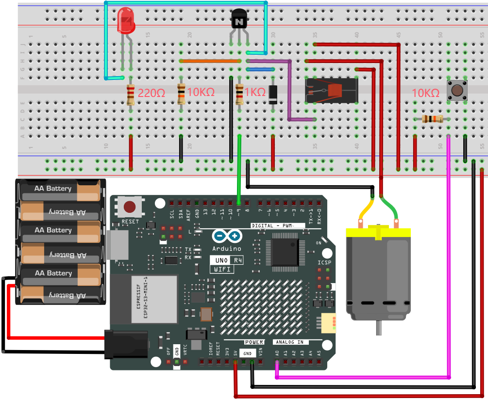


---

**5. Code Flow**


---

**6. Test Code**

```c++
/*  
 * File name: Home_Appliances
 * Function: Relays and button controls motor rotation to simulate a small home appliances
 * Compiling IDE: ARDUINO 2.3.2
 * Author: https://www.keyestudio.com/
*/
int relayPin = 9;          // define relay pin to digital pin 9
int buttonPin = A0;         //define button pin to A0

int buttonState = HIGH;     // record button state and state initializes to high
int relayState = LOW;       //record relay state and state initializes to low
int lastButtonState = HIGH; // record last button state 
long lastChangeTime = 0;    // record button state change time 

void setup() {
  pinMode(buttonPin, INPUT_PULLUP);   // set button pin to input
  pinMode(relayPin, OUTPUT);          // set relay pin to output
  digitalWrite(relayPin, relayState); // set relay initial state to off
}
void loop() {
  int nowButtonState = digitalRead(buttonPin);// read button current state 
  // if button state changes, record the time
  if (nowButtonState != lastButtonState) {
    lastChangeTime = millis();
  }
  // if button state changes and remains stable for a while, it should skip the rebound area
  if (millis() - lastChangeTime > 10) {
    if (buttonState != nowButtonState) {    // ensure button state is changed
      buttonState = nowButtonState;
      if (buttonState == LOW) {             // loe: button is pressed
        relayState = !relayState;           // reverse relay state 
        digitalWrite(relayPin, relayState); // update relay state 
      }
    }
  }
  lastButtonState = nowButtonState; // save the last button state 
}
```
---

**7. Test Result**

Click  to upload code. After uploading the code, unplug the USB cable and wire up. External power supply and power on. After that, press the button and the LED lights up, and the motor rotates. When the motor connects to power, it rotates in one direction. If we reverse the power supply, the motor will change its rotation direction.


---

**8. Code Explanation**

```c++
int nowButtonState = digitalRead(buttonPin);
if (nowButtonState != lastButtonState) {
   lastChangeTime = millis();
}   
```

To eliminate vibration, we use **nowButtonState** to record the level of the button and **lastChangeTime** to record the point of time when the pin level last changed. If the button state changes, it records the time of the change.

```c++
if (millis() - lastChangeTime > 10) {
    if (buttonState != nowButtonState) {    
    buttonState = nowButtonState;
    if (buttonState == LOW) {             
        relayState = !relayState;           
        digitalWrite(relayPin, relayState); 
    }
    }
}
lastButtonState = nowButtonState;
```

If the pin state changes and remains stable over a period of time, it can be regarded as a valid change, and the **buttonState** will be updated, so we determine whether the button is pressed or released according to the current state.

---

### Project 42 Dimming Light


---

**1. Overview**

We have learned how the potentiometer works in experiments of breathing LED. Herein, we use the potentiometer as a switch to control the LED brightness by reading the analog values. The potentiometer analog value ranges from 0 to 1023. The brightness of the LED is controlled by the PWM value, which ranges from 0 to 255.

---

**2. Components**

|  ||||
| ------------------------ | ------------------------ | ---------------------------- |---------------------------- |
| UNO R4 WiFi/Minima main board (either-or) | potentiometer x1 | Red LED x1 | 220Ω resistor x1 |
||||   |
|Breadboard x1 |Jump wires | USB cable x1 |  |

---

**3. Wiring Diagram**

**Schematic diagram:**


**Wiring diagram:**


---

**4. Code Flow**


---

**5. Test Code**

```c++
/*  
 * File name: Dimming_Light
 * Function: potentiometer control LED
 * Compiling IDE: ARDUINO 2.3.2
 * Author: https://www.keyestudio.com/
*/
int potPin = A0; // initialize potentiometer analog pin A0
int ledPin = 6; // initialize digital pin 6
int val = 0; // define val with an initial value of 0

void setup(){
  Serial.begin(9600);// set baud rate to 9600
  pinMode(potPin,INPUT);// set potentiometer analog pin to intput
  pinMode(ledPin,OUTPUT);// set LED digital pin to output
}

void loop(){
  val = analogRead(potPin);// read A0 value and assign it to val 
  Serial.println(val);// print val
  analogWrite(ledPin,val/4);
  delay(100);
}
```
---

**6. Test Result**

Click  to upload code. After uploading the code, unplug the USB cable and wire up. Connect the board to the computer with USB cable and power on. After that, rotate the potentiometer to adjust the brightness of the red LED.


---

**7. Code Explanation**

Please refer to Project 05, Project 06 and Project 21.

---

### Project 43 Night Lamp


---

**1. Overview**

We have learned the working principle of photoresistor before. In this project, we will make a combination experiment of photoresistor and red LED. The LED is off when the light intensity is higher than the set value and the LED is on when it is lower than the set value.

---

**2. Components**

|  ||||
| ------------------------ | ------------------------ | ---------------------------- |---------------------------- |
| UNO R4 WiFi/Minima main board (either-or) | photoresistor x1 |Breadboard x1 | Red LED x1 |
|||  ||
|Jump wires | USB cable x1 | 10kΩ resistor x1 |  220Ω resistor x1  |

---

**3. Wiring Diagram**

**Schematic diagram:**


**Wiring diagram:**

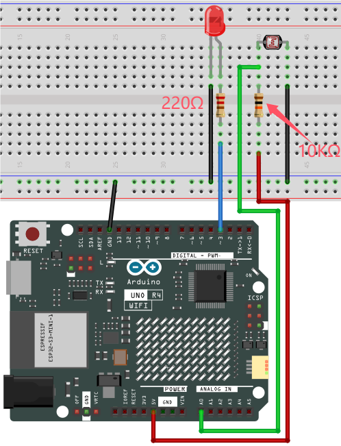


---

**4. Code Flow**


---

**5. Test Code**

<span style="color: rgb(255, 76, 65);">The analog value threshold of 600 in the code can be set according to the actual situation.</span>

```c++
/*  
 * File name: Night_Lamp
 * Function: photoresistor control LED
 * Compiling IDE: ARDUINO 2.3.2
 * Author: https://www.keyestudio.com/
*/
int PIN_ANALOG_IN = A0;   //photoresistor pin to analog A0
int LED_PIN = 3;   //LED pin to D3
int item = 0;  //set item to 0

void setup() {
  Serial.begin(9600); //set baud rate to 9600
  pinMode(PIN_ANALOG_IN, INPUT);    //set photoresistor pin to input
  pinMode(LED_PIN, OUTPUT);  // set led pin to output
}

void loop() {
  item = analogRead(PIN_ANALOG_IN); //read photoresistor analog value
  Serial.println(item);  //print photoresistor analog value
  if (item > 600) {  //the value > 600
    digitalWrite(LED_PIN, HIGH);  //turn on LED   
  } else {  //the value < = 600
    digitalWrite(LED_PIN, LOW);  //turn off LED
  }
}
```
---

**6. Test Result**

Click  to upload code. After uploading the code, unplug the USB cable and wire up. Connect the board to the computer with USB cable and power on. After that, shine a light on the photoresistor. When the detected analog value of light reaches 600, the red LED turns on. Otherwise, it will go off.


---

**7. Code Explanation**

Please refer to Project 21 and Project 37.

---

### Project 44 Variable Speed Water Flow LED


---

**1. Overview**

---

In daily life, we can see many billboards composed of different colors of led, which change the light (like water flowing). But flow rate of them on the billboard is variable. Can we also make such a variable speed water flow LED? Of course yes. 

In this project, we combine potentiometer with red, yellow and green LED to build a variable speed water flow light.

---

**2. Components**

|  |||
| ------------------------ | ------------------------ | ---------------------------- |
| UNO R4 WiFi/Minima main board (either-or) | potentiometer x1 | Red LED x1 |
||||
|Breadboard x1 |Jump wires | USB cable x1 |
||||
| Green LED x1 | Yellow LED x1 |220Ω resistor x3  |

---

**3. Wiring Diagram**

**Schematic diagram:**


**Wiring diagram:**


---

**4. Code Flow**


---

**5. Test Code**

```c++
/*
 * File name: Speed_Regulating_Waterfall_Lights
 * Function: Speed_Regulating_Waterfall_Lights
 * Compiling IDE: ARDUINO 2.3.2
 * Author: https://www.keyestudio.com/
*/
const int ledPins[] = {3, 4, 5};  //define red, yellow, green LED pin
const int potPin = A0;  //define potentiometer pin to analog A0   
int potValue = 0;  //potentiometer value   
int delayTime = 100;  //default delay time  
  
void setup() {  
  for (int i = 0; i < 3; i++) {  
    pinMode(ledPins[i], OUTPUT);  //set LED pin to output 
  }  
  pinMode(potPin, INPUT);  //set potentiometer pin to input 
}  
  
void loop() {  
  potValue = analogRead(potPin);  //read potentiometer value   
  delayTime = map(potValue, 0, 1023, 100, 1000);  //map potentiometer value to delay time 
  
  for (int i = 0; i < 3; i++) {  
    digitalWrite(ledPins[i], HIGH);  //turn on LED   
    delay(delayTime);  //delay   
    digitalWrite(ledPins[i], LOW);  //turn off LED   
  }  
}
```

---

**6. Test Result**

Click  to upload code. After uploading the code, unplug the USB cable and wire up. Connect the board to the computer with USB cable and power on. After that, the red, green and yellow LED keep turning on and off, like a water flow. Rotate the potentiometer to fasten or slow down the flowing speed.


---

**7. Code Explanation**

Please refer to Project 21 and Project 37.

---

### Project 45 Fire-fighting Robot


---

**1. Overview**

Do you know about fire-fighting robots? According to estimates by the National Crime Records Bureau (NCRB), fire accidents in India have killed more than 1.2 million people from 2010 to 2014. Even though many precautions are taken, these disasters still happen from time to time. With the advancement of technology and the development of robot technology, it is very possible to use robots to replace firefighters in the future, which improves the efficiency of fire fighting and protects the lives of firefighters.

In this project, we will learn how to build a very simple robot with the UNO R4 board. We detect the flame with the flame sensor and turn on the motor to blowout the fire source.

---

**2. Components**

|  ||||
| ------------------------ | ------------------------ | ---------------------------- |---------------------------- |
|UNO R4 WiFi/Minima main board (either-or)| S8050 transistor x1 |10kΩ resistor x2 |1kΩ resistor x1|
||  |||
|Flame sensor x1|LED x1|220Ω resistor x1|1.5V AA battery (<span style="color: rgb(255, 76, 65);">Provide for yourself</span>) x6|
| | |||
| DC motor x1 |Breadboard x1 |Jump wires | USB cable x1 |
|||   |  |
|Fan x1|Battery holder x1| Diode x1|   |

<span style="color: rgb(255, 76, 65);">**Please mount the fan to motor first.**</span>

---

**3. Wiring Diagram**

**Schematic diagram:**

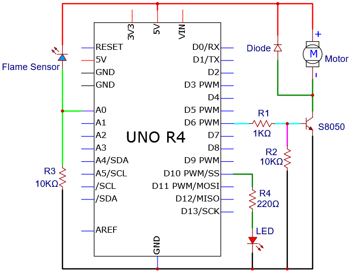

**Wiring diagram:**


---

**4. Code Flow**


---

**5. Test Code**

<span style="color: rgb(255, 76, 65);">The analog value threshold of 100 in the code can be set according to the actual situation.</span>

```c++
/*  
 * File name: Fire-fighting robot
 * Function: The flame sensor controls the motor and the LED to simulate fire-fighting robot
 * Compiling IDE: ARDUINO 2.3.2
 * Author: https://www.keyestudio.com/
*/
int PIN_ANALOG_IN = A0;   //define flame sensor pin to analgo A0
int motorPin = 6;   //define motor  pin to digital 6
int ledPin = 10;   //define led pin to digital 10
int item = 0; //define variable item with an initial value of 0

void setup() {
  Serial.begin(9600);  //set baud rate to 9600
  pinMode(PIN_ANALOG_IN, INPUT); //set flame sensor pin to input
  pinMode(motorPin, OUTPUT); //set motor pin to output
  pinMode(ledPin, OUTPUT); //set led pin to output
}

void loop() {
  item = analogRead(PIN_ANALOG_IN); //read flame sensor analog value and assign it to variable item
  Serial.print(item); //print item
  if (item > 100) { //item > 100, fan on, LED blink
    Serial.print("   "); 
    Serial.println("Put out a fire");
    digitalWrite(motorPin, HIGH); //turn on motor 
    digitalWrite(ledPin, HIGH);
    delay(200);
    digitalWrite(ledPin, LOW);
    delay(200);  
  } 
  else {//or else, fan off, LED off
    Serial.print("   "); 
    Serial.println("No flame detected");
    digitalWrite(motorPin, LOW);
    digitalWrite(ledPin, LOW); 
  } 
}
```
---

**6. Test Result**

The fan requires a larger current than other sensors when it is rotating, thus voltage and current fluctuations may appear, especially when changing direction. This will greatly reduce the voltage and current of the main board, resulting in a reset.

Click  to upload code. After uploading the code, unplug the USB cable and wire up. Connect the board to the computer with USB cable and open serial monitor to set the baud rate to **<u>9600</u>**.

The serial monitor shows the analog values of the flame sensor. If the value exceeds 100, the fan will turn on to blowout the fire, with LED blinking. Meanwhile, the serial monitor displays “**Put out a fire**”. When the value is lower than 100, the fan and LED turn off, and serial monitor prints “**No flame detected**”.


---

**7. Code Explanation**

In the code, we set the threshold to 100 (item > 100), which can be modified according to the actual situations. When the flame sensor detects that the analog value reaches this threshold, the fan will automatically turn on; Otherwise it turns off. 

See Project 15 for how to drive the fan.

---

### Project 46 Induction Lamp


---

**1. Overview**

Induction lights are generally used in dark corridors, bedrooms, underground garage and bathrooms. They are generally composed of PIR motion sensor, a light and photoresistor.

In this project, we will learn how to make an induction light by PIR motion sensor, LED and photoresistor.

---

**2. Components**

|  |||
| ------------------------ | ------------------------ | ---------------------------- |
|UNO R4 WiFi/Minima main board (either-or)| photoresistor x1 |10kΩ resistor x1 |
||  ||
|PIR motion sensor x1|LED x1|220Ω resistor x1|
||||
|Breadboard x1 |Jump wires | USB cable x1 |

---

**3. Wiring Diagram**

**Schematic diagram:**


**Wiring diagram:**


---

**4. Code Flow**


---

**5. Test Code**

<span style="color: rgb(255, 76, 65);">The analog value threshold of 600 in the code can be set according to the actual situation.</span>

```c++
/*  
 * File name: Corridor_Induction_Lamp
 * Function: photoresistor and pir motion sensor are used to control LED.
 * Compiling IDE: ARDUINO 2.3.2
 * Author: https://www.keyestudio.com/
*/
int PIN_ADC0 = A0;   //define photoresistor pin to analog A0
int ledPin = 10;  //define LED pin to digital 10
int pirPin = 3;     //define pir motion sensor pin to digital 3
byte pirStat = 0;   //pir motion sensor state

void setup() {
  Serial.begin(9600);  //set baud rate 9600
  pinMode(ledPin, OUTPUT);  //set LED pin to output
  pinMode(PIN_ADC0, INPUT);  //set photoresistor pin to input
  pinMode(pirPin, INPUT);  //set pir motion sensor pin to input
}

void loop() {
  int adcVal = analogRead(PIN_ADC0); //read photoresistor analog value and assign it to variable adcVal
  Serial.println(adcVal); //serial monitor prints adcVal
  pirStat = digitalRead(pirPin); //read pir motion sensor value
  if (adcVal >= 600) { //if photoresistor analog value is greater than or equal to 600 
    if (pirStat == HIGH){  //if pir motion sensor detects a human motion 
      digitalWrite(ledPin, HIGH); //turn on external LED
      delay(5000);
    } 
    else{ //or else pir motion sensor does not detect a human motion 
      digitalWrite(ledPin, LOW); //turn off external LED   
    }
  }
  else{  //or else photoresistor analog value is less than 600 
    digitalWrite(ledPin, LOW); //turn off external LED
  }
}
```
---

**6. Test Result**

Click  to upload code. After uploading the code, unplug the USB cable and wire up. Connect the board to the computer with USB cable and power on. After that, cover the sensing area of the photoresistor and wave you hand in front of the PIR motion sensor, and you will see the LED lights up. If the PIR motion sensor detects a movement without covering photoresistor, the LED will not turn on.


---

**7. Code Explanation**

Please refer to Project 21 and Project 37.

---

### Project 47 Temperature Meter


---

**1. Overview**

Nowadays, many families may hang a temperature instrument on the wall to measure the indoor temperature. In previous experiments, we have learned how thermistor and OLED display work, so here we will combine them to simulate a temperature meter.

---

**2. Components**

|  ||||
| ------------------------ | ------------------------ | ---------------------------- |---------------------------- |
| UNO R4 WiFi/Minima main board (either-or) | thermistor x1 |OLED x1|Breadboard x1 |
|||  |    |
|Jump wires | USB cable x1 | 4.7KΩ resistor x1 |   |

---

**3. Wiring Diagram**

**Schematic diagram:**


**Wiring diagram:**


---

**4. Code Flow**


---

**5. Test Code**

```c++
/*  
 * File name: Temperature_Instrument_Meter
 * Function: The OLED display displays the temperature measured by the thermistor
 * Compiling IDE: ARDUINO 2.3.2
 * Author: https://www.keyestudio.com/
*/
#include <SPI.h>
#include <Wire.h>
#include <Adafruit_GFX.h>
#include <Adafruit_SSD1306.h>

#define PIN_ANALOG_IN   A0
float Rt=0;      //NTC thermistor
float R=10000;   //10K resistors with fixed resistance values
float T2=273.15+25; //Convert to Kelvin temperature
float B=3950;    //The B value is an important parameter of thermistor
float K=273.15;  //Degree Kelvin (K°)
float VR=0;

#define SCREEN_WIDTH 128 // Display width, in pixels
#define SCREEN_HEIGHT 64 // OLED Display height, in pixels

// Declaration for SSD1306 display connected using I2C
#define OLED_RESET -1  // Reset pin # (or -1 if sharing Arduino reset pin)
#define SCREEN_ADDRESS 0x3C
Adafruit_SSD1306 display(SCREEN_WIDTH, SCREEN_HEIGHT, &Wire, OLED_RESET);

void setup(){
  display.begin(SSD1306_SWITCHCAPVCC, 0x3C); // Initialization with I2C addr 0x3C (for 128x64)
  display.clearDisplay(); // clear display
}

void loop(){
  int AnalogValue = analogRead(PIN_ANALOG_IN);    //read analog value of A0
  VR = (float)(AnalogValue / 1023.0 * 5.0);  //Convert to a voltage value
  Rt = (5.0 - VR) / VR * 4700;    //calculate NTC thermistor
  float temp = 1/(1/T2+log(Rt/R)/B)-K+0.5;//calculate temperature
  display.clearDisplay();  //clear display
  display.setTextSize(1);  //set font size
  display.setTextColor(WHITE);  //set font color
  display.setCursor(15,0);   //set font position
  display.println("Temperature Meter");  //set displayed content 
  display.setCursor(0,25);   //set font position
  display.println("Voltage:");  //set displayed content
  display.setCursor(50,25);
  display.println(VR);
  display.setCursor(80,25);
  display.println("V");
  display.setCursor(0,50);
  display.println("Temperature:");
  display.setCursor(75,50);
  display.println(temp);
  display.setCursor(110,50);
  display.println("C");
  display.display();
  delay(150);
}
```
---

**6. Test Result**

Click  to upload code. After uploading the code, unplug the USB cable and wire up. Connect the board to the computer with USB cable and power on, OLED shows the temperature value detected by the thermistor.


**Note: If the OLED display does not display any information after uploading the code, try pressing the RESET button on the UNO R4 motherboard.**


---

**7. Code Explanation**

Please refer to Project 24 and Project 33.


---

### Project 48 Temperature and Humidity Meter


---

**1. Overview**

In winter, the humidity in the air is very low, that is, the air is very dry. Coupled with the cold, human skin is easy to be too dry and cracked, so you may need to a humidifier. But how to know the humidity? A humidity sensor. 

We have learned how the XH11 temperature and humidity sensor works. In this project, we combine the XH11 temperature and humidity sensor with the IIC 1602 LCD display to make a temperature and humidity meter.

---

**2. Components**

|  ||| |
| ------------------------ | ------------------------ | ---------------------------- |---------------------------- |
|UNO R4 WiFi/Minima main board (either-or)|XH11 temperature and humidity sensor x1| Jump wires | 4.7KΩ resistor x2 |
|||||
|Breadboard x1|IIC 1602 LCD display x1| DuPont wires |USB cable x1|


---

**3. Wiring Diagram**

**Schematic diagram:**


**Wiring diagram:**

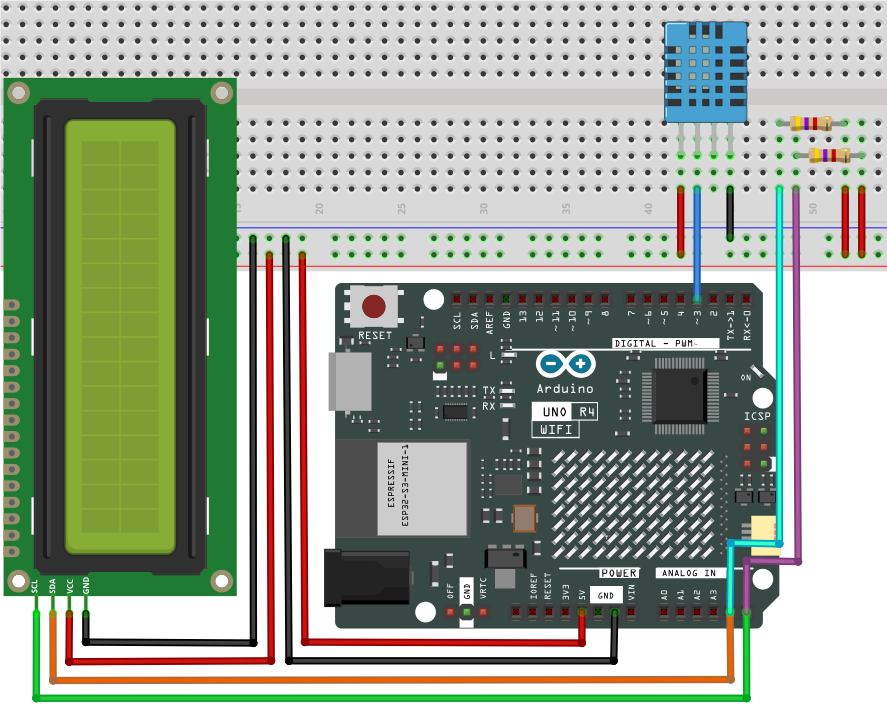


---

**4. Code Flow**


---

**5. Test Code**

```c++
/*  
 * File name: Temperature-humidity meter
 * Function: IIC 1602 LCD displays temperature and humidity analog temperature and humidity meter
 * Compiling IDE: ARDUINO 2.3.2
 * Author: https://www.keyestudio.com/
 */
#include "DHT.h"  //DHT Library 
#include <Wire.h>  //Wire Library 
#include <LiquidCrystal_I2C.h>  //IIC 1602 LCD display Library 
LiquidCrystal_I2C lcd(0x27,16,2);  // Set the LCD address to 0x27 and display it in 16 characters and 2 lines

#define DHTPIN  3    //define XHT11 to the digital pin 3
DHT dht(DHTPIN, DHT11);  //initialize

void setup() {
  Serial.begin(9600); //set baud rate to 9600
  lcd.init();   // initialize LCD
  lcd.clear();   // clear the LCD display
  lcd.backlight(); //turn on LCD backlight
  dht.begin();  //dht works
}

void loop() {
  lcd.setCursor(0,0);  //LCD display location
  lcd.print("Humidity: ");  //LCD display strings Humidity:
  lcd.print((const int)dht.readHumidity());  //The LCD displays the humidity measured by XHT11
  lcd.print("%"); //LCD shows %
  lcd.setCursor(0,1);
  lcd.print("Temperature: ");
  lcd.print((const int)dht.readTemperature()); //LCD displays the temperature measured by XHT11
  lcd.print("C");
  delay(100);
}
```
---

**6. Test Result**

Click  to upload code. After uploading the code, unplug the USB cable and wire up. Connect the board to the computer with USB cable and power on. After that, the IIC 1602 LCD display shows the temperature and humidity value detected by the XH11 temperature and humidity sensor.


**Note: If the LCD display does not display any information after uploading the code, try pressing the RESET button on the UNO R4 motherboard.**


---

**7. Code Explanation**

Please refer to Project 27 and Project 32.

---

### Project 49 Colorful Music Box


---

**1. Overview**

Music box is a toy that automatically plays music through mechanical force. Its melodious music often brings back memories of the good old days. In this experiment, the "colorful music box" made by Ultrasonic sensor, passive buzzer and LED, plays notes by waving palms.

---

**2. Components**

|   ||||
| ------------------------ | ------------------------ | ---------------------------- |---------------------------- |
|UNO R4 WiFi/Minima main board (either-or)| NPN transistor (S8050) x1 | passive buzzer x1 | 1kΩ resistor x1 |
||| ||
| Ultrasonic sensor x1 |DuPont wires |Red LED x7|220Ω resistor x7  |
|||||
|Breadboard x1 |Jump wires | USB cable x1 | 10kΩ resistor x1 |


---

**3. Wiring Diagram**

**Schematic diagram:**


**Wiring diagram:**


---

**4. Code Flow**


---

**5. Test Code**

```c++
/*  
 * File name: Magic_Color_Music_Box
 * Function: Ultrasonic measurement distance control buzzer and 7 LED analog magic color music box
 * Compiling IDE: ARDUINO 2.3.2
 * Author: https://www.keyestudio.com/
*/
int trig = A1;  //define ultrasonic Trig pin to A1
int echo = A0;  //define ultrasonic Echo pin to A0
int LED1 = 6;   //define LED1 pin to 6
int LED2 = 7;   //define LED2 pin to 7
int LED3 = 8;   //define LED3 pin to 8
int LED4 = 9;   //define LED4 pin to 9
int LED5 = 10;   //define LED5 pin to 10
int LED6 = 11;   //define LED6 pin to 1
int LED7 = 12;   //define LED7 pin to 12
int beeppin = 2;  //define passive buzzer pin to 2

int duration = 0;  //define variable duration with an initial value of 0
int distance = 0;  //define variable distance with an initial value of 0

void setup() {
  Serial.begin(9600);     //set baud rate to 9600
  pinMode(trig, OUTPUT);  //set ultrasonic Trig digital pin to output
  pinMode(echo, INPUT);   //set ultrasonic Echo digital pin to output
  pinMode(LED1, OUTPUT);  //set LED1 digital pin to output
  pinMode(LED2, OUTPUT);  //set LED2 digital pin to output
  pinMode(LED3, OUTPUT);  //set LED3 digital pin to output
  pinMode(LED4, OUTPUT);  //set LED4 digital pin to output
  pinMode(LED5, OUTPUT);  //set LED5 digital pin to output
  pinMode(LED6, OUTPUT);  //set LED6 digital pin to output
  pinMode(LED7, OUTPUT);  //set LED7 digital pin to output
  pinMode(beeppin, OUTPUT); //set passive buzzer digital pin to output
  noTone(beeppin);  //stop playing
}

void loop(){
  //Keep trigPin output high for 10μs to trigger HC_SR04
  digitalWrite(trig, HIGH);
  delayMicroseconds(10);
  digitalWrite(trig, LOW);
  //Wait for HC-SR04 to return to high and measure this wait time
  duration = pulseIn(echo, HIGH);
  //Calculate distance based on time
  distance = (duration / 2) / 28.5;
  Serial.println(distance);  //Serial port print distance value
  if (distance > 0 && distance <= 5){  //if the detected distance is within 0~5cm 
    digitalWrite(LED1, HIGH);  //LED1 on
    tone(beeppin, 262);  //passive buzzer plays tone do
    delay(1000);  //delay 1000ms
  }
  else{  //or else, the detected distance is without 0~5cm 
    digitalWrite(LED1, LOW);  //LED1 off
    noTone(beeppin);  //stop playing
  }
  if (distance > 5 && distance <= 10){  //if the detected distance is within 5~10cm 
    digitalWrite(LED2, HIGH);  //LED2 on
    tone(beeppin, 294);  //passive buzzer plays tone re
    delay(750);
  }
  else{  //or else, the detected distance is without 5~10cm 
    digitalWrite(LED2, LOW);  //LED2 off
    noTone(beeppin);  //stop playing
  }
  if (distance > 10 && distance <= 15){  //if the detected distance is within 10~15cm 
    digitalWrite(LED3, HIGH);  //LED3 on
    tone(beeppin, 330);  //passive buzzer plays tone mi
    delay(625);
  }
  else{  //or else, the detected distance is without 10~15cm 
    digitalWrite(LED3, LOW);  //LED3 off
    noTone(beeppin);  //stop playing
  }
    if (distance > 15 && distance <= 20){  //if the detected distance is within 15~20cm 
    digitalWrite(LED4, HIGH);  //LED4 on
    tone(beeppin, 349);  //passive buzzer plays tone fa
    delay(500);
  }
  else{  //or else, the detected distance is without 15~20cm 
    digitalWrite(LED4, LOW);  //LED4 off
    noTone(beeppin);//stop playing
  }
  if (distance > 20 && distance <= 25){  //if the detected distance is within 20~25cm 
    digitalWrite(LED5, HIGH);  //LED5 on
    tone(beeppin, 392);  //passive buzzer plays tone so
    delay(375);
  }
  else{  //or else, the detected distance is without 20~25cm 
    digitalWrite(LED5, LOW);  //LED5 off
    noTone(beeppin);//stop playing
  }
  if (distance > 25 && distance <= 30){  //if the detected distance is within 25~30cm 
    digitalWrite(LED6, HIGH);  //LED6 on
    tone(beeppin, 440);   //passive buzzer plays tone la
    delay(250);
  }
  else{  //or else, the detected distance is without 25~30cm 
    digitalWrite(LED6, LOW);  //LED6 off
    noTone(beeppin);//stop playing
  }
  if (distance > 30 && distance <= 35){  //if the detected distance is within 30~35cm 
    digitalWrite(LED7, HIGH);  //LED7 on
    tone(beeppin, 494);  //passive buzzer plays tone si
    delay(125);
  }
  else{  //or else, the detected distance is without 30~35cm 
    digitalWrite(LED7, LOW);  //LED7 off
    noTone(beeppin);//stop playing
  }
}     
```
---

**6. Test Result**

Click  to upload code. After uploading the code, unplug the USB cable and wire up. Connect the board to the computer with USB cable and power on. After that, wave your hand, and the passive buzzer plays music with 7 LED lighting up, forming a colorful music box.


---

**7. Code Explanation**

Please refer to Project 14, Project 28 and Project 37.

---

### Project 50 Joystick Machine


---

**1. Overview**

In previous experiments, we have learned how joystick works and how the UNO R4 control LED matrix display. Herein, can we combine them to make a fun and interesting joystick game machine? Of course we can. What are we waiting for? Let's do it!

---

**2. Components**

|  ||||
| ------------------------ | ------------------------ | ---------------------------- |---------------------------- |
|UNO R4 WiFi/Minima main board (either-or)| joystick x1 | DuPont wires |USB cable x1|

---

**3. Experiment 1**

(1) Schematic diagram:


(2) Wiring diagram:


(3) Code flow:


(4) Test code:

```c++
/*  
 * File name: Joystick_Game_Machine1
 * Function: Joystick controls UNO R4 WIFI on-board LED matrix to simualte game machine
 * Compiling IDE: ARDUINO 2.3.2
 * Author: https://www.keyestudio.com/
*/
#include "Arduino_LED_Matrix.h"

ArduinoLEDMatrix matrix;

// Define the pin of the joystick
const int joystickXPin = A0;
const int joystickYPin = A1;
const int joystickButtonPin = 7;

// Define the size of the matrix
const int width = 12;
const int height = 8;

// Define the position of the current square
int blockX = 5;
int blockY = 0;

// Define the state of the matrix
uint8_t grid[height][width] = {
  { 0, 0, 0, 0, 0, 0, 0, 0, 0, 0, 0, 0 },
  { 0, 0, 0, 0, 0, 0, 0, 0, 0, 0, 0, 0 },
  { 0, 0, 0, 0, 0, 0, 0, 0, 0, 0, 0, 0 },
  { 0, 0, 0, 0, 0, 0, 0, 0, 0, 0, 0, 0 },
  { 0, 0, 0, 0, 0, 0, 0, 0, 0, 0, 0, 0 },
  { 0, 0, 0, 0, 0, 0, 0, 0, 0, 0, 0, 0 },
  { 0, 0, 0, 0, 0, 0, 0, 0, 0, 0, 0, 0 },
  { 0, 0, 0, 0, 0, 0, 0, 0, 0, 0, 0, 0 }
};

void setup() {
  Serial.begin(115200);
  matrix.begin();
  pinMode(joystickButtonPin, INPUT_PULLUP);
}

void loop() {
  // Read the X and Y axis values of the joystick
  int xValue = analogRead(joystickXPin);
  int yValue = analogRead(joystickYPin);

  // control the position of the square by moving the joystick
  if (xValue > 800) {
    // Shake the joystick to the left (positive on the X axis on the joystick module)
    if (blockX > 0) {
      blockX--;
    }
  } else if (xValue < 300) {
    // Shake the joystick to the right (opposite the X axis on the joystick module)
    if (blockX < width - 2) {
      blockX++;
    }
  }

  // Check that the button is pressed
  if (digitalRead(joystickButtonPin) == LOW) {
    // put a square
    placeBlock();
    delay(300); // Prevent button jitter
  }

  // Render matrix
  renderGrid();
  delay(100); // Delay 100 milliseconds to prevent joystick jitter
}

void placeBlock() {
  // Check if you can place squares
  if (blockY + 1 < height && grid[blockY + 1][blockX] == 0 && grid[blockY + 1][blockX + 1] == 0) {
    blockY++;
  } else {
    // place square
    grid[blockY][blockX] = 1;
    grid[blockY][blockX + 1] = 1;
    grid[blockY + 1][blockX] = 1;
    grid[blockY + 1][blockX + 1] = 1;

    // Check if it is full
    if (isGridFull()) {
      resetGrid();
    } else {
      // Reset square position
      blockX = 5;
      blockY = 0;
    }
  }
}

boolean isGridFull() {
  for (int y = 0; y < height; y++) {
    for (int x = 0; x < width; x++) {
      if (grid[y][x] == 0) {
        return false;
      }
    }
  }
  return true;
}

void resetGrid() {
  for (int y = 0; y < height; y++) {
    for (int x = 0; x < width; x++) {
      grid[y][x] = 0;
    }
  }
}

void renderGrid() {
  uint8_t frame[height][width];
  for (int y = 0; y < height; y++) {
    for (int x = 0; x < width; x++) {
      frame[y][x] = grid[y][x];
    }
  }

  // Render current square
  if (blockY + 1 < height && grid[blockY + 1][blockX] == 0 && grid[blockY + 1][blockX + 1] == 0) {
    frame[blockY][blockX] = 1;
    frame[blockY][blockX + 1] = 1;
    frame[blockY + 1][blockX] = 1;
    frame[blockY + 1][blockX + 1] = 1;
  }

  // Render matrix
  matrix.renderBitmap(frame, height, width);
}
```

(5) Test result:

Click  to upload code. After uploading the code, unplug the USB cable and wire up. Connect the board to the computer with USB cable and power on. 

After that, LED matrix shows a square formed by 4 LED that is falling down. Rotate the joystick on axis-x direction, and the square will move right and left. Press the reset button on UNO R4 WiFi board, LED clears display.


---

**4. Experiment 2**

(1) Wiring diagram:


(2) Code flow:


(3) Test code:

```c++
/*  
 * File name: Joystick_Game_Machine2
 * Function: Joystick control The LED dot-matrix analog joystick game console built into the UNO R4 WIFI master board
 * Compiling IDE: ARDUINO 2.3.2
 * Author: https://www.keyestudio.com/
*/
#include "Arduino_LED_Matrix.h"

ArduinoLEDMatrix matrix;

// joystick pins
const int joystickXPin = A0;
const int joystickYPin = A1;
const int joystickButtonPin = 7;

// set initial number
int number = 0;

// heart icon
uint8_t heart[8][12] = {
  { 0, 0, 0, 0, 0, 0, 0, 0, 0, 0, 0, 0 },
  { 0, 0, 1, 1, 0, 0, 0, 0, 1, 1, 0, 0 },
  { 0, 1, 1, 1, 1, 0, 0, 1, 1, 1, 1, 0 },
  { 0, 1, 1, 1, 1, 1, 1, 1, 1, 1, 1, 0 },
  { 0, 0, 1, 1, 1, 1, 1, 1, 1, 1, 0, 0 },
  { 0, 0, 0, 1, 1, 1, 1, 1, 1, 0, 0, 0 },
  { 0, 0, 0, 0, 1, 1, 1, 1, 0, 0, 0, 0 },
  { 0, 0, 0, 0, 0, 0, 0, 0, 0, 0, 0, 0 }
};

void setup() {
  Serial.begin(115200);
  matrix.begin();
  pinMode(joystickButtonPin, INPUT_PULLUP);
}

void loop() {
  // Read the X and Y axis values of the joystick
  int xValue = analogRead(joystickXPin);
  int yValue = analogRead(joystickYPin);

  // Control the increase or decrease of numbers according to the movement of the joystick
  if (yValue < 200) {
    // up
    if (number < 100) {
      number++;
    }
  } else if (yValue > 800) {
    // down
    if (number > 0) {
      number--;
    }
  } else if (xValue < 200) {
    // left
    if (number < 98) {
      number += 2;
    }
  } else if (xValue > 800) {
    // right
    // show heart 
    matrix.renderBitmap(heart, 8, 12);
    delay(500); // delay 500ms
    return;
  }

  // show number
  displayNumber(number);
  delay(200); // delay 200 ms to eliminate jitters
}

void displayNumber(int num) {
  uint8_t frame[8][12] = {
    { 0, 0, 0, 0, 0, 0, 0, 0, 0, 0, 0, 0 },
    { 0, 0, 0, 0, 0, 0, 0, 0, 0, 0, 0, 0 },
    { 0, 0, 0, 0, 0, 0, 0, 0, 0, 0, 0, 0 },
    { 0, 0, 0, 0, 0, 0, 0, 0, 0, 0, 0, 0 },
    { 0, 0, 0, 0, 0, 0, 0, 0, 0, 0, 0, 0 },
    { 0, 0, 0, 0, 0, 0, 0, 0, 0, 0, 0, 0 },
    { 0, 0, 0, 0, 0, 0, 0, 0, 0, 0, 0, 0 },
    { 0, 0, 0, 0, 0, 0, 0, 0, 0, 0, 0, 0 }
  };

  // Convert numbers to a dot matrix display
  if (num >= 0 && num <= 9) {
    drawDigit(frame, num, 4, 2); // A single number is displayed in the middle
  } else if (num >= 10 && num <= 99) {
    drawDigit(frame, num / 10, 2, 2); // The ten digit number is shown left of center
    drawDigit(frame, num % 10, 6, 2); // The units digit is displayed center-right
  }

  // Render matrix
  matrix.renderBitmap(frame, 8, 12);
}

void drawDigit(uint8_t frame[8][12], int digit, int x, int y) {
  // number 0-9
  uint8_t digits[10][5][3] = {
    { {1, 1, 1}, {1, 0, 1}, {1, 0, 1}, {1, 0, 1}, {1, 1, 1} }, // 0
    { {0, 1, 0}, {1, 1, 0}, {0, 1, 0}, {0, 1, 0}, {1, 1, 1} }, // 1
    { {1, 1, 1}, {0, 0, 1}, {1, 1, 1}, {1, 0, 0}, {1, 1, 1} }, // 2
    { {1, 1, 1}, {0, 0, 1}, {1, 1, 1}, {0, 0, 1}, {1, 1, 1} }, // 3
    { {1, 0, 1}, {1, 0, 1}, {1, 1, 1}, {0, 0, 1}, {0, 0, 1} }, // 4
    { {1, 1, 1}, {1, 0, 0}, {1, 1, 1}, {0, 0, 1}, {1, 1, 1} }, // 5
    { {1, 1, 1}, {1, 0, 0}, {1, 1, 1}, {1, 0, 1}, {1, 1, 1} }, // 6
    { {1, 1, 1}, {0, 0, 1}, {0, 1, 0}, {1, 0, 0}, {1, 0, 0} }, // 7
    { {1, 1, 1}, {1, 0, 1}, {1, 1, 1}, {1, 0, 1}, {1, 1, 1} }, // 8
    { {1, 1, 1}, {1, 0, 1}, {1, 1, 1}, {0, 0, 1}, {1, 1, 1} }  // 9
  };

  // Draws matrix patterns of numbers into frame
  for (int i = 0; i < 5; i++) {
    for (int j = 0; j < 3; j++) {
      frame[y + i][x + j] = digits[digit][i][j];
    }
  }
}
```

(4) Test result:

Click  to upload code. After uploading the code, unplug the USB cable and wire up. Connect the board to the computer with USB cable and power on. 

 After that, LED matrix shows a number 0. Pull the joystick on the positive direction of axis-x, and shows a “❤” icon. Pull it on the negative direction of axis-x, the number will adds 2 after each pulling. 

Pull the joystick on the positive direction of axis-y, the number will adds 1 after each pulling. The number decreases 1 if you pull on the opposite direction.

Press the reset button on the UNO R4 WiFi board, the LED matrix clears its display.


---

**5. Code Explanation**

| Code                           | Explanation                                              |
| ----------------------------------- | ------------------------------------------------------------ |
|placeBlock()| Place block function |
|renderGrid(); | Render lattice       |
|void placeBlock(){}| Place block function |
|displayNumber(number); | Display numbers |
|matrix.renderBitmap(frame, 8, 12);|Render lattice|

For more, please refer to Project 31.

---

### Project 51 Ping Pong Game


---

**1. Overview**

This is a simple ping-pong game designed with an OLED display and an Arduino UNO R4 main board. In the game, the opponent is the computer, and we need control a vertical racket to bounce ball back. The goal is to prevent the ball from going over the edge of your racket, otherwise the opponent scores.

Game mechanics includes:

 - Ball motion

	The ball moves in its current direction at a set speed. Every time the ball collides with the racket, its speed increases, making the game more challenging.

 - Racket motion

	Racket can move up or down to stop the movement of the ball. Players press buttons to control their racket, and the computer's racket automatically follows the position of the ball.

 - Score

	Every time the ball crosses the left or right edge of the screen, the corresponding party scores.

---

**2. Components**

|  | ||
| ------------------------ | ------------------------ | ---------------------------- |
| UNO R4 WiFi/Minima main board (either-or) | yellow button cap x1 | OLED x1 |
||| |
|Jump wires | USB cable x1 | red button cap x1 |
||||
| button x2 | 10KΩ resistor x2 |Breadboard  x1 |

---

**3. Wiring Diagram**

**Schematic diagram:**


**Wiring diagram:**


---

**4. Code Flow**


---

**5. Test Code**

```c++
/*  
 * File name: Ping Pong Game
 * Function: 2 buttons combined with OLED to play ping pong game
 * Compiling IDE: ARDUINO 2.3.2
 * Author: https://www.keyestudio.com/
*/
#include <SPI.h>
#include <Wire.h>
#include <Adafruit_GFX.h>
#include <Adafruit_SSD1306.h>

#define UP_BUTTON 8
#define DOWN_BUTTON 11

#define SCREEN_WIDTH 128  // OLED display width, in pixels
#define SCREEN_HEIGHT 64  // OLED display height, in pixels

// Declaration for an SSD1306 display connected to I2C (SDA, SCL pins)
#define OLED_RESET 4  // Reset pin # (or -1 if sharing Arduino reset pin)
Adafruit_SSD1306 display(SCREEN_WIDTH, SCREEN_HEIGHT, &Wire, OLED_RESET);

// ball set
const unsigned long BALL_RATE = 16;
int ball_x = 64, ball_y = 32;
int ball_speed = 1; 
int8_t ball_dir_x = 1, ball_dir_y = 1;

//flash rate
unsigned long ball_update;
unsigned long paddle_update;

// paddle set
const unsigned long PADDLE_RATE = 33;
const uint8_t PADDLE_HEIGHT = 16;
const uint8_t CPU_X = 12;
int8_t cpu_y = 16;
const uint8_t PLAYER_X = 115;
int8_t player_y = 16;
int paddle_speed = 3;

// score
uint8_t player_score = 0;
uint8_t cpu_score = 0;


void setup() {
  Serial.begin(115200);

  randomSeed(analogRead(A0));
  ball_dir_x = random(0, 2) * 2 - 1;
  ball_dir_y = random(0, 2) * 2 - 1;

  display.begin(SSD1306_SWITCHCAPVCC, 0x3C);
  display.display();

  pinMode(UP_BUTTON, INPUT);
  pinMode(DOWN_BUTTON, INPUT);

  unsigned long start = millis();

  display.clearDisplay();
  drawCourt();

  while (millis() - start < 2000)
    ;

  displayScore();
  display.display();

  ball_update = millis();
  paddle_update = ball_update;
}

void loop() {
  bool update = false;
  unsigned long time = millis();

  static bool up_state = false;
  static bool down_state = false;

  /* check if the button pressed */
  up_state |= (digitalRead(UP_BUTTON) == LOW);
  down_state |= (digitalRead(DOWN_BUTTON) == LOW);

  /* refresh the ball */
  if (time > ball_update) {
    int new_x = ball_x + ball_dir_x * ball_speed;
    int8_t new_y = ball_y + ball_dir_y * ball_speed;

    // Check if it hits the horizontal walls.
    if (new_y <= 0 || new_y >= SCREEN_HEIGHT - 1) {
      ball_dir_y = -ball_dir_y;
      new_y += ball_dir_y + ball_dir_y * ball_speed;
      displayScore();
    }

    // Check if it hits the CPU paddle
    if (crossesCpuPaddle(ball_x, new_x, ball_y)) {
      ball_dir_x = -ball_dir_x;
      new_x = CPU_X + 1;// move the ball's position to the left edge of the paddle
      ball_speed++;     // speeds up
    }

    // Check if it hits the player paddle
    if (crossesPlayerPaddle(ball_x, new_x, ball_y)) {
      ball_dir_x = -ball_dir_x;
      new_x = PLAYER_X - 1; // move the ball's position to the right edge of the paddle
      ball_speed++;         // speeds up
    }

    // Check if it hits the vertical walls
    if (new_x <= 0 || new_x >= SCREEN_WIDTH - 1) {
      if (new_x <= 1) {
        player_score++;
      }
      if (new_x >= 126) {
        cpu_score++;
      }
      /* reset ball */
      displayScore();
      ball_speed = 1;  // reset speed
      new_x = 64; // reset position
      // new_y = 32;
      ball_dir_x = (ball_dir_x > 0) ? -1 : 1;     // reset direction
      ball_dir_y = (random(0, 2) == 0) ? 1 : -1;  // reset direction
    }

    display.drawPixel(ball_x, ball_y, BLACK);
    display.drawPixel(new_x, new_y, WHITE);
    ball_x = new_x;
    ball_y = new_y;

    ball_update += BALL_RATE; // next refresh time
    update = true;
  }

  /* refresh paddles */
  if (time > paddle_update) {
    paddle_update += PADDLE_RATE; // next refresh time

    // CPU paddle
    display.drawFastVLine(CPU_X, cpu_y, PADDLE_HEIGHT, BLACK); //clear paddle
    const uint8_t half_paddle = PADDLE_HEIGHT >> 1;
    if (cpu_y + half_paddle > ball_y) {
      cpu_y -= paddle_speed;
    }
    if (cpu_y + half_paddle < ball_y) {
      cpu_y += paddle_speed;
    }
    // constraint position
    if (cpu_y < 1) cpu_y = 1;
    if (cpu_y + PADDLE_HEIGHT > 63) cpu_y = 63 - PADDLE_HEIGHT;
    display.drawFastVLine(CPU_X, cpu_y, PADDLE_HEIGHT, WHITE); //show paddle

    // Player paddle
    display.drawFastVLine(PLAYER_X, player_y, PADDLE_HEIGHT, BLACK); //clear paddle
    if (up_state) {
      player_y -= paddle_speed;
    }
    if (down_state) {
      player_y += paddle_speed;
    }
    up_state = down_state = false;
    // constraint position
    if (player_y < 1) player_y = 1;
    if (player_y + PADDLE_HEIGHT > 63) player_y = 63 - PADDLE_HEIGHT;
    display.drawFastVLine(PLAYER_X, player_y, PADDLE_HEIGHT, WHITE); //show paddle
    update = true;
  }

  if (update)
    display.display();
}

bool crossesPlayerPaddle(uint8_t old_x, uint8_t new_x, uint8_t ball_y) {
  return old_x < PLAYER_X && new_x >= PLAYER_X && ball_y >= player_y && ball_y <= player_y + PADDLE_HEIGHT;
}

bool crossesCpuPaddle(uint8_t old_x, uint8_t new_x, uint8_t ball_y) {
  return old_x > CPU_X && new_x <= CPU_X && ball_y >= cpu_y && ball_y <= cpu_y + PADDLE_HEIGHT;
}

void drawCourt() {
  display.drawRect(0, 0, SCREEN_WIDTH, SCREEN_HEIGHT, WHITE);
}

void displayScore() {
  display.fillRect(SCREEN_WIDTH / 2 - 20, 10, 60, 10, BLACK); // clear
  
  display.setCursor(SCREEN_WIDTH / 2 - 20, 10);  
  display.setTextSize(1);
  display.setTextColor(WHITE);

  display.print(cpu_score);
  display.print(" - ");
  display.print(player_score);
}
```
---

**6. Test Result**

Click  to upload code. After uploading the code, unplug the USB cable and wire up. Connect the board to the computer with USB cable and power on.

After powering on, in the game, press the up and down buttons respectively to control the vertical racket moving up and down. Players compete with the computer to bounce the ball back. The goal is to prevent the ball from going over the edge of your racket, otherwise the opponent scores.

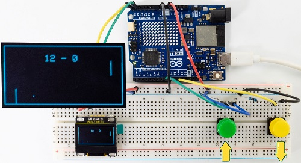


**Note: If the OLED display does not display any information after uploading the code, try pressing the RESET button on the UNO R4 motherboard.**


---

**7. Code Explanation**

Please refer to Project 18 and Project 33.

---

### Project 52 Control Servo and LED

---

**1. Overview**

We have learned the relevant knowledge of servo, red LED, button and potentiometer. So we combine them to make a more complex experiment. 

In this experiment, the button controls the red LED to light up, and the potentiometer controls the servo to rotate slowly back and forth.

---

**2. Components**

|  ||||
| ------------------------ | ------------------------ | ---------------------------- |---------------------------- |
| UNO R4 WiFi/Minima main board (either-or) | potentiometer x1                       | Red LED x1                             | 220Ω resistor x1                                             |
|| |||
| button x1                                 | Servo x1                               | 10kΩ resistor x1                       | USB cable x1                                                 |
|||||
| Breadboard x1                             | Jump wires                             |battery holder x1|1.5V AA battery (<span style="color: rgb(255, 76, 65);">Provide for yourself</span>) x6|

---

**3. Wiring Diagram**

**Schematic diagram:**


**Wiring diagram:**


---

**4. Code Flow**


---

**5. Test Code**

```c++
/*  
 * File name: Control_Servo_Led
 * Function: Control_Servo_Led
 * Compiling IDE: ARDUINO 2.3.2
 * Author: https://www.keyestudio.com/
*/
#include <Servo.h>

Servo myservo;  //Create a servo object to control the servo
int servoPin = 3;  // define servo pin to D3

int ledPin = 11; // define LED to pin D11

#define PIN_BUTTON  6  //Connect the pin of the self-locking key to the D6
#define PIN_ANALOG_IN  A0  //set potentiometer to pin A0

int val1 = 0;   //store button value
int val2 = 0;   //set val2 to 0

void setup() {
  pinMode(PIN_ANALOG_IN, INPUT);    //Set the potentiometer pin to input mode
  pinMode(PIN_BUTTON, INPUT);    //Set the pin of the button to input mode
  pinMode(ledPin, OUTPUT);// Set the led pin to output mode
  myservo.attach(servoPin);  //set servo pin to D3
  myservo.write(0); // servo rotates 0°
  delay(200); // delay 200ms
}

void loop() {
  val1 = digitalRead(PIN_BUTTON);  //Read the value of button and assign it to the variable val1
  if (val1 == 0) {       //press button to read high
    digitalWrite(ledPin, HIGH); // LED on
  }
  else {
    digitalWrite(ledPin, LOW); // LED off
  }  
  val2 = analogRead(PIN_ANALOG_IN);    //The analog value of the potentiometer
  myservo.write((map(val2, 0, 1023, 0, 180)));   // The analog value of the potentiometer is mapped to the position of the servo
  delay(5);   // Wait 10ms for the servo to reach the corresponding position
}
```

---

**6. Test Result**

Click  to upload code. After uploading the code, unplug the USB cable and wire up. Connect the board to the computer with USB cable and power on.

After powering on, press the button to light up LED, and rotate the potentiometer to slowly adjust the rotation of the servo back and forth.

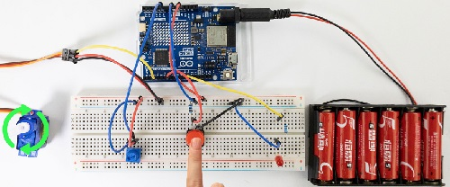


---

**7. Code Explanation**

Please refer to Project 18，Project 16，Project 21 and Project 37.

---

### Project 53 Number Dice


---

**1. Overview**

In this project, we simulate dice rolling with a 74HC595 shift register and a digital tube. It is activated by directly shaking the tilt switch. During this operation, the digital tube loops randomly among 1 to 6, simulating a dice roll. After a short interval, it displays a random number representing the result of the dice roll.

---

**2. Components**

|  |||
| ------------------------ | ------------------------ | ---------------------------- |
|UNO R4 WiFi/Minima main board (either-or)| 4-bit Digital Tube x1 | 1-bit Digital Tube x1 |
||||
|220Ω resistor  x8  |tilt switch x1|DuPont wires |
||||
|Breadboard x1 |Jump wires | USB cable x1 |

---

**3. Wiring Diagram**

**Schematic diagram:**


**Wiring diagram:**


---

**4. Code Flow**


---

**5. Test Code**

```c++
/*
 * File name: Digital_Dice
 * Function: Digital_Dice
 * Compiling IDE: ARDUINO 2.3.2
 * Author: https://www.keyestudio.com/
*/
const int dataPin = 10;   // DS of 74HC595
const int clockPin = 13;  // SH_CP of 74HC595
const int latchPin = 12;  // ST_CP of 74HC595
const int tiltPin = 2;    // The pin where the tilt switch is connected

// Byte representation for numbers in a common-cathode 7-segment display
byte numbers[] = {
  // 0b00111111,  // 0
  0b00000110,  // 1
  0b01011011,  // 2
  0b01001111,  // 3
  0b01100110,  // 4
  0b01101101,  // 5
  0b01111101,  // 6
  //... Add the values for the rest of the numbers
};

// State and timing variables
volatile bool rolling = false;
unsigned long lastShakeTime = 0;

void setup() {
  // Initialize pins
  pinMode(dataPin, OUTPUT);
  pinMode(clockPin, OUTPUT);
  pinMode(latchPin, OUTPUT);
  pinMode(tiltPin, INPUT_PULLUP);  // Enable internal pull-up resistor

  // Attach an interrupt to the tiltPin. When the tilt switch is activated, the shakeDetected function will be called
  attachInterrupt(digitalPinToInterrupt(tiltPin), rollDice, CHANGE);
}

void loop() {
  // Check if it's rolling
  if (rolling) {
    byte number = random(1, 7);  // Generate a random number between 1 and 6
    displayNumber(number);
    delay(100);  // Delay to make the rolling effect visible

    // Stop rolling after 1 second
    if ((millis() - lastShakeTime) > 1000) {
      rolling = false;
    }
  }
}

// Interrupt handler for shake detection
void rollDice() {
  if (digitalRead(tiltPin) == LOW) {
    lastShakeTime = millis();  // Record the time of shake
    rolling = true;            // Start rolling
  }
}

// Function to display a number on the 7-segment display
void displayNumber(byte number) {
  digitalWrite(latchPin, LOW);
  shiftOut(dataPin, clockPin, MSBFIRST, numbers[number - 1]);
  digitalWrite(latchPin, HIGH);
}
```

---

**6. Test Result**

Click  to upload code. After uploading the code, unplug the USB cable and wire up. Connect the board to the computer with USB cable and power on.

After powering on, directly shake the tilt switch to activate the dice. During this operation, the digital display loops between random numbers within 1 to 6, simulating a dice roll. After a short interval, the roll stops and shows a random number.


---

**7. Code Explanation**

Variable initialization:

- <span style="color: rgb(255, 76, 65);">dataPin</span>,  <span style="color: rgb(255, 76, 65);">clockPin</span>,  <span style="color: rgb(255, 76, 65);">latchPin</span>: 74HC595 pin. 
- <span style="color: rgb(255, 76, 65);">tiltPin</span>: the digital pin connect to the tilt switch
- <span style="color: rgb(255, 76, 65);">numbers[]</span>: An array for storing an encoding numbers 1 to 6 on a common cathode digital tube.

volatile variable:

- <span style="color: rgb(255, 76, 65);">rolling</span>: This is a volatile variable that indicates whether the dice is rolling. It is accessible in both programs of interrupt service routine and main.

setup():

- Set pin mode. Use the internal pull-up resistor to set the input mode of the tilt switch. Assign an interrupt to the tilt switch that calls the rollDice function when the state of the tilt switch changes.

loop():

- It checks if rolling is true. If it is, it will continue to display random numbers among 1 to 6. If the tilt switch is shaken for more than 500 milliseconds, the rolling will stop.

rollDice():

- This is an interrupt service procedure for the tilt switch. It checks if the tilt switch is shaken (low level). If so, record the current time and start rolling.

displayNumber():

- This function displays a number on the digital tube. It sends the numbers to the digital tube via the 74HC595 shift register.

---

### Project 54 IR Remote Control Digital Tube and LED

**1. Overview**

In the previous experiments, we learned to display numbers on a digital tube and to use an infrared receiver to reveal the key value corresponding to the received remote control. Herein, we will combine the IR receiver and the digital tube to display numbers.

There are keys (“①”, “②”, “③”, “④”, “⑤”, “⑥”, “⑦”, “⑧”, “⑨”, “0”) on the remote control. We press them to display corresponding numbers on the digital tube. And the “OK” is used to control the external LED to be on or off. So we first need to learn a data type — boolean.

Data type **boolean** is a numeric form with variable storing 8 bits (1 byte), and it can only be **True** or **False**. A boolean variable displays its value as True or False (when using Print), or #TRUE# or #FALSE# (when using Write #). Therefore, we can use the keywords True and False to assign a boolean variable to one of these two states.

We can program: When the "OK" key is pressed and a certain condition is met, light the external LED; When the "OK" key is pressed and another condition is met, turn off the external LED. Therefore, boolean is a perfect choice because it can only be True or False. Now it is simple: We set the flag to true when pressing the "OK" key to light up external LED; Similarly, press the "OK" while the flag is false, and turn off the external LED.

---

**2. Components**

|  |||  |
| ------------------------ | ------------------------ | ---------------------------- |---------------------------- |
|UNO R4 WiFi/Minima main board (either-or)| IR receiver x1 | 1-bit Digital Tube x1  | 10kΩ resistor x1 |
|||||
|Breadboard x1 |Jump wires | USB cable x1 |220Ω resistor x9 |
|||   |    |
|remote control x1 | Red LED x1 |   |   |

---

**3. Wiring Diagram**

**Schematic diagram:**


**Wiring diagram:**


---

**4. Code Flow**


---

**5. Test Code**

```c++
/*  
 * File name: IR Control a digital tube and LED
 * Function: IR Control a digital tube and LED
 * Compiling IDE: ARDUINO 2.3.2
 * Author: https://www.keyestudio.com/
*/
#include <Arduino.h>
#include <IRremote.hpp>

#define IR_RECEIVE_PIN  2   // Defines the infrared reception and the pin is connected to the number 2
IRrecv irrecv(IR_RECEIVE_PIN);     // Creates a class object that receives the class
decode_results results;     // Create a decoded result class object
// set IO pins of each segments
int a=7;  // set a segment to digital pin 7
int b=6;  // set b segment to digital pin 6
int c=5;  // set c segment to digital pin 5
int d=10;  // set d segment to digital pin 10
int e=11;  // set e segment to digital pin 11
int f=8;  // set f segment to digital pin 8
int g=9;  // set g segment to digital pin 9
int dp=4;  // set dp segment to digital pin 4
int LED_L = 12;  //Define the external LED light pin to connect to the digital pin 12

boolean flag = true;  //LED marker bit

void setup() {
  Serial.begin(9600);
  IrReceiver.begin(IR_RECEIVE_PIN, ENABLE_LED_FEEDBACK);  // Start receiver
  int i;  // set variable i
  for(i=4;i<=11;i++)
  pinMode(i,OUTPUT);  // set pins 4-11 to output
  pinMode(LED_L,OUTPUT);  // set UNO R4 board L pin to output
}

void loop() {
  if (IrReceiver.decode()) {
      Serial.print(IrReceiver.decodedIRData.decodedRawData, HEX);  // Print raw data
      IrReceiver.printIRResultShort(&Serial); // Print the complete received data in one line
      IrReceiver.printIRSendUsage(&Serial);  // Print the statement needed to send this data
      handleControl(IrReceiver.decodedIRData.decodedRawData);      // Handle commands from remote control
      IrReceiver.resume(); // Enable receiving the next value
  }
}

void handleControl(unsigned long value){
  if (value == 0xBF40FF00 && flag == true){ // press button “OK” on the remote control and receive “OK” 
    digitalWrite(LED_L, HIGH);
    flag = false;
  } 
  else if (value == 0xBF40FF00 && flag == false){ // press button “OK” on the remote control and receive “OK”
    digitalWrite(LED_L, LOW);
    flag = true;
  } 
  else if(value == 0xE916FF00){ // press button “1” on the remote control
    digital_1();// display number 1
  } 
  else if(value == 0xE619FF00){ // press button “2” on the remote control
    digital_2();// display number  2
  } 
  else if(value == 0xF20DFF00){ // press button “3” on the remote control
    digital_3();// display number  3
  }
  else if(value == 0xF30CFF00){ // press button “4” on the remote control
    digital_4();// display number  4
  }
  else if(value == 0xE718FF00){ // press button “5” on the remote control
    digital_5();// display number  5
  }
  else if(value == 0xA15EFF00){ // press button “6” on the remote control
    digital_6();// display number  6
  }
  else if(value == 0xF708FF00){ // press button “7” on the remote control
    digital_7();// display number  7
  }
  else if(value == 0xE31CFF00){ // press button “8” on the remote control
    digital_8();// display number  8
  }
  else if(value == 0xA55AFF00){ // press button “9” on the remote control
    digital_9();// display number  9
  }
  else if(value == 0xAD52FF00){ // press button “0” on the remote control
    digital_0();// display number  0
  }
  else if(value == 0xBD42FF00){ // press button “*” on the remote control
    // turn off
    digitalWrite(c,LOW);
    digitalWrite(b,LOW);
    digitalWrite(f,LOW);
    digitalWrite(g,LOW);
    digitalWrite(dp,LOW);
    digitalWrite(a,LOW);
    digitalWrite(e,LOW);
    digitalWrite(d,LOW);
  }
}

void digital_0(void) { // display number 0
  digitalWrite(a,HIGH);
  digitalWrite(b,HIGH);
  digitalWrite(c,HIGH);
  digitalWrite(d,HIGH);
  digitalWrite(e,HIGH);
  digitalWrite(f,HIGH);
  digitalWrite(g,LOW);
  digitalWrite(dp,LOW);
}
void digital_1(void) { // display number  1
  unsigned char j;
  digitalWrite(c,HIGH);// Set the level of pin 5 to "High", turn on c
  digitalWrite(b,HIGH);// turn on b
  for(j=7;j<=11;j++)// turn off other segments
  digitalWrite(j,LOW);
  digitalWrite(dp,LOW);// turn off dp
}
void digital_2(void) { // display number  2
  unsigned char j;
  digitalWrite(b,HIGH);
  digitalWrite(a,HIGH);
  for(j=9;j<=11;j++)
  digitalWrite(j,HIGH);
  digitalWrite(dp,LOW);
  digitalWrite(c,LOW);
  digitalWrite(f,LOW);
}
void digital_3(void) { // display number  3
  digitalWrite(g,HIGH);
  digitalWrite(a,HIGH);
  digitalWrite(b,HIGH);
  digitalWrite(c,HIGH);
  digitalWrite(d,HIGH);
  digitalWrite(dp,LOW);
  digitalWrite(f,LOW);
  digitalWrite(e,LOW);
}
void digital_4(void) { // display number  4
  digitalWrite(c,HIGH);
  digitalWrite(b,HIGH);
  digitalWrite(f,HIGH);
  digitalWrite(g,HIGH);
  digitalWrite(dp,LOW);
  digitalWrite(a,LOW);
  digitalWrite(e,LOW);
  digitalWrite(d,LOW);
}
void digital_5(void) { // display number  5
  unsigned char j;
  digitalWrite(a,HIGH);
  digitalWrite(b, LOW);
  digitalWrite(c,HIGH);
  digitalWrite(d,HIGH);
  digitalWrite(e, LOW);
  digitalWrite(f,HIGH);
  digitalWrite(g,HIGH);
  digitalWrite(dp,LOW);
}
void digital_6(void) { // display number  6
  unsigned char j;
  for(j=7;j<=11;j++)
  digitalWrite(j,HIGH);
  digitalWrite(c,HIGH);
  digitalWrite(dp,LOW);
  digitalWrite(b,LOW);
}
void digital_7(void) { // display number  7
  unsigned char j;
  for(j=5;j<=7;j++)
  digitalWrite(j,HIGH);
  digitalWrite(dp,LOW);
  for(j=8;j<=11;j++)
  digitalWrite(j,LOW);
}
void digital_8(void) { // display number  8
  unsigned char j;
  for(j=5;j<=11;j++)
  digitalWrite(j,HIGH);
  digitalWrite(dp,LOW);
}
void digital_9(void) { // display number  9
  unsigned char j;
  digitalWrite(a,HIGH);
  digitalWrite(b,HIGH);
  digitalWrite(c,HIGH);
  digitalWrite(d,HIGH);
  digitalWrite(e, LOW);
  digitalWrite(f,HIGH);
  digitalWrite(g,HIGH);
  digitalWrite(dp,LOW);
}
```
---

**6. Test Result**

Click  to upload code. After uploading the code, unplug the USB cable and wire up. Connect the board to the computer with USB cable and power on. Open serial monitor to set the baud rate to **<u>9600</u>**.


Remove the insulation sheet in the remote control and align it to the IR receiver.

Press the key  “ **OK** ” on the remote control for the first time, the external LED lights up.

Press the key  “ **OK** ” on the remote control again, the external LED goes off.

Press the key  “ **①** ”  on the remote control, and the digital tube shows number 1.

Press the key  “ **②** ”  on the remote control, and the digital tube shows number 2.

Press the key  “ **③** ”  on the remote control, and the digital tube shows number 3.

Press the key  “ **④** ”  on the remote control, and the digital tube shows number 4.

Press the key  “ **⑤** ”  on the remote control, and the digital tube shows number 5.

Press the key  “ **⑥** ”  on the remote control, and the digital tube shows number 6.

Press the key  “ **⑦** ”  on the remote control, and the digital tube shows number 7.

Press the key  “ **⑧** ”  on the remote control, and the digital tube shows number 8.

Press the key  “ **⑨** ”  on the remote control, and the digital tube shows number 9.

Press the key  “ **0** ”  on the remote control, and the digital tube shows number 0.

---

**7. Code Explanation**

| Code                | Explanation                                                  |
| ------------------- | ------------------------------------------------------------ |
| boolean flag = true | set a variable flag to data type of “boolean”, and value to true. |
| flag = false        | assign the data type of “boolean” flag to false, when the "OK" button is pressed again, the conditions for extinguishing the red LED and the yellow LED are met. |

---

### Project 55 Smart Access Control System


---

**1. Overview**

In life, many access control systems use RF modules for unlocking, which is both convenient and safe. We have learned the working principle of the RFID RC522 module, the small speaker on the MP3 module and the servo. In this project, we will learn to use them to set up an access control system.

The principle is very simple. In the sensor area on the RFID RC522 module, we use IC card or key chain to unlock, the servo rotates to open the lock, and the MP3 make a voice broadcast that whether the code is correct and whether the door is open.

---

**2. Components**

|  | |||
| ------------------------ | ------------------------ | ---------------------------- |---------------------------- |
| UNO R4 WiFi/Minima main board (either-or) | RFID module x1                                               | DuPont wires                           | Servo x1                                                     |
|||||
|MP3 module x1|Key chain / IC card x1| USB cable x1 |Jump wires |
|||||
|mini speaker ×1|TF card (<span style="color: rgb(255, 76, 65);">provided by yourself</span>)×1| battery holder x1                      | AA battery (<span style="color: rgb(255, 76, 65);">Provide for yourself</span>) x6 |

---

**3. Wiring Diagram**

**Schematic diagram:**


**Wiring diagram:**


---

**4. Code Flow**


---

**5. Test Code**

**<span style="color: rgb(255, 76, 65);">NOTE: For how to import audio files into TF card of MP3 module, please refer to Project 35. Audio files are also included in this project code folder. If you have imported all the audio files into the TF card, there is no need to import them again.</span>**

**<span style="background:#ff0;color:#000">ATTENTION: The UID code may vary from different IC cards and key chains. Before running the code, please replace the UID code in the program with yours (UID code can be read in Project 34).</span>**

```c++
/*  
 * File name: IR Control a digital tube and LED
 * Function: IR Control a digital tube and LED
 * Compiling IDE: ARDUINO 2.3.2
 * Author: https://www.keyestudio.com/
*/
#include "MFRC522_I2C_SOFT.h"
//The IIC pins default to A4 and A5
// 0x28 is the i2c address on the SDA. If it doesn't match, check your address with i2cscanner.
MFRC522 mfrc522(0x28, A4, A5);   // Create an instance of MFRC522.

#include <Servo.h>
Servo myservo;  // Create a servo object to control the servo
int servoPin = 6; // Define servo pin D6

#include <SoftwareSerial.h>  //Soft serial port library file
SoftwareSerial mySerial(10, 11); //MP3 TX pin to 10，RX pin to 11

String rfid_str = "";

void setup() {
  Serial.begin(9600); // Initialize the hardware serial port
  mySerial.begin(9600); // Initialize the software serial port
  mfrc522.PCD_Init();
  ShowReaderDetails();           // Display the PCD-MFRC522 card reader
  Serial.println(F("Scan PICC to see UID, type, and data blocks..."));

  myservo.attach(servoPin);  //choose servo pin D6
  myservo.write(0); 
  delay(500);
}

void loop() {
   if ( ! mfrc522.PICC_IsNewCardPresent() || ! mfrc522.PICC_ReadCardSerial() ) {
    delay(50);
    return;
  }
  
  //Select a key card whose UID and SAK are mfrc522.uid, respectively.
  
  // save UID
  rfid_str = "";  //clear string 
  Serial.print(F("Card UID:"));
  for (byte i = 0; i < mfrc522.uid.size; i++) {
    rfid_str = rfid_str + String(mfrc522.uid.uidByte[i], HEX);  //Convert strings to real numbers
    //Serial.print(mfrc522.uid.uidByte[i] < 0x10 ? " 0" : " ");
    //Serial.print(mfrc522.uid.uidByte[i], HEX);
  } 
  Serial.println(rfid_str);
  
  if (rfid_str == "cae07ebe") {
    int cmd1[]={0x7e, 0xff, 0x06, 0x0f, 0x00, 0x01, 0x0B, 0xef}; //song 01 corresponding command, hexadecimal
    for(char i=0; i<8; i++){  
      mySerial.write(cmd1[i]); 
    }
    delay(2000);
    myservo.write(180);
    delay(500);
  } 
  else if (rfid_str == "39b646c2") {
    int cmd2[]={0x7e, 0xff, 0x06, 0x0f, 0x00, 0x01, 0x0C, 0xef}; //song 02 corresponding command, hexadecimal
    for(char i=0; i<8; i++){  
      mySerial.write(cmd2[i]); 
    }
    delay(2000);
    myservo.write(0);
    delay(500);
  }
}

void ShowReaderDetails() {
  // Obtain MFRC522 software
  byte v = mfrc522.PCD_ReadRegister(mfrc522.VersionReg);
  Serial.print(F("MFRC522 Software Version: 0x"));
  Serial.print(v, HEX);
  if (v == 0x91)
    Serial.print(F(" = v1.0"));
  else if (v == 0x92)
    Serial.print(F(" = v2.0"));
  else
    Serial.print(F(" (unknown)"));
  Serial.println("");
  // When 0x00 or 0xFF is returned, the communication signal may not be transmitted
  if ((v == 0x00) || (v == 0xFF)) {
    Serial.println(F("WARNING: Communication failure, is the MFRC522 properly connected?"));
  }
}
```

---

**6. Test Result**

Click to upload code. After uploading the code, unplug the USB cable and wire up. Connect the board to the computer with USB cable and power on.

Open serial monitor to set the baud rate to **<u>9600</u>**.

When using the correct IC card or key chain, the small speaker on the MP3 module announces “**the magnetic card is correct, and the door opens**”, and the servo rotates (to open the door). 

Otherwise, the speaker will broadcast “**the magnetic card is incorrect, and the door don't open**” and the servo will not rotate.


---

**7. Code Explanation**

In the previous projects, the IC card and key chain UID code have been tested by the RFID module. Herein we apply the UID code to control the small speaker to broadcast and the servo to rotate the certain angle to simulate door opening.

---

### Project 56 Ultrasonic Radar


---

**1. Overview**

Bats fly and acquire prey by echolocation. What is echolocation? Some animals emit ultrasonic waves from throat through the mouth or nasal cavity and determine directions by echo sounds. Inspired by bats, scientists invented radar. Radar antenna likes bat's mouth, and the radio waves emitted by the antenna are equivalent to the bat's ultrasonic waves, and the fluorescent screen to receive the echo waves is bat's ear.

In this project, we combine the HC-SR04 ultrasonic sensor, MP3 module and IIC 1602 LCD display to make a simple radar. The speaker will broadcast the corresponding distance number, which is also displayed on the IIC 1602 LCD. 

**<span style="color: rgb(255, 76, 65);">ATTENTION:</span>** Two library functions are required: playTrack() and playDistanceTrack()

- playTrack(int trackNumber):

	- Function: Broadcast the corresponding audio of the trackNumber.

	- Parameter: 

		trackNumber: The file name of the audio.

- playDistanceTrack(int distance):

	- Function: At the same time of broadcasting the correct distance, LCD shows “Playing Distance”.

	- Parameter: 

		distance: The ultrasonic sensor detects the distance. Effective distance (integer) 0<distance<31.


---

**2. Components**

|  | |||
| ------------------------ | ------------------------ | ---------------------------- |---------------------------- |
|UNO R4 WiFi/Minima main board (either-or)| IIC 1602 LCD  x1 |Battery holder x1|DuPont wires|
|||||
| Ultrasonic sensor x1                      | mini speaker ×1                        | TF card (<span style="color: rgb(255, 76, 65);">provided by yourself</span>)×1 | Breadboard x1                          |
|||| |
|Jump wires | USB cable x1 |4.7KΩ resistor x2|  |

---

**3. Wiring Diagram**

**Schematic diagram:**


**Wiring diagram:**


---

**4. Code Flow**


---

**5. Test Code**

**<span style="color: rgb(255, 76, 65);">NOTE: For how to import audio files into TF card of MP3 module, please refer to Project 35. Audio files are also included in this project code folder. If you have imported all the audio files into the TF card, there is no need to import them again.</span>**

**<span style="background:#ff0;color:#000">ATTENTION: The distance threshold in the code can be set according to the actual situation.</span>**

```c++
/*  
 * File name: Ultrasonic radar monitoring
 * Function: Ultrasonic control IIC 1602 LCD screen and MP3 module to simulate ultrasonic radar
 * Compiling IDE: ARDUINO 2.3.2
 * Author: https://www.keyestudio.com/
*/
#include <SoftwareSerial.h> //Soft serial port library
#include <LiquidCrystal_I2C.h> //i2c 1602 LCD library

const int TrigPin = 3; // ultrasonic trig pin to 3
const int EchoPin = 4; // ultrasonic echo pin to 4
SoftwareSerial mySerial(10, 11); // MP3 TX pin to 10，RX pin to 11
LiquidCrystal_I2C lcd(0x27, 16, 2); // initialize I2C LCD
int distance; // Define global variables and save distances.

void setup() {
  Serial.begin(9600);  // set hardware serial baud rate to 9600
  mySerial.begin(9600);  // set software serial baud rate to 9600
  pinMode(TrigPin, OUTPUT);  //set TrigPin to output
  pinMode(EchoPin, INPUT);  //set EchoPin to input
  lcd.clear(); // clear the LCD display
  lcd.init(); // initialize LCD
  lcd.backlight(); // turn on LCD backlight
}

void loop() {
  static int currentTrack = 1;
  playTrack(currentTrack);
  currentTrack++;
  if (currentTrack > 31) {
    currentTrack = 1;
  }

  // Detect the distance and broadcast it, 1602LCD shows 
  distance = getDistance();
  Serial.print(distance);
  Serial.println("cm");
  if (distance > 0 && distance <= 30) {
    lcd.clear();
    lcd.setCursor(0, 0);
    lcd.print("Distance: ");
    lcd.print(distance);
    lcd.print(" cm");
    playDistanceTrack(distance);
  }
  else{
    int cmd[] = {0x7e, 0xff, 0x06, 0x16, 0x00, 0x00, 0x00, 0xef};
    for (char i = 0; i < 8; i++) {
      mySerial.write(cmd[i]);
    }
    delay(2000);
  } 
  delay(5000);
}

void playTrack(int trackNumber) { // LCD shows MP3 broadcast ultrasonic detection distance 
  int cmd[] = {0x7e, 0xff, 0x06, 0x0f, 0x00, 0x02, trackNumber, 0xef};
  for (char i = 0; i < 8; i++) {
    mySerial.write(cmd[i]);
  }
  lcd.clear();
  lcd.setCursor(0, 0);
  lcd.print("Playing Track: ");
  lcd.print(trackNumber);
}

void playDistanceTrack(int distance) { // LCD shows MP3 broadcast ultrasonic detection distance and “Playing Distance”
  int cmd[] = {0x7e, 0xff, 0x06, 0x0f, 0x00, 0x02, distance, 0xef};
  for (char i = 0; i < 8; i++) {
    mySerial.write(cmd[i]);
  }
  lcd.setCursor(0, 1);
  lcd.print("Playing Distance");
}

float getDistance() {
  digitalWrite(TrigPin, LOW);
  delayMicroseconds(2); 
  digitalWrite(TrigPin, HIGH);
  delayMicroseconds(10); 
  digitalWrite(TrigPin, LOW);
  float distance = pulseIn(EchoPin, HIGH) / 58.0; 
  delay(300);
  return distance;
}
```
---

**6. Test Result**

Click  to upload code. After uploading the code, unplug the USB cable and wire up. Connect the board to the computer with USB cable and power on.

Open the serial monitor. 

Move a book back and forth in front of the ultrasonic module (0 < distance ≤30), and the serial  monitor  will show the current distance values, with MP3 module saying "Current distance xx cm". On the IIC 1602 LCD display, “Distance:xx cm” is shown on the first line and “Playing Distance” on the second line. 

If the object is without the range of 0 < distance ≤30, the voice broadcast and the distance displayed on the IIC 1602 LCD / serial monitor may be inconsistent with the actual values.


**Note: If the LCD display does not display any information after uploading the code, try pressing the RESET button on the UNO R4 motherboard.**


---

**7. Code Explanation**

| Code                                             | Explanation                                                  |
| ------------------------------------------------ | ------------------------------------------------------------ |
| digitalWrite(TrigPin, LOW); delayMicroseconds(2) | Give a short low level beforehand to ensure a clean high pulse. |

---

### Project 57 Cooling Device


---

**1. Overview**

In life, our computers and circuit board chips will heat up seriously due to long working time or large power consumption, so we often need a cooling device.

We have learned how the LM35 temperature sensor, the IIC 1602 LCD display, the MP3 module, and the motor work. So in this project, we combine them to build a simple cooling device. When the LM35 temperature sensor detects that the ambient temperature is higher than a certain value, the speaker on the MP3 module gives a voice prompt, and the motor is turned on for cooling down, and then the temperature value is displayed on the IIC 1602 LCD.

---

**2. Components**

|  ||||
| ------------------------ | ------------------------ | ---------------------------- |---------------------------- |
| UNO R4 WiFi/Minima main board (either-or) | S8050 transistor x1                                          | 10kΩ resistor x1                        | 1kΩ resistor x1                                              |
| ||||
| DC motor x1                               | IIC 1602 LCD x1                                              | MP3 module x1                           | DuPont wires                                                 |
|||||
| LM35 temperature sensor x1                | Fan x1                                                       | Battery holder x1                       |1.5V AA battery (<span style="color: rgb(255, 76, 65);">Provide for yourself</span>) x6 |
|| |||
| Diode x1 | Breadboard x1 | Jump wires | USB cable x1|
||| | |
| mini speaker ×1 | TF card (<span style="color: rgb(255, 76, 65);">provided by yourself</span>)×1 | 4.7KΩ resistor x2|  |

---

**3. Wiring Diagram**

**Schematic diagram:**


**Wiring diagram:**


---

**4. Code Flow**


---

**5. Test Code**

**<span style="color: rgb(255, 76, 65);">NOTE: For how to import audio files into TF card of MP3 module, please refer to Project 35. Audio files are also included in this project code folder. If you have imported all the audio files into the TF card, there is no need to import them again.</span>**

**<span style="background:#ff0;color:#000">ATTENTION: The temperature threshold 30 in the code can be set according to the actual situation.</span>**

```c++
/*  
 * File name: Cooling Device
 * Function: temperature sensor controls four-bit digital tube and motor to simulate cooling device
 * Compiling IDE: ARDUINO 2.3.2
 * Author: https://www.keyestudio.com/
*/
#include <SoftwareSerial.h> //Soft serial port library
#include <LiquidCrystal_I2C.h> //i2c 1602 LCD library

int lm35Pin = A0;   // define LM35 to pin A0
int motorPin = 5;  // define DC motor to pin D5
SoftwareSerial mySerial(10, 11); // MP3 TX to pin 10, RX to pin 11
LiquidCrystal_I2C lcd(0x27, 16, 2); // initialize I2C LCD

void setup() {
  Serial.begin(9600);  // hardware serial baud rate to 9600
  mySerial.begin(9600);  // software serial baud rate to 9600
  pinMode(lm35Pin, INPUT); // set lm35Pin to input
  pinMode(motorPin, OUTPUT); // set motorPin to output
  lcd.init(); // initialize LCD
  lcd.clear(); // clear the LCD display
  lcd.backlight(); // turn on LCD bakclight
}

void loop() {
  int reading = analogRead(lm35Pin);  // read LM35 pin analog value
  int temperC = (reading * 0.0048828125 * 100); //Voltage and Celsius conversion :0.00488125=5/1024, 0~5V corresponds to analog port reading 1~1024, every 10 millivolts corresponds to 1℃, calculate the Celsius temperature.
  int temperF = (temperC * 1.8) + 32.0; // Celsius to Fahrenheit conversion: Fahrenheit = Celsius x 1.8 + 32, calculate the temperature in Fahrenheit
  Serial.print("C: ");
  Serial.print(temperC);
  Serial.print(" C");
  Serial.print("  | F: ");
  Serial.print(temperF);
  Serial.println(" F");
  lcd.setCursor(0,0);
  lcd.print("C: ");
  lcd.print(temperC);
  lcd.print(" C");
  lcd.setCursor(8,0);
  lcd.print("F: ");
  lcd.print(temperF);
  lcd.print(" F");
  delay(10);
  if (temperC > 30) { // When the temperature exceeds 30 ° C, the small speaker on the MP3 module announces the voice and the fan turns on
    lcd.setCursor(0,1);
    lcd.print("Turn on the fan");
    int cmd1[]={0x7e, 0xff, 0x06, 0x0f, 0x00, 0x01, 0x0D, 0xef}; //song 1 corresponding command, hexadecimal
    for(char i=0; i<8; i++){
      mySerial.write(cmd1[i]);
    }
    delay(2000);
    digitalWrite(motorPin, HIGH);
  } 
  else { // Otherwise, the MP3 module on the small speaker voice broadcast, fan off
    lcd.setCursor(0,1);
    lcd.print("Turn off the fan"); 
    int cmd2[]={0x7e, 0xff, 0x06, 0x0f, 0x00, 0x01, 0x0E, 0xef}; //song 2 corresponding command, hexadecimal
    for(char i=0; i<8; i++){
      mySerial.write(cmd2[i]);
    }
    delay(2000);
    digitalWrite(motorPin, LOW);
  }
}
```
---

**6. Test Result**

Click to upload code. After uploading the code, unplug the USB cable and wire up. Connect the board to the computer with USB cable and power on.

When the LM35 temperature sensor detects that the ambient temperature is higher than a certain value, the speaker on the MP3 module gives a voice prompt, and the motor is turned on for cooling down, and then the temperature value is revealed on the IIC 1602 LCD.


---

**7. Code Explanation**

As we learned before, we set a temperature threshold (30 can be modified according to the actual situation). The motor rotates when the detected value exceeds the threshold, and the 4-bit digital tube displays the temperature value. 

When the LM35 temperature sensor detects the ambient temperature is higher than a certain value, the small speaker on the MP3 module gives a voice prompt, and the motor is turned on for cooling down, and then the temperature value is revealed on the IIC 1602 LCD.


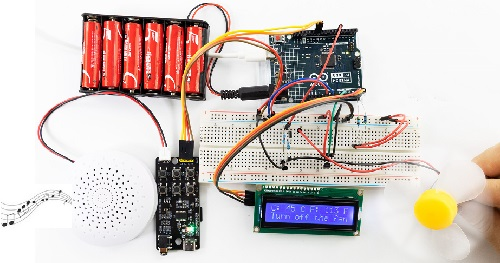

**Note: If the LCD display does not display any information after uploading the code, try pressing the RESET button on the UNO R4 motherboard.**


---

<span style="color: rgb(255, 76, 65); font-size: 24px;">**ATTENTION: The following projects for WiFi and Bluetoothare only available for UNO R4 WiFi boards.**</span>

---

### Project 58 Bluetooth Control

---

**1. Overview**

UNO R4 WiFi board is equipped with an ESP32 module that offers Bluetooth® LE and Bluetooth® 5 capabilities and supports speeds of up to 2 Mbps. It also comes with a tracking antenna to take advantage of the board's connectivity without an external one.

<span style="color: rgb(255, 76, 65);">**ATTENTION:**</span> The tracking antenna in the ESP32 module is shared with the Bluetooth® module, which means you can't use Bluetooth® and Wi-Fi® at the same time.


In this project, UNO R4 WiFi board acts as a peripheral in a Bluetooth Low Power (BLE) network. It offers a customized BLE service designed to control on-board LED and LED matrix, which can be read and written from a central device, such as a smart phone or tablet. Once the central device is connected to the Arduino UNO R4 WiFi, it can change LED state. The Arduino IDE serial monitor displays debugging information, including the current LED state and the MAC address of the connected central device.

---

**2. Components**

|    ||
| ------------------------ | --------------------- |
| UNO R4 WiFi main board x1 | USB cable  x1       |

---

**3. Component Knowledge**

**Basic Concept of BLE:** 

Bluetooth Low Energy (BLE) is a low-power wireless communication technology designed for short-range interaction. Unlike traditional Bluetooth, BLE focuses on power efficiency and fast connectivity, which is ideal for a range of applications including Internet of Things (IOT) devices and health monitoring devices.

BLE communication relies on two key protocols: GATT(Generic Attribute Profile, for data exchange) and GAP(Generic Access Profile, for device discovery and connectivity).


**Peripheral Unit (Typically GATT Servers):**

In a BLE network, peripherals primarily broadcast data to be discovered and accessed by a central device (typically acting as a GATT client). Such devices are usually sensors or small hardware, such as heart rate monitors, temperature sensors and smart light bulbs.

In BLE communication model, peripherals typically provide one or more services, each containing a set of features. These services and features work together to support specific functions or use cases that allow a central device to read or manipulate relevant data.

- Service industry

  In BLE, services act as advanced abstractions for organizing and encapsulating related features. Services in BLE can be divided into standard ones and custom ones depending on their source and purpose.

  - Standard services: They are defined by the Bluetooth SIG (Bluetooth Special Interest Group) for specific functions. For example, a heart rate service for heart rate monitors, a device information service with details about the manufacturer, model and version, as well as a battery service that indicates battery level and status.

  - Custom services: They are defined by the developer or device manufacturer to meet the requirements of a specific application or device. For example, a smart home device manufacturer might define a custom service to control the color and brightness of the light.

- Characteristics

  - Characteristics in BLE are the basic units of data exposed by peripherals. They are contained in services to define various types of data and actions that can be performed on them. Each Characteristic is identified by a UUID and has a set of associated properties, such as values, descriptors, and permissions.

  - Permissions: In BLE, each Characteristic is associated with a set of permissions that indicate whether the Characteristic is readable, writable, or notifiable. This helps protect the data and define how to interact.

**Central Unit (Typically GATT Clients):**

**The central device in the BLE network** scans nearby peripherals and establishes connections to collect or control data. These devices are more sophoscated in functions, including smartphones, tablets and dedicated gateway hardware. They are responsible for discovering and connecting to peripherals and accessing/subscribing to services and features provided by them in various programs to solve specific problems.

The central device interacts with features in the following ways:

- **Read**: Request the peripheral to send the current value of the Characteristic. This is often used for features that change infrequently, such as configuration settings or version numbers.

- **Write**: Modify the value of a Characteristic. It is often used for command-like operations, including instructing a peripheral device to turn on or off a motor.

- **Subscribe**: Require the peripheral device to continuously send updated values of the Characteristic without the central device repeatedly requesting this data.

---

**4. Connection**


---

**5. Test Code**

**<span style="background:#ff0;color:#000"> ATTENTION: If you copy and paste the code into Arduino IDE for uploading, please import <span style="color: rgb(255, 76, 65);">frames.h</span> library first, which is provided in the folder.</span>**


```c++
/*  
 * File name: Bluetooth
 * Function: Bluetooth control LED
 * Compiling IDE: ARDUINO 2.3.2
 * Author: https://www.keyestudio.com/
*/
#include <ArduinoBLE.h>

BLEService ledService("19B10000-E8F2-537E-4F6C-D104768A1214"); // Bluetooth® Low Energy LED Service

// Bluetooth® Low Energy LED Switch Characteristic - custom 128-bit UUID, read and writable by central
BLEByteCharacteristic switchCharacteristic("19B10001-E8F2-537E-4F6C-D104768A1214", BLERead | BLEWrite);

#include "Arduino_LED_Matrix.h"   // Include the LED_Matrix library
#include "frames.h"               // Include a header file containing some custom icons

ArduinoLEDMatrix matrix;          // Create an instance of the ArduinoLEDMatrix class

const int ledPin = LED_BUILTIN; // pin to use for the LED

void setup() {
  Serial.begin(115200);      // Initialize serial communication at a baud rate of 115200
  while (!Serial);

  // set LED pin to output mode
  pinMode(ledPin, OUTPUT);

  // begin initialization
  if (!BLE.begin()) {
    Serial.println("starting Bluetooth® Low Energy module failed!");

    while (1);
  }

  // set advertised local name and service UUID:
  BLE.setLocalName("UNO R4 LED");
  BLE.setAdvertisedService(ledService);

  // add the characteristic to the service
  ledService.addCharacteristic(switchCharacteristic);

  // add service
  BLE.addService(ledService);

  // set the initial value for the characeristic:
  switchCharacteristic.writeValue(0);

  // start advertising
  BLE.advertise();

  Serial.println("BLE LED Peripheral");

  matrix.begin();           // Initialize the LED matrix
}

void loop() {
  // listen for Bluetooth® Low Energy peripherals to connect:
  BLEDevice central = BLE.central();

  // if a central is connected to peripheral:
  if (central) {
    Serial.print("Connected to central: ");
    // print the central's MAC address:
    Serial.println(central.address());

    // while the central is still connected to peripheral:
    while (central.connected()) {
      // if the remote device wrote to the characteristic,
      // use the value to control the LED:
      if (switchCharacteristic.written()) {
        if (switchCharacteristic.value()) {   // any value other than 0
          Serial.println(F("LED and LED Matrix on"));
          matrix.loadFrame(heart);        // Load and display the "happy" frame on the LED matrix
          digitalWrite(ledPin, HIGH);     // will turn the LED on
        } else {                          // a 0 value
          Serial.println(F("LED and LED Matrix off"));
          matrix.clear();          // Turn off the display
          digitalWrite(ledPin, LOW);     // will turn the LED off
        }
      }
    }

    // when the central disconnects, print it out:
    Serial.print(F("Disconnected from central: "));
    Serial.println(central.address());
  }
}
```
---

**6. Test Result**

Click  to upload code. If “**ArduinoBLE.h: No such file or directory**” appears, please load library first. Please visit [How to import Arduino library](https://docs.keyestudio.com/projects/KS0590-KS0594/en/latest/docs/Arduino_C_Tutorial.html#import-arduino-library).

After uploading the code, unplug the USB cable and wire up. Connect the board to the computer with USB cable and power on. Connect the Arduino UNO R4 WIFI board via Bluetooth.

To interact with the services and features created in the Sketch, we should use a generic Bluetooth Low Energy ® central application, such as LightBlue (for iOS and Android) or nRF Connect (only for Android).

We will demonstrate how the UNO R4 WiFi main board control LED matrix via Bluetooth on LightBlue.

1\. Take a tablet or smartphone, click [App Store](https://apps.apple.com/us/app/lightblue/id557428110)(iOS users) or [Google Play](https://play.google.com/store/apps/details?id=com.punchthrough.lightblueexplorer)(Android users) to download  LightBlue. Or directly search “<span style="color: rgb(255, 76, 65);">LightBlue</span>” in **App Store**(iOS users) or **Google Play**(Android users).

<span style="color: rgb(255, 76, 65);">**Here we take Android system as an example, and iOS users may have a reference.**</span>


2\. Connect UNO R4 WiFi to your smartphone or tablet via Bluetooth.

Turn on Bluetooth on your smartphone or tablet, navigate to your Bluetooth Settings and find the device named "<span style="color: rgb(0, 209, 0);">UNO R4 LED</span>" to continue connecting to it.


3\. Use LightBlue to interact with Arduino UNO R4 WiFi via Bluetooth.

Open LightBlue and click **Bonded** at the bottom. Here you will see a list of BLE devices that your smartphone/tablet was previously paired with. Find **UNO R4 LED** and **CONNECT**.


After connecting, you can access detailed informations of “**UNO R4 LED**” Bluetooth. Scroll down to find “ledService (19b10000-e8f2-537e-4f6c-d104768a1214)” and “switchCharacteristic (19b10001-e8f2-537e-4f6c-d104768a1214)”.

Click 19b10001-e8f2-537e-4f6c-d104768a1214, and you can see that the Characteristic is both readable and writeable.

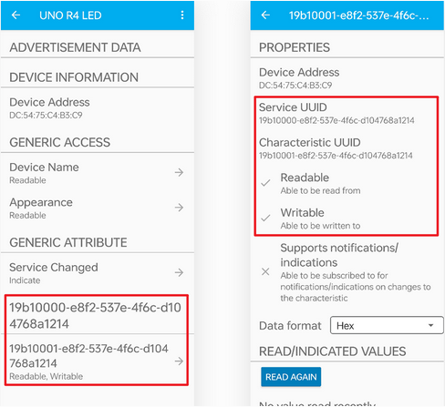

Scroll down to find  **WRITTEN VALUES**, write '**1**' to set Characteristic value to 1, so the Arduino R4 WIFI **on-board LED** and **On-board LED matrix** can be turned on.


Similarly, write '**0**' to turn off the **on-board LED** and **On-board LED matrix**.


If you connect UNO R4 WiFi main board to computer via USB cable, open serial monitor and set baud rate to **<u>115200</u>** to see the following messages:


---

**7. Code Explanation**

<span style="color: rgb(255, 76, 65);">Note:</span> When defining services and features, we need to use UUIDs to identify them. To avoid UUID conflicts and make it easier to use, you can use the UUID generation tool in [uuidgenerator](https://www.uuidgenerator.net/version4).

```c++
#include <ArduinoBLE.h>

BLEService ledService("19B10000-E8F2-537E-4F6C-D104768A1214"); // Bluetooth® Low Energy LED Service

// Bluetooth® Low Energy LED Switch Characteristic - custom 128-bit UUID, read and writable by central
BLEByteCharacteristic switchCharacteristic("19B10001-E8F2-537E-4F6C-D104768A1214", BLERead | BLEWrite);

#include "Arduino_LED_Matrix.h"   // Include the LED_Matrix library
#include "frames.h"               // Include a header file containing some custom icons

ArduinoLEDMatrix matrix;          // Create an instance of the ArduinoLEDMatrix class

const int ledPin = LED_BUILTIN; // pin to use for the LED

```

Iniitalize BLE, LED Matrix and LED: including ArduinoBLE library, defining BLE service and features setting built-in LED pins to ledPin.

```c++
void setup() {
Serial.begin(115200);      // Initialize serial communication at a baud rate of 115200
while (!Serial);

// set LED pin to output mode
pinMode(ledPin, OUTPUT);

// begin initialization
if (!BLE.begin()) {
    Serial.println("starting Bluetooth® Low Energy module failed!");

    while (1);
}

// set advertised local name and service UUID:
BLE.setLocalName("UNO R4 LED");
BLE.setAdvertisedService(ledService);

// add the characteristic to the service
ledService.addCharacteristic(switchCharacteristic);

// add service
BLE.addService(ledService);

// set the initial value for the characeristic:
switchCharacteristic.writeValue(0);

// start advertising
BLE.advertise();

Serial.println("BLE LED Peripheral");

matrix.begin();           // Initialize the LED matrix
}
```

Initialize serial communication and set LED pin to output; Initialize BLE and import service and features to connect BLE; Initialize LED matrix.

```c++
void loop() {
// listen for Bluetooth® Low Energy peripherals to connect:
BLEDevice central = BLE.central();

// if a central is connected to peripheral:
if (central) {
    Serial.print("Connected to central: ");
    // print the central's MAC address:
    Serial.println(central.address());

    // while the central is still connected to peripheral:
    while (central.connected()) {
    // if the remote device wrote to the characteristic,
    // use the value to control the LED:
    if (switchCharacteristic.written()) {
        if (switchCharacteristic.value()) {   // any value other than 0
        Serial.println(F("LED and LED Matrix on"));
        matrix.loadFrame(heart);        // Load and display the "happy" frame on the LED matrix
        digitalWrite(ledPin, HIGH);     // will turn the LED on
        } else {                          // a 0 value
        Serial.println(F("LED and LED Matrix off"));
        matrix.clear();          // Turn off the display
        digitalWrite(ledPin, LOW);     // will turn the LED off
        }
    }
    }

    // when the central disconnects, print it out:
    Serial.print(F("Disconnected from central: "));
    Serial.println(central.address());
}
}
```

If the the list of BLE central devices connects a central device, the Characteristic values are read to control the on-board LED and LED matrix. If the received value is not 0, turn on the LED and LED matrix. If 0 is received, turn off them.

<span style="color: rgb(255, 76, 65);">**For more information, please visit**</span> [Arduino Reference - ArduinoBLE](https://www.arduino.cc/reference/en/libraries/arduinoble/).

**TIP: If you turn on the serial monitor and set the baud rate without seeing any information on the monitor, try to press the RESET button on the UNO R4 WiFi board.**


---

### Project 59 Read WiFi IP

---

**1. Overview**

UNO R4 WiFi board is equipped with an ESP32 module that offers Wi-Fi® capabilities and supports Bit Rate of up to 150 Mbps. It also comes with a tracking antenna to take advantage of the WiFi connectivity without an external one. To use the Wi-Fi® of UNO R4 WiFi, please apply the built-in WiFiS3 library of UNO R4 Core.

In this project, we connect the UNO R4 WiFi main board via WiFi to read its IP address.

<span style="color: rgb(255, 76, 65);">**ATTENTION:**</span> The tracking antenna in the ESP32 module is shared with the Bluetooth® module, which means you can't use Bluetooth® and Wi-Fi® at the same time.

---

**2. Components**

|    ||
| ------------------------ | --------------------- |
| UNO R4 WiFi main board x1 | USB cable x1         |

---

**3. Connection**


---

**4. Test Code**

<span style="color: rgb(255, 76, 65);">**Special note**</span>: If you are copying code directly into the Arduino IDE, you need to add the library of <span style="color: rgb(0, 209, 0);">arduino_secrets.h</span> , which can be found in the corresponding code folder provided.


Service Set ldentifier, short for SSID, is the name of the router of the wireless network. SSID technology can divide a WLAN into several subnetworks requiring different authentication, with each requiring an independent authentication. Only authenticated users can access the corresponding subnetwork. 

So before uploading code, you need to configure the WiFi name and passwords, replace them with yours, as shown below.


```c++
/*
 * File name: WiFi IP
 * Function: connect to router, read wifi IP address
 * Compiling IDE: ARDUINO 2.3.2
 * Author: https://www.keyestudio.com/
*/
#include "WiFiS3.h"
#include "arduino_secrets.h"

//Please enter your sensitive data in the Secret TAB /arduino_secrets.h
char ssid[] = "test12";   // your wifi SSID(name)
char pass[] = "11111111"; // your wifi passwords (For WPA, or as a WEP key)
int keyIndex = 0;         // your wifi key index number (required for WEP only)
int status = WL_IDLE_STATUS;
WiFiServer server(80);

void setup() {
  Serial.begin(9600);  // baud rate to 9600

  // Check WiFi module:
  if (WiFi.status() == WL_NO_MODULE) {
    Serial.println("Communication with WiFi module failed!");
    // Not continue
    while (true);
  }

  String fv = WiFi.firmwareVersion();
  if (fv < WIFI_FIRMWARE_LATEST_VERSION) {
    Serial.println("Please upgrade the firmware");
  }

  // Try to connect to a WiFi network:
  while (status != WL_CONNECTED) {
    Serial.print("Attempting to connect to Network named: ");
    Serial.println(ssid);                   // Print Network Name (SSID)

    // Connect to a WPA/WPA2 network, if using an open or WEP network, change this line:
    status = WiFi.begin(ssid, pass);
    // Wait 10 seconds to connect:
    delay(10000);
  }
  server.begin();                           // Start the web server on port 80
  printWifiStatus();                        // You're now connected, so print out the status
}

void loop() {
  WiFiClient client = server.available();   // Monitor incoming clients in real time

  if (client) {                             // If you're listening to the client,
    Serial.println("new client");           // Print a message on the serial port
    String currentLine = "";                // Creates a string to hold the data passed in from the client
    while (client.connected()) {            // Loop when the client connects
      if (client.available()) {             // If there are bytes to be read from the client,
        char c = client.read();             // Read a byte, and then
        Serial.write(c);                    // Print to serial monitor
        if (c == '\n') {                    // If the byte is a newline character

          // If the current action is empty, there are two newlines in a line.
          // This is the end of the client's HTTP request, so a response is sent:
          if (currentLine.length() == 0) {
            // HTTP headers always start with a response code (e.g. HTTP/1.1 200 OK)
            // And a content type so the client knows what's going to happen, followed by a blank line:
            client.println("HTTP/1.1 200 OK");
            client.println("Content-type:text/html");
            client.println();
            
            // The HTTP response ends with another blank line:
            client.println();
            // exit the while loop:
            break;
          } else {    // If there is a newline, clear currentLine:
            currentLine = "";
          }
        } else if (c != '\r') {  // If you have any characters other than the return character,
          currentLine += c;      // And add it to the end of currentLine
        }
      }     
    }
    // disconnect
    client.stop();
    Serial.println("client disconnected");
  }
}

void printWifiStatus() {
  // Print the SSID of the wifi you are connected to:
  Serial.print("SSID: ");
  Serial.println(WiFi.SSID());

  // Print the IP address received by the main control board:
  IPAddress ip = WiFi.localIP();
  Serial.print("IP Address: ");
  Serial.println(ip);

  // Print the received signal strength:
  long rssi = WiFi.RSSI();
  Serial.print("signal strength (RSSI):");
  Serial.print(rssi);
  Serial.println(" dBm");
}

```

---

**5. Test Result**

Click  to upload code. After uploading the code, unplug the USB cable and wire up. Connect the board to the computer with USB cable and power on. Open serial monitor to set the baud rate to **<u>9600</u>**.

When connecting, the serial monitor shows  “**<u>Attempting to connect to Network named: test12</u>**”, indicating that you are connecting to the SSID of the router. When the ESP32 module on the UNO R4 WiFi main board successfully connects to the SSID, the serial monitor prints the **<u>IP address</u>** assigned by the WiFi to the ESP32 module.


**<span style="color: rgb(255, 76, 65);">TIP</span> : If you turn on the serial monitor and set the baud rate without seeing any information on the monitor, try to press the RESET button on the UNO R4 WiFi board.**


---

**6. Code Explanation**

| Code                   | Explanation                                                  |
| ---------------------- | ------------------------------------------------------------ |
| WiFi.begin(ssid, pass) | Initialize the connection. ssid is the WiFi name and pass is the password for WiFi. |
| WiFi.status()          | After calling, the wifi will not be connected immediately. This Interface function is used to check whether the wifi is connected. When the return value is WL_CONNECTED, the connection is complete. It also returns other values, indicating that the wifi connection failed, etc. |
| WiFi.localIP()         | Display the ip of the local WiFi.                            |
| WiFi.RSSI()            | Show the strength of the local WiFi.                         |
| server.available()     | Monitor incoming clients in real time                        |

---

### Project 60 WiFi Web-page Control

---

**1. Overview**

In previous experiments, we have understood the WiFi function of the ESP32 module on the UNO R4 WiFi main board, and read the IP address of the corresponding WiFi. Herein, we control multiple modules on a web pages.

---

**2. Components**

|  ||||
| ------------------------ | ------------------------ | ---------------------------- |---------------------------- |
|UNO R4 WiFi main board x1|  S8050 triode x1  |S8550 triode  x1 |1KΩ resistor x2|
| | |||
| motor x1|Breadboard x1 |Jump wires | USB cable x1 |
|||||
|fan  x1| Battery holder x1                       | 1.5V AA battery (<span style="color: rgb(255, 76, 65);">Provide for yourself</span>) x6 | 10kΩ resistor x1 |
| | |||
|diode x1|MP3 module x1| TF card (<span style="color: rgb(255, 76, 65);">provided by yourself</span>)×1 |RGB LED x1|
|||||
|servo ×1|active buzzer  ×1|220Ω resistor ×3| DuPont wires|

---

**3. Wiring Diagram**

**Schematic diagram:**


**Wiring diagram:**


---

**4. Test Code**

<span style="color: rgb(255, 76, 65);">**Special note**</span>: If you are copying code directly into the Arduino IDE, you need to add the library of <span style="color: rgb(0, 209, 0);">arduino_secrets.h</span> , which can be found in the corresponding code folder provided.

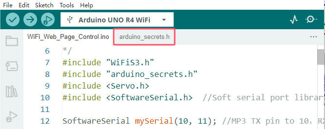


Before uploading this code, you will need to modify the WiFi name and password into yours.


```c++
/*
 * File name: WiFi Web Page Control 
 * Function: WiFi Web Page Control multiple modules to simulate WiFi smart life
 * Compiling IDE: ARDUINO 2.3.2
 * Author: https://www.keyestudio.com/
*/
#include "WiFiS3.h"
#include "arduino_secrets.h" 
#include <Servo.h>
#include <SoftwareSerial.h>  //Soft serial port library

SoftwareSerial mySerial(10, 11); //MP3 TX pin to 10，RX pin to 11
 
//Please enter your sensitive data in the Secret TAB /arduino_secrets.h
char ssid[] = "test12";    // Your wifi SSID(Name)
char pass[] = "11111111";  // Your wifi password (for WPA, or as a WEP key)
int keyIndex = 0;          // Your wifi Key Index number (required for WEP only)
int val = 0;

int redPin = 6;    // define RGB redpin pin to D6
int greenPin = 5;  // define RGB greenpin pin to D5
int bluePin = 3;   // define RGB bluepin pin to D3
int buzzerPin = 2; // define active buzzer pin to D2
int motorPin = 9;  // define the digital control pin of DC motor to D9
int servoPin = 8;  // define servo pin to 8
Servo myservo;  // Create a servo object to control the servo

int status = WL_IDLE_STATUS;
WiFiServer server(80);

void setup() {
  Serial.begin(9600); // Initialize the hardware serial port
  mySerial.begin(9600); // Initialize the software serial port
  pinMode(redPin, OUTPUT);  // set RGB redpin pin to output
  pinMode(greenPin, OUTPUT);  // set RGB greenpin pin to output
  pinMode(bluePin, OUTPUT);  // set RGB bluepin pin to output
  pinMode(motorPin, OUTPUT);  // set DC motor motorPin pin to output
  pinMode(buzzerPin, OUTPUT);  // set active buzzer pin to output

  myservo.attach(servoPin);  //set servo pin to D8
  myservo.write(0); //Rotate to 0 degrees
  delay(1000); //delay 1s

  // Check WiFi module:
  if (WiFi.status() == WL_NO_MODULE) {
    Serial.println("Communication with WiFi module failed!");
    // Not continue
    while (true);
  }

  String fv = WiFi.firmwareVersion();
  if (fv < WIFI_FIRMWARE_LATEST_VERSION) {
    Serial.println("Please upgrade the firmware");
  }

  // Try to connect to a WiFi network:
  while (status != WL_CONNECTED) {
    Serial.print("Attempting to connect to Network named: ");
    Serial.println(ssid);     // Print Network Name (SSID)

    // Connect to a WPA/WPA2 network, if using an open or WEP network, change this line:
    status = WiFi.begin(ssid, pass);
    // Wait 10 seconds to connect:
    delay(10000);
  }
  server.begin();      // Start the web server on port 80
  printWifiStatus();   // You're now connected, so print out the status
}

void loop() {
  WiFiClient client = server.available();   // Monitor incoming clients in real time

  if (client) {                             // If you're listening to the client,
    Serial.println("new client");           // Print a message on the serial port
    String currentLine = "";                // Creates a string to hold the data passed in from the client
    while (client.connected()) {            // Loop when the client connects
      if (client.available()) {             // If there are bytes to be read from the client,
        char c = client.read();             // Read a byte, and then
        Serial.write(c);                    // Print to serial monitor
        if (c == '\n') {                    // If the byte is a newline character

          // If the current action is empty, there are two newlines in a line.
          // This is the end of the client's HTTP request, so a response is sent:
          if (currentLine.length() == 0) {
            // HTTP headers always start with a response code (e.g. HTTP/1.1 200 OK)
            // And a content type so the client knows what's going to happen, followed by a blank line:
            client.println("HTTP/1.1 200 OK");
            client.println("Content-type:text/html");
            client.println();

            // The content of the HTTP response follows the header:
            client.print("<p style=\"font-size:7vw;\">Click <a href=\"/A\">here</a> turn on RGB<br></p>");
            client.print("<p style=\"font-size:7vw;\">Click <a href=\"/B\">here</a> turn off RGB<br></p>");
            client.print("<p style=\"font-size:7vw;\">Click <a href=\"/C\">here</a> turn on fan<br></p>");
            client.print("<p style=\"font-size:7vw;\">Click <a href=\"/D\">here</a> turn off fan<br></p>");
            client.print("<p style=\"font-size:7vw;\">Click <a href=\"/E\">here</a> turn on buzzer<br></p>");
            client.print("<p style=\"font-size:7vw;\">Click <a href=\"/F\">here</a> turn off buzzer<br></p>");
            client.print("<p style=\"font-size:7vw;\">Click <a href=\"/G\">here</a> turn on MP3<br></p>");
            client.print("<p style=\"font-size:7vw;\">Click <a href=\"/H\">here</a> <br>servo turn to 180</p>");
            client.print("<p style=\"font-size:7vw;\">Click <a href=\"/I\">here</a> <br>servo turn to 0</p>");
           
            // The HTTP response ends with another blank line:
            client.println();
            // exit the while loop:
            break;
          } else {    // If there is a newline, clear currentLine:
            currentLine = "";
          }
        } else if (c != '\r') {  // If you have any characters other than the return character,
          currentLine += c;      // And add it to the end of currentLine
        }

        // Check whether the client request exists "GET /A"or"GET /B"or"GET /C"or"GET /D"or"GET /E"or"GET /F"or"GET /G"or"GET /H"or"GET /I":
        if (currentLine.endsWith("GET /A")) {    // GET /A RGB on
          // Cycle through basic colors
          color(255, 0, 0);  // Red
          delay(1000);       // Wait for 1 second
          color(0, 255, 0);  // Green
          delay(1000);       // Wait for 1 second
          color(0, 0, 255);  // Blue
          delay(1000);       // Wait for 1 second

          // Cycle through blended colors
          color(255, 0, 252);  // Magenta
          delay(1000);         // Wait for 1 second
          color(237, 109, 0);  // Orange
          delay(1000);         // Wait for 1 second
          color(255, 215, 0);  // Yellow
          delay(1000);         // Wait for 1 second
          color(34, 139, 34);  // Forest Green
          delay(1000);         // Wait for 1 second
          color(0, 112, 255);  // Light Blue
          delay(1000);         // Wait for 1 second
          color(0, 46, 90);    // Indigo
          delay(1000);         // Wait for 1 second
          color(128, 0, 128);  // Purple
          delay(1000);         // Wait for 1 second       
        }
        if (currentLine.endsWith("GET /B")) {    // GET /B RGB off
          color(0, 0, 0);  // Black
        }
        if (currentLine.endsWith("GET /C")) {  // GET /C DC motor rotates
          digitalWrite(motorPin, LOW);                
        }
        if (currentLine.endsWith("GET /D")) {  // GET /D DC motor does not rotate
          digitalWrite(motorPin, HIGH);               
        }
        if (currentLine.endsWith("GET /E")) {  // GET /E turn on buzzer
          digitalWrite(buzzerPin, HIGH);                               
        }
        if (currentLine.endsWith("GET /F")) {  // GET /F turn off buzzer
          digitalWrite(buzzerPin, HIGH);                               
        }
        if (currentLine.endsWith("GET /G")) {  // GET /F MP3 plays audio
          MP3();          
        }
        if (currentLine.endsWith("GET /H")) {  // GET /H servo rotates to 180°
          myservo.write(180); //servo rotates to 180°
          delay(1000); //delay 1s
        }
        if (currentLine.endsWith("GET /I")) {  // GET /I servo rotates to 0°
          myservo.write(0); //servo rotates to 0°
          delay(1000); //delay 1s
        }
      } 
    }
    // disconnect:
    client.stop();
    Serial.println("client disconnected");
  }
}

void printWifiStatus() {
  // Print the SSID of the wifi you are connected to
  Serial.print("SSID: ");
  Serial.println(WiFi.SSID());

  // Print the IP address received by the main control board
  IPAddress ip = WiFi.localIP();
  Serial.print("IP Address: ");
  Serial.println(ip);

  // Print the received signal strength
  long rssi = WiFi.RSSI();
  Serial.print("signal strength (RSSI):");
  Serial.print(rssi);
  Serial.println(" dBm");
  
  // open http://[ip] in your browser
  Serial.print("To see this page in action, open a browser to http://");
  Serial.println(ip);
}

void MP3() {
  int cmd1[]={0x7e, 0xff, 0x06, 0x0f, 0x00, 0x01, 0x01, 0xef}; //song 01 corresponding command, hexadecimal
  for(char i=0; i<8; i++){  
    mySerial.write(cmd1[i]); 
  }
  delay(2000);

  int cmd2[]={0x7e, 0xff, 0x06, 0x0f, 0x00, 0x01, 0x02, 0xef}; //song 02 corresponding command, hexadecimal
  for(char i=0; i<8; i++){
    mySerial.write(cmd2[i]);
  }
  delay(2000);

  int cmd3[]={0x7e, 0xff, 0x06, 0x0f, 0x00, 0x01, 0x03, 0xef}; //song 03 corresponding command, hexadecimal
  for(char i=0; i<8; i++){
    mySerial.write(cmd3[i]);
  }
  delay(2000);

  int cmd4[]={0x7e, 0xff, 0x06, 0x0f, 0x00, 0x01, 0x04, 0xef}; //song 04 corresponding command, hexadecimal
  for(char i=0; i<8; i++){
    mySerial.write(cmd4[i]);
  }
  delay(2000);

  int cmd5[]={0x7e, 0xff, 0x06, 0x0f, 0x00, 0x01, 0x05, 0xef}; //song 05 corresponding command, hexadecimal
  for(char i=0; i<8; i++){
    mySerial.write(cmd5[i]);
  }
  delay(2000);

  int cmd6[]={0x7e, 0xff, 0x06, 0x0f, 0x00, 0x01, 0x06, 0xef}; //song 06 corresponding command, hexadecimal
  for(char i=0; i<8; i++){
    mySerial.write(cmd6[i]);
  }
  delay(2000);

  int cmd7[]={0x7e, 0xff, 0x06, 0x0f, 0x00, 0x01, 0x07, 0xef}; //song 07 corresponding command, hexadecimal
  for(char i=0; i<8; i++){
    mySerial.write(cmd7[i]);
  }
  delay(2000);
  
}

// Function to set the RGB LED color
void color(int red, int green, int blue) {    
  // Write analog values to the RGB pins
  analogWrite(redPin, red);   
  analogWrite(greenPin, green); 
  analogWrite(bluePin, blue); 
}

```

---

**5. Test Result**

Click  to upload code. After uploading the code, wire up and the external power supply is connected to the UNO R4 WiFi board to power the board.

<span style="color: rgb(255, 76, 65);">**NOTE:**</span> To prevent the fan from working normally sometimes, be sure to give the UNO R4 WiFi motherboard external power supply, so as to ensure that the fan can work normally and prevent the motherboard from burning out.

Open serial monitor to set the baud rate to **<u>9600</u>**. The monitor prints the IP address.


**TIP: If you turn on the serial monitor and set the baud rate without seeing any information on the monitor, try to press the RESET button on the UNO R4 WiFi board.**


Then open the browser to enter the **<span style="color: rgb(255, 169, 0);">WIFI IP address (192.168.43.124)</span>** on the serial monitor as shown above, and click “**<span style="color: rgb(255, 76, 65);">search</span>**”.

<span style="color: rgb(0, 209, 0);">**ATTENTION: the WiFi name and password in the code are the same as that of the network (or WiFi) connected to the smartphone/tablet (or computer). And the computer and smartphone/tablet should be on the same network (or WiFi).**</span>


After a few seconds, the WiFi web page is displayed, indicating that the ESP32 module on the UNO R4 WiFi main board has successfully connected to WiFi.


<span style="color: rgb(255, 76, 65);">**Special note**: Wait until the speaker on the MP3 module finishes playing the voice, and then Click here in "Click here servo turn to 180".</span>

| Icon               | Click      | Function                                                 |
| --------------------- | -------- | ------------------------------------------------------------ |
| | click here | turn on RGB LED in various colors |
|  | click here | turn off RGB LED |
| | click here | turn on DC motor, fan rotates |
|  | click here | turn off DC motor, fan does not rotate |
|  | click here |turn on active buzzer |
|  | click here |turn off active buzzer |
| | click here | turn on the speaker on the MP3 to broadcast |
| | click here | servo ratates to 180° |
|| click here | servo ratates to 0°. |


---

**6. Code Explanation**

Please refer to the Code Explanation of previous projects.


